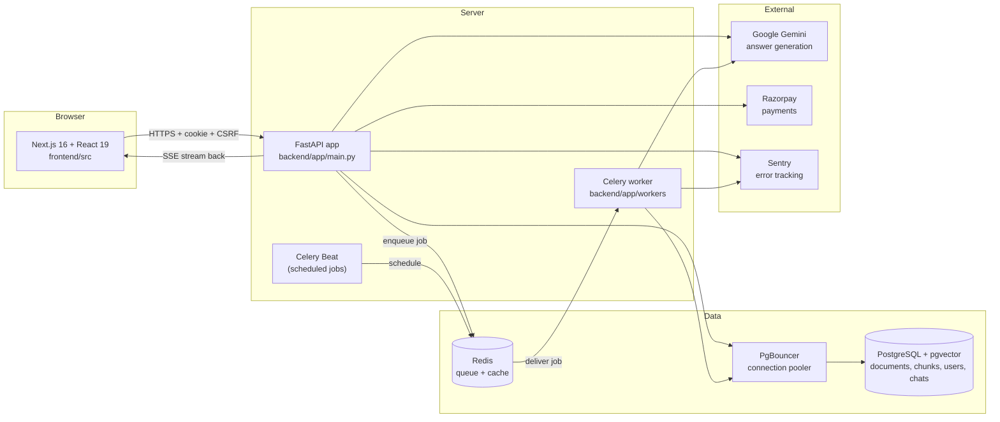

# 01 — The Big Picture

Read this before anything technical. No prior knowledge is needed. Every
word that could be new is explained as it appears.

---

## 1.1 What does this product actually do?

Imagine you have twenty PDF files. A rent agreement, a company's yearly
financial report, your class notes, three job résumés. You want answers from
them. Not a web search — an answer **from your own files**.

Today you would open each file and use Ctrl+F to search for words. That only
finds exact words. If the agreement says "the lessee shall vacate" and you
search for "when do I have to move out", Ctrl+F finds nothing.

DocuMindAI is a website where you:

1. Upload your documents.
2. Ask a question in normal language.
3. Get an answer written in normal language.
4. **See exactly which page of which document the answer came from.**
5. Get told "I cannot find this in your documents" when the answer is not
   there — instead of a confident, invented answer.

That fourth and fifth point are the whole product. Anyone can connect a
chat box to an AI model. The engineering work here is making the answer
**traceable** and making the system **refuse** when it does not know.

### The vocabulary of the product

Three words you will see everywhere:

- **Document** — one file you uploaded (a PDF, a Word file, a slide deck),
  or a piece of text you pasted in (the code calls a pasted piece a "clip").
- **Workspace** — a mode of the app tuned for one kind of work. There are
  seven: General, HR, Legal, Finance, Study, Research, Exam. They share
  almost all their code. Only the instructions given to the AI model and the
  extra business rules differ. For example, in the Finance workspace the
  system pulls numbers out of a report and then **calculates** ratios in
  Python; in the HR workspace it ranks résumés against a job description.
- **Grounded answer** — an answer built only from text actually found in
  your documents, with a pointer back to the page it came from. The opposite
  is an **ungrounded** answer, where the model writes from its own general
  training. This system is designed to prefer refusing over answering
  ungrounded.

### Who is it for, and what does it charge?

It is multi-tenant. **Multi-tenant** means many separate customers share one
running copy of the software, and no customer can ever see another
customer's data. Each user gets a free trial with a limited number of
questions, then pays through Razorpay (an Indian payments company).

---

## 1.2 The shape of the system, in one paragraph

There is a **frontend** (the website you see, built with Next.js and React,
running in your browser), a **backend** (a program on a server that answers
requests, built with Python and FastAPI), a **database** (PostgreSQL, which
stores users, documents, chat history, and the mathematical fingerprints of
your text), a **worker** (a second Python program that does slow jobs like
reading a 200-page PDF, using Celery), a **queue** (Redis, which is how the
backend hands slow jobs to the worker), and an **AI service** (Google's
Gemini, which turns evidence into a written answer). All of them run in
**containers** (isolated, pre-packaged boxes) started by Docker Compose.

If a single sentence of that was unfamiliar — good. That is the whole point.
Every one of those words gets its own chapter.

---

## 1.3 The story of one click, told with no jargon

A user named Priya is on the Legal workspace page. She has already uploaded
a rental agreement. She types:

> *"What is the notice period if I want to leave early?"*

She presses Enter. Here is everything that happens, in order. I will tell
the story first in plain language, then again with the real file names.

### The plain-language version

1. **Her browser notices the key press.** The webpage is a program running
   inside her browser. It sees the Enter key, takes the text out of the box,
   and immediately shows her own message on screen, so the app feels fast.
   Nothing has left her computer yet.

2. **The browser sends a message over the internet.** It packages the
   question into a small block of text and sends it to the server's address.
   Attached to that message, automatically, is a small file the server gave
   her when she logged in — a **cookie**. The cookie is how the server knows
   this is Priya and not someone else.

3. **The server receives the message.** Before the question is even looked
   at, the message passes through a series of guards, one after another.
   One guard checks that the request came from the real website and not from
   a malicious page in another tab. One guard adds a tracking number so this
   request can be found later in the logs. One guard reads the cookie,
   confirms the digital signature on it, and works out who the user is.

4. **The server checks she is allowed to ask.** She is on a free trial, so
   the server counts how many questions she has already asked and refuses
   politely if she is out.

5. **The server turns her question into numbers.** This is the strange step.
   A separate small AI model reads the sentence and produces a list of 1024
   numbers that represent its *meaning*. This list is called an
   **embedding**. Two sentences that mean similar things produce similar
   number lists, even when they share no words at all. That is how "leave
   early" can match "lessee shall vacate".

6. **The server searches the database twice, two different ways.** Once by
   meaning, comparing her question's numbers against the numbers stored for
   every piece of her documents. Once by keyword, the old-fashioned way, in
   case the exact words matter (names, clause numbers, amounts). Two searches
   because each one fails in a different situation, and their weaknesses do
   not overlap.

7. **The two result lists are merged.** A simple, well-known formula blends
   the two rankings into one list. Then a slower, more careful AI model
   re-reads the top candidates side by side with the question and reorders
   them properly. Only the best five survive.

8. **The evidence is packed into a budget.** The AI model can only read so
   much text at once, so the server adds pieces until the budget is used up,
   and labels each piece with its filename and page number.

9. **The question and the evidence go to Google's Gemini model.** With a
   strict instruction: answer only from this evidence, cite the page, and if
   the evidence does not contain the answer, say so.

10. **The answer comes back one word at a time, and is forwarded to Priya's
    browser the moment each piece arrives.** She sees the answer typing
    itself out. This is done with a technique where the connection stays open
    and the server keeps pushing small updates down it.

11. **A trust score is computed and sent.** After the answer is complete, the
    server scores how well the answer is supported by the evidence and sends
    that as a final update.

12. **Everything is saved.** Her question and the answer are written into
    the database so the conversation is still there tomorrow.

That is the whole journey: **browser → network → guards → identity →
permission → meaning-search → keyword-search → merge → rerank → budget → AI
→ streamed answer → saved history**.

### Why it is built this way, in one line each

- **Two searches, not one** — because meaning-search misses exact names, and
  keyword-search misses paraphrases.
- **Rerank after searching** — because the cheap search is fast but rough,
  and the expensive model is accurate but too slow to run on everything.
- **A token budget** — because AI models charge by the amount of text and
  fail if you exceed their limit.
- **Streaming** — because a ten-second silence feels broken, but a
  ten-second answer that starts appearing in one second feels instant.
- **A separate worker program** — because reading a 200-page scanned PDF
  takes minutes, and no web request may take minutes.

---

## 1.4 The same story, with the real files

Now the same journey, but pointing at actual code. Do not try to understand
the code yet. Just see that every step above corresponds to a real place.

### Step 1 — the browser sends the request

The frontend calls one function for every question:
[`frontend/src/lib/api.ts:309`](../frontend/src/lib/api.ts) —
`askQuestionStream`.

```ts
const res = await apiFetch(`/query/stream`, {
  method: "POST",
  headers: { "Content-Type": "application/json" },
  signal,
  body: JSON.stringify({
    query,
    top_k: topK,
    similarity_threshold: 0.1,
    session_id: sessionId || null,
    workspace_type: workspaceType || "general",
    comparison_mode: comparisonMode || false,
  })
});
```

Reading it slowly:

- `await` means "wait here until this finishes, but let the rest of the page
  keep working."
- `apiFetch` is this project's own wrapper around the browser's built-in
  `fetch` function. Wrapper means: a function that adds extra behaviour
  around another function.
- `"POST"` is the HTTP method meaning "I am sending you data", as opposed to
  `GET`, which means "give me data".
- `body: JSON.stringify({...})` turns a JavaScript object into a text format
  called **JSON**, because a network can only carry text or bytes, not
  live objects.
- `signal` is a cancel handle. If Priya clicks "stop", this is how the
  request is aborted.

### Step 2 — what `apiFetch` adds automatically

[`frontend/src/lib/api.ts:120`](../frontend/src/lib/api.ts):

```ts
export const apiFetch = async (endpoint: string, options: RequestInit = {}, _retried = false): Promise<Response> => {
  const isMutation = ['POST', 'PUT', 'DELETE', 'PATCH'].includes(options.method?.toUpperCase() || 'GET');
  if (isMutation && !csrfToken && !endpoint.startsWith('/auth/')) {
    await _fetchCsrf();
  }
  const headers = new Headers(options.headers || {});
  if (isMutation && csrfToken) headers.set('X-CSRF-Token', csrfToken);
  if (deviceFingerprint) headers.set('X-Device-ID', deviceFingerprint);

  let response: Response;
  try {
    response = await fetch(`${API_BASE}${endpoint}`, { ...options, headers, credentials: 'include' });
  } catch (error: any) {
    if (error.name === 'TypeError' && error.message === 'Failed to fetch') {
      throw new Error('Network error: The server is unreachable. Please check your connection.');
    }
    throw error;
  }
```

Three things are happening that you would otherwise have to remember by hand
on every single call:

- **CSRF token.** CSRF stands for Cross-Site Request Forgery — an attack
  where a different website tricks your browser into sending a request to
  this one using your cookie. The defence is a secret value the real
  frontend knows and an attacker's page cannot read. Here it is attached as
  the `X-CSRF-Token` header on every request that changes something.
- **`credentials: 'include'`.** Without this, the browser does not attach
  cookies to a cross-origin request, and the server would see an anonymous
  stranger.
- **A readable network error.** The browser's raw failure message is
  `"Failed to fetch"`, which tells a user nothing. It is translated here.

Further down, at line 143, there is one more piece of engineering: if the
server replies "401 not authenticated", the wrapper quietly tries to renew
the session once and retries the request, and only then gives up. The user
never sees a random logout in the middle of typing.

### Step 3 — the guards on the server

[`backend/app/main.py:110`](../backend/app/main.py):

```python
app.add_middleware(SecurityHeadersMiddleware)
app.add_middleware(CSRFMiddleware)
app.add_middleware(TenantContextMiddleware)
app.add_middleware(DeviceFingerprintMiddleware)
```

**Middleware** means: code that sits between the network and your actual
handler, and runs on every single request without the handler asking for it.
Think of airport security — every passenger passes through it, and no gate
agent has to check individually.

The order matters and is not alphabetical. It is deliberate. We will spend a
whole section on the ordering rules later.

### Step 4 — working out who the user is

[`backend/app/core/auth.py:50`](../backend/app/core/auth.py):

```python
async def get_current_user(request: Request) -> Dict[str, Any]:
    """FastAPI Dependency to enforce protected routes and extract the validated tenant context from cookies."""
    token = request.cookies.get("token")
    if not token:
        raise HTTPException(status_code=401, detail="Not authenticated")
    user = AuthProvider.verify_token(token)
    _set_request_owner(user["id"])
    return user
```

The cookie holds a **JWT** — a JSON Web Token. That is a small block of text
containing facts about the user ("this is user 8f3a…, their email is …"),
plus a **signature**: a mathematical seal made with a secret key that only
the server knows. Anyone can read a JWT; nobody can change one without the
server noticing, because the seal would no longer match.

`verify_token` (line 11 of the same file) checks that seal:

```python
secret = settings.AUTH_SECRET_KEY
algorithms = [settings.JWT_ALGORITHM]
claims = jwt.decode(token, secret, algorithms=algorithms, options={"verify_signature": True})
```

Note the comment above it in the real file. It records a fixed bug: the code
used to fall back to a hardcoded secret string if the real one was missing,
which meant anyone who knew that string could forge a token for any user.
And it records a second one: accepting more than one signing algorithm opens
a known attack called algorithm confusion. Those two lines are small; the
reasoning behind them is not. This is the kind of thing you will be asked
about in interviews.

The last line, `_set_request_owner(user["id"])`, is the most important line
in the file for safety. It stores "the current user is this person" in a
place the database layer reads automatically, so that **every** database
read is filtered to that user without each endpoint having to remember. If
that value is missing, the database layer raises an error rather than
returning everyone's rows. Safety by construction, not by discipline.

### Step 5 — permission to ask

Inside the streaming endpoint, [`backend/app/api/v1/endpoints/query.py`](../backend/app/api/v1/endpoints/query.py),
the trial counter is checked with `check_and_increment_trial` (imported at
line 28). If the trial is exhausted, the server answers with HTTP status
`402 Payment Required`, and the frontend turns that into an upgrade dialog —
you can see that exact handling at
[`frontend/src/lib/api.ts:342`](../frontend/src/lib/api.ts).

### Step 6 and 7 — retrieval

[`backend/app/services/retrieval_service.py:25`](../backend/app/services/retrieval_service.py)
is the heart of the search.

The question becomes numbers:

```python
loop = asyncio.get_running_loop()
query_vector = (
    await loop.run_in_executor(
        None, embedding_service.generate_embeddings, [query]
    )
)[0]
```

`run_in_executor` means "run this slow, CPU-heavy function on a different
thread so the server can keep answering other people while it works". The
comment right above it explains that this was a real bug: the model call was
made directly, and it froze every other request in the process for its
duration. That is one of the most valuable lessons in this whole repository,
and Chapter 07 is dedicated to it.

Then the meaning search:

```python
distance_expr = DocumentChunk.embedding.cosine_distance(query_vector).label('distance')
similarity_expr = (1 - distance_expr).label('similarity')

stmt_vec = (
    select(DocumentChunk, DocumentPage.page_number, Document.filename, similarity_expr)
    .join(Document, DocumentChunk.document_id == Document.id)
    .join(DocumentPage, DocumentChunk.page_id == DocumentPage.id)
    .where(Document.owner_id == owner_id)
)
```

`cosine_distance` is the database itself comparing number-lists. `.where(Document.owner_id == owner_id)`
is the tenant filter — Priya's search can only ever see Priya's documents.

And the keyword search, using PostgreSQL's built-in full-text engine:

```python
ts_query = func.websearch_to_tsquery('english', query)
ts_vector = func.to_tsvector('english', DocumentChunk.text_content)
lexical_rank_expr = func.ts_rank_cd(ts_vector, ts_query).label('lexical_rank')
```

Then the two lists are merged with **Reciprocal Rank Fusion**:

```python
rrf_k = 60 # Standard smoothing constant to prevent high-ranked outliers from dominating
...
fused_scores[chunk_id] += 1.0 / (rrf_k + rank + 1)
```

Read that formula. It does not use the scores at all — only the *positions*.
A result that is 3rd in one list and 4th in the other beats a result that is
1st in one list and absent from the other. That is deliberate: the two
searches produce scores on completely different scales that cannot be
compared, but their *rankings* can. This is a genuinely clever, genuinely
simple idea, and it is a favourite interview question.

### Step 8 — reranking and the token budget

[`backend/app/services/grounding_service.py:16`](../backend/app/services/grounding_service.py)
takes the merged list and does the expensive, careful pass:

```python
loop = asyncio.get_running_loop()
reranked_candidates = await loop.run_in_executor(
    None, reranker_service.rerank_results, query, unique_candidates
)
```

Then it fills the budget and labels each piece of evidence:

```python
for candidate in selected_candidates:
    chunk_tokens = len(candidate["text_content"]) // 4
    if current_token_estimate + chunk_tokens > max_tokens:
        logger.warning(f"[Tracing] Token budget exceeded ({max_tokens}). Halting evidence injection.")
        break

    current_token_estimate += chunk_tokens
    accepted_evidence.append(candidate)

    context_block = (
        f"<evidence document=\"{candidate['filename']}\" "
        f"page=\"{candidate['page_number']}\" "
        f"chunk_id=\"{candidate['chunk_id']}\">\n"
        f"{candidate['text_content']}\n"
        f"</evidence>"
    )
    grounded_context.append(context_block)
```

Look at what the evidence block contains: the filename and the page number,
written right into the text the AI model reads. **That is how citations
exist.** The model is not guessing which page something came from — it is
copying a label that the Python code put there. Chapter 24 covers why this
design makes fake citations structurally difficult.

### Step 9, 10 and 11 — generation, streaming, trust

The answer is generated by `llm_service` and pushed to the browser as a
stream of small labelled messages. The browser side that decodes them is
[`frontend/src/lib/api.ts:355`](../frontend/src/lib/api.ts):

```ts
const reader = res.body?.getReader();
if (!reader) throw new Error("No readable stream");

const decoder = new TextDecoder("utf-8");
let buffer = "";

while (true) {
  const { value, done } = await reader.read();
  if (done) break;

  buffer += decoder.decode(value, { stream: true });
  const blocks = buffer.split('\n\n');
  buffer = blocks.pop() || "";
```

That last line is subtle and worth staring at. Data arrives from the network
in arbitrary pieces — a message can be cut in half. The code splits on the
blank line that separates messages, then **puts the final, possibly
incomplete piece back into the buffer** to be finished by the next chunk of
data. Getting this wrong produces the classic bug where every so often half
a word is lost.

The message types are then dispatched:

```ts
if (event === "status") {
  onStatus(JSON.parse(data).message);
} else if (event === "metadata") {
  onMetadata(JSON.parse(data));
} else if (event === "token") {
  onToken(JSON.parse(data).token);
} else if (event === "thinking_stage") {
  ...
} else if (event === "trust_report") {
  onTrustReport?.(JSON.parse(data));
```

Those names — `status`, `metadata`, `token`, `thinking_stage`,
`trust_report`, `error`, `done`, `trial_status` — are a **contract**. The
server writes them in `query.py`; the browser reads them here. If either
side renames one, the feature silently stops working with no error anywhere.
That is why the project's `CLAUDE.md` lists them as an architectural
invariant. An **invariant** is a fact about the system that must stay true.

The trust report itself is built at
[`backend/app/api/v1/endpoints/query.py:86`](../backend/app/api/v1/endpoints/query.py):

```python
async def _compute_trust_event(
    answer: str, chunks: Any, query: str, document_ids: Any, db: Any
) -> str:
    try:
        ...
        return f"event: trust_report\ndata: {json.dumps(_veritas_sse_payload(report))}\n\n"
    except Exception:
        logger.error("[query/stream] Veritas trust computation failed", exc_info=True)
        return ""
```

Notice the shape of the error handling. If the trust score fails, the answer
still reaches the user — but the failure is logged loudly at ERROR level.
The project has a rule about this called **loud degradation**: a system may
lose a feature, but it must never quietly pretend the feature worked.

---

## 1.5 The second story: uploading a document

The question flow is fast. The upload flow is the opposite, and it teaches a
different lesson.

When Priya uploads a 200-page scanned PDF:

1. The browser first asks the server *where* to put the file
   (`/documents/upload/presigned`), uploads the bytes, then tells the server
   "done, please process it" (`/documents/upload/verify`). You can read all
   three steps in [`frontend/src/lib/api.ts:178`](../frontend/src/lib/api.ts).
2. The server does **not** read the PDF. It creates a database row with
   status `PENDING_UPLOAD`, puts a job on the Redis queue, and immediately
   replies. The whole request takes milliseconds.
3. A completely separate program — the Celery **worker**, started by the
   `worker:` service in
   [`infrastructure/docker-compose.yml`](../infrastructure/docker-compose.yml) —
   picks the job off the queue. It extracts the text page by page, runs
   **OCR** (Optical Character Recognition: reading text out of a picture)
   on pages that are scans, splits the text into overlapping pieces called
   **chunks**, turns each chunk into an embedding, and writes it all back to
   the database.
4. The document's status moves `PENDING_UPLOAD → UPLOADED → PROCESSING →
   EXTRACTED → INDEXING → READY`. The frontend polls and shows progress. You
   can see those exact status names typed out in
   [`frontend/src/lib/api.ts:4`](../frontend/src/lib/api.ts).
5. Only documents with status `READY` are searchable — that is the
   `.where(Document.status == "READY")` line you saw in the retrieval code.

**The lesson:** any work that can take longer than a few seconds must be
moved off the request. A web request that takes four minutes will be killed
by a proxy, will hold a database connection hostage, and will make the user
think the site is broken. Chapter 19 is entirely about this pattern.

---

## 1.6 What runs where

Here is the whole system as boxes. This is the map you should be able to
draw from memory by the end of Chapter 02.



Two details in that picture that beginners always miss:

- **PgBouncer sits between the app and the database.** Opening a database
  connection is expensive, and PostgreSQL can only handle a limited number
  at once. PgBouncer keeps a small set of real connections and shares them.
  Chapter 34 measures why this matters.
- **The worker talks to the database directly too.** It is not a small
  helper — it is a full second copy of the application code, running
  different entry points. That is why a mistake in shared code breaks both.

---

## 1.7 Why you should not describe this as "AI wrote it"

You will be asked, in interviews, how this was built. The honest and
accurate answer is: **you owned the architecture, the task breakdown, the
review, and the integration; AI models acted as implementation assistants
under that direction.**

That is not a face-saving phrase. It is what the repository shows. The
evidence is in the repository itself, and you should know where it is:

- `CLAUDE.md` — a 40,000-character engineering handbook defining the
  execution model, the responsibility split, the delegation rules, and the
  invariants. A person wrote the rules; the assistants worked inside them.
- `.claude/agents/` — eleven specialist definitions, each answering exactly
  one question no other one may answer (`test-runner`, `security-reviewer`,
  `integrity-auditor`, `rag-pipeline-tracer`, and so on). Designing a set of
  roles with no overlap is an architecture task.
- `final_audit.md` — a standing register of 83 defects found by a
  line-by-line read of all 425 tracked files.
- The git history — 233 commits whose messages read like incident notes:
  *"fix(query): refuse when a chat's documents can't be loaded, don't answer
  ungrounded"*. Each states the defect, the mechanism, and the decision.

Chapter 04 teaches this properly as an engineering pattern: why splitting
work into focused, isolated roles produces better results than one giant
instruction, how one role's output becomes the next role's input, and when
this is genuinely worth doing versus when it is overkill.

---

## 1.8 What to hold onto from this chapter

If you remember only five things:

1. **The product's promise is traceability and refusal**, not chat.
2. **Every request passes guards, then identity, then permission, then
   work** — in that order, always.
3. **Search happens twice and is then merged**, because the two methods fail
   differently.
4. **Citations exist because Python writes the page number into the evidence
   before the model ever sees it.**
5. **Slow work leaves the request.** Fast path answers; worker processes.

---

## 1.9 Checkpoint questions

Answer these in your own words before moving on. Answers are at the bottom
of `02-system-design.md`.

1. Priya's browser has a cookie. Why is a cookie alone not enough to protect
   a request that changes data, and what is added on top?
2. Why does the system search by meaning *and* by keyword instead of picking
   the better one?
3. RRF uses positions, not scores. Why can the scores not simply be added?
4. Why can the PDF not be processed inside the upload request?
5. The `trust_report` computation is wrapped in a `try/except` that returns
   an empty string. Why is that acceptable here, when the project has a rule
   against silent fallbacks?

---

*Next: [02-system-design.md](02-system-design.md) — the architect's view.*
