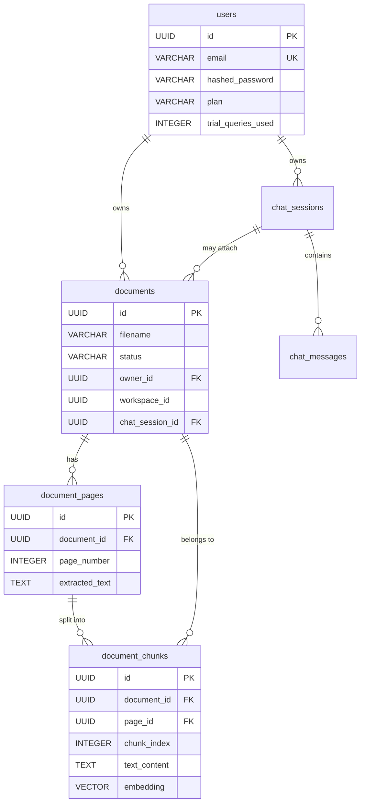

# 10 — SQL and Databases From Zero

**Prerequisites:** none. Every idea this chapter needs is re-explained where it
appears.

**What this chapter is for.** This system stores users, documents, pages, text
chunks, conversations, exam papers, billing state — about fifty kinds of thing —
in a database called PostgreSQL. The Python code talks to it through a library
that hides most of the details.

**We are going to learn the database first, and the library later.** That order
is deliberate. A tool that hides something is only safe in the hands of someone
who knows what is being hidden. Engineers who learn the library first can write
queries that work and cannot explain why one takes 4 milliseconds and another
takes 40 seconds — and they cannot fix it when it matters.

By the end of this chapter you will be able to read the actual tables in this
project, write real queries against them by hand, explain why each key,
constraint and index exists, and reason about what happens when two people press
the same button at the same moment.

---

# Part A — Why Databases Exist At All

## A.1 The problem: try doing it with files

A quick anchor first. A computer has two kinds of storage. **Memory (RAM)** is
fast and forgets everything when the power goes off. A **disk** is much slower
and remembers. A **file** is a named run of bytes on a disk.

So the obvious way to store a list of users is a file:

```
priya,priya@example.com,trial,3
arjun,arjun@example.com,paid,0
```

This works for about a week. Then every one of these problems arrives:

**1. Finding things is slow.** To find one user you read the whole file, line by
line. With ten users that is instant. With a million it is not, and it gets
worse every day.

**2. Two writers destroy each other.** Two requests arrive at the same moment.
Both read the file, both change their own copy in memory, both write it back.
The second overwrites the first, and one user's change vanishes with no error
anywhere.

**3. A crash halfway through leaves rubbish.** Writing a large file takes time.
If the power fails in the middle, you have half a file. Not an old version, not
a new version — a broken one.

**4. Nothing enforces the shape.** A line with four fields, a line with three, a
line where the count is the word "hello". Nothing objects until something reads
it and fails somewhere else entirely.

**5. Related data goes wrong.** Documents belong to users. If you delete a user,
who deletes their documents? If you forget, those documents stay forever,
pointing at somebody who no longer exists.

**6. Everybody writes their own searching code.** "Find all trial users who have
used more than five queries, newest first" is a loop somebody has to write, and
somebody else writes it slightly differently.

**A database is the program that solves all six.** That is the entire
justification, and every feature in this chapter maps to one of those six lines.

## A.2 What people tried before

**Flat files with hand-written index files (1960s).** Keep a second file that
says "user priya is at byte 4,096". Faster, and now you have two files that can
disagree — and no help when they do.

**Hierarchical databases (IBM's IMS, 1966).** Data was arranged as a tree: a
customer contains orders, an order contains lines. Fast for the questions the
tree was designed for. Terrible for anything else — the question "which
customers bought this product" ran against the grain of the tree, and answering
it meant restructuring the data or scanning everything.

**Network databases (CODASYL, late 1960s).** Records linked by explicit
pointers. More flexible, and now the program had to *follow the pointers by
hand*. Your code contained the navigation. **Change the layout and every program
breaks.**

**The shared, fatal weakness of both:** the way data was physically stored was
baked into every program that used it.

## A.3 The relational model — the idea that won

In 1970 Edgar Codd, at IBM, published a paper proposing something different:
store data in **simple tables of rows and columns**, and let programs ask for
what they want **without saying how to find it**.

Two ideas, and both are still the reason this works:

**1. Data independence.** Programs describe *what* they want. The database
decides *how* to get it. Add an index, reorganise the storage, move to a bigger
machine — the queries do not change.

**2. A declarative language.** You write "give me the READY documents belonging
to this user, newest first". You do not write the loop. The database has a
component called the **query planner** whose only job is to work out the fastest
way, using what it knows about the data right now.

**Why that mattered so much.** In the pointer-chasing systems, the fastest way
was decided by the programmer, in advance, forever. In the relational model it
is decided by the machine, at the moment of asking, with current information.
When your table grows from a thousand rows to ten million, the planner changes
strategy. Your code does not.

**The language that expresses this is SQL** — Structured Query Language,
standardised in 1986, and still the way essentially all relational databases are
addressed. It is one of the very few technologies from the 1970s that a person
learning today will still be using in thirty years.

## A.4 What this project uses, and why

**PostgreSQL.** Free, open source, extremely reliable, and — the reason that
decided it here — extensible. This system needs to store the *meaning* of text
as long lists of numbers and find similar ones quickly. That is not something
databases traditionally do. PostgreSQL allows add-ons, and one called
**pgvector** teaches it exactly that skill (Part F.5).

Chapter 02 recorded the decision (D-012) with the arithmetic behind it: all the
number-lists in this system add up to roughly 24 gigabytes at a thousand users,
which fits one PostgreSQL instance comfortably. A second, specialised database
would have meant a second thing to back up, secure and keep consistent — and it
would have broken the ability to delete a document and its pieces in one
indivisible step (Part G).

---

# Part B — Tables, Rows and Columns

## B.1 The shape of everything

A **table** is a grid.
A **column** is a named vertical slot with one kind of value.
A **row** is one horizontal entry — one document, one user, one message.

Here is the real `documents` table in this project, shown as a grid with two
rows:

| id | filename | status | owner_id | size_bytes | created_at |
|---|---|---|---|---|---|
| 0a56…c1 | contract.pdf | READY | 8f3a…7d | 482113 | 2026-08-01 09:14:22+00 |
| 7b21…9e | resume.pdf | PROCESSING | 8f3a…7d | 91002 | 2026-08-02 11:02:05+00 |

Two documents, both belonging to the same person, one finished and one still
being processed.

**Creating that table in SQL:**

```sql
CREATE TABLE documents (
    id          UUID PRIMARY KEY,
    filename    VARCHAR NOT NULL,
    status      VARCHAR NOT NULL,
    owner_id    UUID NOT NULL,
    size_bytes  INTEGER NOT NULL,
    created_at  TIMESTAMPTZ DEFAULT now()
);
```

Every word does something, and the rest of this part explains each.

## B.2 Column types, and why they are not optional detail

A quick anchor: a computer stores everything as numbers. What makes the number
65 into the letter `A` is an agreement about how to interpret it. A **type** is
that agreement.

The types you need:

| Type | Holds | Notes |
|---|---|---|
| `INTEGER` | whole numbers | 4 bytes, up to about 2.1 billion |
| `BIGINT` | bigger whole numbers | 8 bytes |
| `VARCHAR(n)` / `TEXT` | text | in PostgreSQL these perform identically |
| `BOOLEAN` | true or false | |
| `TIMESTAMPTZ` | a moment in time, with time zone | |
| `UUID` | a 128-bit unique identifier | stored as 16 bytes |
| `JSON` / `JSONB` | a whole structure in one column | `JSONB` is stored parsed, and can be indexed |
| `VECTOR(1024)` | a list of 1024 numbers | added by pgvector |

**Why declaring a type matters — four reasons, all practical:**

1. **It rejects nonsense.** Putting `"hello"` in an `INTEGER` column fails
   immediately, at the moment of the mistake, rather than at the moment somebody
   tries to add it up.
2. **It saves space.** A UUID stored as text takes 36 bytes; stored as `UUID` it
   takes 16. Across ten million rows that is 200 megabytes of difference.
3. **It makes comparisons correct.** As text, `"10"` sorts *before* `"9"`. As
   numbers, it does not.
4. **It lets the database index efficiently**, because it knows what the values
   are.

**A real one from this project**, in
[`backend/app/models/document_chunk.py`](../backend/app/models/document_chunk.py),
with a comment that tells you exactly how much a type can cost:

```python
    # 1024 dimensions for BAAI/bge-m3 (current embedding_service model).
    # If you change the embedding model, you MUST also alter this column dim and
    # the HNSW index, then re-embed every chunk.
    embedding = Column(Vector(1024), nullable=True)
```

The number 1024 is not decoration. It is fixed by the model that produces those
lists. Change the model and the column, the index, and **every stored row** must
be regenerated. That is what "a type is a contract" means when the data is
already there.

## B.3 `NULL` — the third value, and the trap inside it

**`NULL` means "there is no value here".** Not zero, not empty text — *unknown
or absent*.

**Why it exists.** Some facts genuinely are not known. A document's
`workspace_id` may not be decided yet. A user may have no phone number.
Inventing a fake value to mean "none" is worse, because someone will eventually
treat it as real.

**And now the trap, which is one of the most common sources of wrong query
results in the world.** SQL has three-valued logic: true, false, and **unknown**.
Any comparison with `NULL` produces unknown, and rows where the condition is
unknown are **not returned**.

```sql
SELECT * FROM documents WHERE workspace_id = NULL;    -- returns NOTHING, ever
SELECT * FROM documents WHERE workspace_id IS NULL;   -- correct
```

The first is not an error. It runs, and it returns zero rows, always — because
`anything = NULL` is unknown, never true. Even `NULL = NULL` is unknown.

**The second trap is subtler and catches experienced people.** Consider:

```sql
SELECT * FROM documents WHERE status != 'READY';
```

Rows where `status` is `NULL` are **not** included, because `NULL != 'READY'` is
unknown, not true. If you meant "everything that is not ready, including the
ones we do not know about", you must say so:

```sql
SELECT * FROM documents WHERE status IS DISTINCT FROM 'READY';
```

**How to avoid the whole category:** make columns `NOT NULL` unless absence is
genuinely meaningful. `NOT NULL` means the database rejects a row that leaves it
empty.

**And in this project, one `NOT NULL` is a security control**, in
[`backend/app/models/document.py`](../backend/app/models/document.py):

```python
    owner_id = Column(UUID(as_uuid=True), index=True, nullable=False)
```

Every document must have an owner. A piece of code that forgets to set it does
not create an unowned document — it **fails, loudly, at the database**. Chapter
03 described the same principle in application code: make the unsafe thing
impossible rather than discouraged. Here it is enforced one layer deeper, where
no application bug can bypass it.

## B.4 The real `documents` table, column by column

```python
class Document(Base):
    __tablename__ = "documents"

    id = Column(UUID(as_uuid=True), primary_key=True, default=uuid.uuid4, index=True)
    filename = Column(String, index=True, nullable=False)
    file_hash = Column(String, index=True, nullable=False)
    mime_type = Column(String, nullable=False)
    size_bytes = Column(Integer, nullable=False)
    storage_path = Column(String, nullable=False)
    status = Column(Enum(DocumentStatus), default=DocumentStatus.PENDING_UPLOAD, nullable=False)

    owner_id = Column(UUID(as_uuid=True), index=True, nullable=False)
    workspace_id = Column(UUID(as_uuid=True), index=True, nullable=True)
    chat_session_id = Column(UUID(as_uuid=True), index=True, nullable=True)

    content_hash = Column(String(32), nullable=True, index=True)
    source = Column(String(20), nullable=True)

    created_at = Column(DateTime(timezone=True), server_default=func.now())
    updated_at = Column(DateTime(timezone=True), server_default=func.now(), onupdate=func.now())
```

Reading it as a database designer would:

- **`file_hash`** — a short fingerprint computed from the file's bytes. Two
  identical files produce the same fingerprint, which is how the system spots
  that a document has already been uploaded. It is indexed because it is
  *searched by*, which is the rule for indexes (Part F).
- **`storage_path`** — where the actual file lives. **The file itself is not in
  the database.** Chapter 02 gave the rule: databases store facts about files;
  file storage stores files. A 200 MB PDF inside a row makes every backup and
  every copy of the database miserable.
- **`status`** — one of eight fixed words. The `Enum` means the database itself
  rejects a ninth.
- **`owner_id` NOT NULL, `workspace_id` and `chat_session_id` nullable** — three
  identifiers with three different meanings. Owner must exist. The other two are
  optional groupings. **The nullability is the design**: it states which facts
  are required and which are not.
- **`created_at` / `updated_at` with `server_default=func.now()`** — the
  *database* fills these in, not the application. That matters because every
  application server has its own clock and they drift; the database has one
  clock, so timestamps are comparable.

---

# Part C — Keys

## C.1 The primary key: how a row is identified

**The problem.** Two documents can have the same filename, the same size, the
same owner and the same upload minute. How do you refer to *this* one?

**A primary key is a column whose value uniquely identifies a row.** The
database enforces uniqueness, forbids `NULL`, and automatically builds an index
for it — so looking a row up by key is the fastest thing a database does.

**Two ways to choose one**, and it is a genuine decision with consequences:

**Auto-incrementing integers** — 1, 2, 3, …

- Small, fast, easy to read in logs.
- The database must assign them, so you cannot know the id until after
  inserting.
- **They are guessable.** `/documents/124` tells an attacker to try 125. Chapter
  03 called this an enumeration oracle.
- They leak business information: customer #38 tells the world you have had 38
  customers.

**UUIDs** — 128-bit random identifiers like `0a56958c-…`.

- Not guessable, and they reveal nothing.
- **They can be generated anywhere** — by the application, by a worker, by a
  browser — before any database call. That is what allows this project's upload
  flow to create a document id, hand it to the browser, and have the browser
  upload the bytes with that id already agreed.
- Bigger (16 bytes rather than 4) and not human-friendly.
- Random UUIDs land in random places in an index, which makes writes slightly
  less efficient than sequential numbers (Part F.3).

**This project chose UUIDs everywhere**, and the upload flow is the strongest
reason: the id must exist before the file does.

## C.2 The foreign key: how tables relate

**The problem.** A chunk of text belongs to a document. If you store
`document_id` on the chunk and nothing checks it, you can end up with chunks
pointing at documents that never existed or that were deleted — **orphans**.
Every query joining them then quietly returns fewer rows than expected, and
nothing errors.

**A foreign key is a column that must contain a value that exists in another
table's primary key.** The database refuses anything else.

```sql
CREATE TABLE document_chunks (
    id           UUID PRIMARY KEY,
    document_id  UUID NOT NULL REFERENCES documents(id) ON DELETE CASCADE,
    page_id      UUID NOT NULL REFERENCES document_pages(id) ON DELETE CASCADE,
    chunk_index  INTEGER NOT NULL,
    text_content TEXT NOT NULL
);
```

**What it enforces, in both directions:**

1. You cannot insert a chunk pointing at a document that does not exist.
2. You cannot delete a document that still has chunks — **unless** you say what
   should happen, which is the next section.

That property has a name: **referential integrity**. It means the links between
tables are always real.

## C.3 `ON DELETE CASCADE`

When a document is deleted, what happens to its pages and chunks?

Four possible answers, and the database will do whichever you specify:

- `RESTRICT` / `NO ACTION` — refuse the delete while children exist.
- `CASCADE` — delete the children too.
- `SET NULL` — keep the children, empty their link.
- `SET DEFAULT` — keep them, point them somewhere else.

This project chooses `CASCADE` for pages and chunks, and it is the right choice
for a specific reason: **a chunk has no meaning without its document.** It is not
an independent thing that happens to be linked; it is a piece of that document.

**What it buys, concretely:** deleting a 200-page document removes one row, and
the database removes its ~200 pages and ~400 chunks in the same indivisible
step. Without cascade, the application would have to delete children first, in
the right order, and any crash halfway would leave orphans behind forever.

**The danger, stated honestly:** cascade means a small delete can quietly become
an enormous one. Deleting a user with cascade all the way down could remove
hundreds of thousands of rows in one statement — locking things, taking time,
and with no confirmation step. That is a good reason to be deliberate about
where cascade is *not* used.

## C.4 Unique constraints

A primary key is unique. Sometimes another column must be too.

```python
    email = Column(String, unique=True, index=True, nullable=False)
```

From [`backend/app/models/org.py`](../backend/app/models/org.py). Two accounts
cannot share an email address, and **the database is what guarantees it**.

**Why that matters more than an application check.** Imagine checking in Python:
"is this email already taken? No? Then insert." Two people register with the
same address at the same moment. Both checks run before either insert. Both see
"not taken". Both insert. Now you have two accounts with one email, and every
login is ambiguous.

**A unique constraint cannot be beaten this way**, because the database applies
it at the moment of writing. The second insert fails. Your application catches
that failure and shows "email already registered".

**The general rule, and it is one of the most valuable in this chapter:**
*a check that is separate from the write is a race waiting to happen; a
constraint is part of the write.*

The same file shows a second one:

```python
    share_token: Mapped[Optional[str]] = mapped_column(String(32), unique=True, nullable=True)
```

Share tokens must be unique — two chats sharing a token would let one link open
the wrong conversation. Note it is also nullable: most chats are not shared. In
PostgreSQL, `NULL` values do not conflict with each other in a unique index, so
thousands of unshared chats coexist happily.

## C.5 The four-table document hierarchy

Now the real structure of this system's core data:



`PK` marks a primary key, `FK` a foreign key, `UK` a unique column.

**One thing in that diagram deserves attention**, because it looks like a
mistake and is not. `document_chunks` has **both** `document_id` and `page_id`,
even though the page already knows its document. Storing a fact you could
derive is called **denormalisation**, and it is done here for a specific reason:
the retrieval query filters chunks by document constantly. Having the column
directly means one fewer join on the hottest path in the system.

**The price** is that the two must agree. If a chunk's `page_id` pointed at a
page belonging to a different document, nothing would notice. That is the
standard trade: **denormalisation buys speed and costs an invariant you must
now maintain yourself.**

---

# Part D — Relationships and Normalisation

## D.1 The three shapes

**One-to-many.** One document has many pages. Implemented by putting the "one"
side's id on the "many" side — `document_pages.document_id`. This is by far the
most common relationship.

**Many-to-one.** The same relationship seen from the other end.

**Many-to-many.** A student takes many courses; a course has many students.
Neither side can hold the other's id, so you need a third table:

```sql
CREATE TABLE enrolments (
    student_id UUID NOT NULL REFERENCES students(id),
    course_id  UUID NOT NULL REFERENCES courses(id),
    PRIMARY KEY (student_id, course_id)
);
```

That is a **junction table**, and note its primary key is *two columns together*
— a **composite key** — which also guarantees nobody is enrolled twice.

## D.2 Normalisation, taught by watching it go wrong

**Normalisation is the practice of storing each fact exactly once.**

Suppose we had stored chunks like this instead:

| chunk_id | text | document_filename | document_owner_email |
|---|---|---|---|
| c1 | "The lessee shall…" | contract.pdf | priya@example.com |
| c2 | "Notice period of…" | contract.pdf | priya@example.com |
| c3 | "Rent payable…" | contract.pdf | priya@example.com |

Convenient — one table answers everything. And it produces three classic
problems, each with a name:

**Update anomaly.** Priya changes her email. Now you must update every chunk
row. Miss one, and the database holds two different emails for one person and
neither is obviously wrong.

**Insertion anomaly.** You cannot record a document that has no chunks yet,
because a row requires a chunk.

**Deletion anomaly.** Delete the last chunk and you have destroyed the record
that the document and its owner existed.

**The fix is the structure this project actually uses:** the email lives in
`users` once, the filename lives in `documents` once, and chunks store only
*links*. Change an email in one place and every question about it is
automatically correct.

**The formal levels, briefly**, because interviewers ask:

- **First normal form (1NF):** each cell holds one value, not a list.
- **Second normal form (2NF):** in 1NF, and every non-key column depends on the
  *whole* key, not part of it.
- **Third normal form (3NF):** in 2NF, and no non-key column depends on another
  non-key column.

**The practical version you can actually use**, which is what most engineers
carry: *every fact lives in exactly one place, and every column in a table
describes the thing the primary key identifies.* If a column describes something
else, it belongs in another table.

## D.3 When to break the rule on purpose

Normalisation optimises for correctness of updates. It costs joins on reads.
When a read is on a hot path and the value never changes, storing it twice can
be right.

Chapter 02's lecture-search example used it deliberately: copying `course_id`
onto every transcript segment so that the search query could filter directly
instead of joining. This project does the same with `document_chunks.document_id`
(C.5).

**The rule for doing it safely:** denormalise only when you can say *what keeps
the copies consistent*. If the answer is "we remember to", you have created a
future bug.

---

# Part E — SQL, The Language

## E.1 The mental shift: describe, do not instruct

Most programming tells the computer *how*: loop over this, compare that, collect
the results. SQL tells it *what*: these rows, matching this condition, in this
order.

```sql
SELECT filename, created_at
FROM documents
WHERE owner_id = '8f3a...7d' AND status = 'READY'
ORDER BY created_at DESC
LIMIT 20;
```

You did not say whether to use an index, which order to apply the filters, or
how to sort. The **query planner** decides all of that, and its decision changes
as the data grows.

**This is the single biggest adjustment for a new SQL writer**, and it has a
practical consequence: when a query is slow, you do not "fix the loop" — you
either give the planner better information (an index, updated statistics) or you
ask a different question.

## E.2 Reading data

```sql
SELECT * FROM documents;                              -- every column, every row
SELECT filename, status FROM documents;               -- two columns
SELECT filename FROM documents WHERE status = 'READY';
SELECT filename FROM documents WHERE size_bytes > 100000 AND status = 'READY';
SELECT filename FROM documents WHERE filename LIKE '%contract%';
SELECT filename FROM documents WHERE status IN ('READY', 'INDEXING');
SELECT filename FROM documents ORDER BY created_at DESC LIMIT 10;
SELECT DISTINCT status FROM documents;                -- each value once
```

**Never write `SELECT *` in application code.** Three reasons: it fetches
columns you do not need (including, here, a 4-kilobyte embedding per chunk); it
breaks silently when someone adds a column; and it hides which columns the code
actually depends on, so nobody can safely remove one.

## E.3 Changing data

```sql
INSERT INTO documents (id, filename, status, owner_id, size_bytes)
VALUES ('0a56...c1', 'contract.pdf', 'PENDING_UPLOAD', '8f3a...7d', 482113);

UPDATE documents SET status = 'READY' WHERE id = '0a56...c1';

DELETE FROM documents WHERE id = '0a56...c1';
```

**The most important safety habit in this whole chapter:** an `UPDATE` or
`DELETE` without a `WHERE` clause applies to **every row in the table**. There
is no confirmation and no undo.

```sql
DELETE FROM documents;        -- deletes everything. Instantly.
```

Professionals write the `SELECT` first, look at what comes back, and only then
change it into an `UPDATE` or `DELETE` with the same `WHERE`.

## E.4 Summarising

**Aggregate functions** collapse many rows into one value:

```sql
SELECT COUNT(*) FROM documents;
SELECT COUNT(*) FROM documents WHERE status = 'READY';
SELECT AVG(size_bytes), MAX(size_bytes) FROM documents;
```

**`GROUP BY`** produces one row per group:

```sql
SELECT status, COUNT(*) AS n
FROM documents
GROUP BY status
ORDER BY n DESC;
```

That single query answers "how many documents are in each stage of the
pipeline?" — which, in this system, is exactly how you would find documents
stuck in `PROCESSING` (Chapter 02's critique named that missing check as a real
gap).

**`HAVING` filters groups**, where `WHERE` filters rows:

```sql
SELECT owner_id, COUNT(*) AS n
FROM documents
GROUP BY owner_id
HAVING COUNT(*) > 50;
```

`WHERE` runs before grouping and cannot see the counts; `HAVING` runs after.
Mixing them up is one of the most common beginner errors.

## E.5 Joins — using several tables at once

**The problem.** Chunks are stored with a `document_id`, not a filename. But a
citation must say *contract.pdf, page 4*. The filename is in another table.

**A join matches rows from two tables using a condition.**

```sql
SELECT c.text_content, d.filename
FROM document_chunks AS c
JOIN documents AS d ON c.document_id = d.id
WHERE d.owner_id = '8f3a...7d';
```

`AS c` and `AS d` are **aliases** — short names so the rest of the query is
readable.

**The kinds of join, and what each is for:**

- **`INNER JOIN`** (the default) — only rows that match on both sides. A chunk
  with no document disappears.
- **`LEFT JOIN`** — every row from the left table, with `NULL`s where the right
  has no match. Use it when the absence is the thing you care about.
- **`RIGHT JOIN`** — the mirror image; rarely used, because you can swap the
  tables.
- **`FULL OUTER JOIN`** — everything from both sides.

**A `LEFT JOIN` finding a real problem:**

```sql
SELECT d.id, d.filename
FROM documents AS d
LEFT JOIN document_chunks AS c ON c.document_id = d.id
WHERE d.status = 'READY' AND c.id IS NULL;
```

*Documents marked READY that have no chunks at all.* Those are documents the
system believes are searchable and which contain nothing — a real failure mode
this project's own pipeline could produce, and one query finds them.

**How a join actually works internally**, because it explains the performance:

- **Nested loop** — for each row on the left, look up matches on the right. Fast
  when one side is small *and* the join column is indexed.
- **Hash join** — build a lookup table of one side in memory, then scan the
  other once. Good for larger sets.
- **Merge join** — sort both sides and walk them together. Good when both are
  already sorted.

The planner picks. **Your job is to make sure the join column is indexed**,
because a nested loop without an index is a full scan of the right-hand table
for every single row on the left — the difference between milliseconds and
minutes.

## E.6 Subqueries and CTEs

A **subquery** is a query inside a query:

```sql
SELECT filename FROM documents
WHERE owner_id IN (SELECT id FROM users WHERE plan = 'trial');
```

A **CTE** (common table expression) is the same thing given a name, which is far
easier to read:

```sql
WITH trial_users AS (
    SELECT id FROM users WHERE plan = 'trial'
)
SELECT d.filename
FROM documents d
JOIN trial_users t ON d.owner_id = t.id;
```

For anything with more than one step, prefer the CTE. Queries are read many more
times than they are written.

## E.7 The real retrieval query, as SQL

The most important query in this system runs on every question a user asks. In
the code it is built with a library, but this is what the database actually
receives — and you can now read all of it:

```sql
SELECT
    c.id,
    c.text_content,
    c.chunk_index,
    p.page_number,
    d.filename,
    1 - (c.embedding <=> :query_vector) AS similarity
FROM document_chunks AS c
JOIN documents      AS d ON c.document_id = d.id
JOIN document_pages AS p ON c.page_id = p.id
WHERE d.owner_id = :owner_id
  AND d.workspace_id = :workspace_id
  AND d.status = 'READY'
ORDER BY c.embedding <=> :query_vector
LIMIT 30;
```

Line by line:

- **`SELECT`** names exactly the columns needed. Note it does *not* select
  `c.embedding` — 4 kilobytes per row that nobody would use.
- **`1 - (c.embedding <=> :query_vector)`** — `<=>` is pgvector's operator for
  **cosine distance**: how different two lists of numbers point in direction.
  Small means similar. Subtracting from 1 turns it into a similarity, where
  bigger is better, because that is easier for humans to read.
- **`:query_vector`** is a **parameter** — a placeholder filled in safely by the
  driver. It is *never* built by joining text together, and Part I explains why
  that distinction is a security boundary.
- **Two joins** bring in the page number and the filename, which are what makes
  a citation possible.
- **`WHERE d.owner_id = :owner_id`** — the tenant filter. Chapter 03 spent a
  whole section on the consequences of this line being absent.
- **`ORDER BY c.embedding <=> :query_vector`** — nearest first. This is the
  line that uses the vector index (F.5).
- **`LIMIT 30`** — a wide net for the reranking stage that follows.

**One thing worth noticing as an engineer:** the ordering uses the raw distance,
while the selected column is the similarity. Sorting by the underlying operator
is what allows the index to be used; sorting by the computed `similarity` alias
might not. Small detail, large difference — from index scan to full scan.

---

# Part F — Indexes

## F.1 The problem

```sql
SELECT * FROM documents WHERE owner_id = '8f3a...7d';
```

Without help, the database reads **every row** in the table and checks each one.
That is a **sequential scan**. With 100 rows it is instant. With 10 million it
is seconds — and if that query runs on every request, the system stops.

## F.2 What an index is and how it works

**An index is an extra data structure that lets the database find matching rows
without reading all of them.** The everyday comparison is the index at the back
of a book: rather than reading 500 pages to find "photosynthesis", you look it
up and are sent straight to page 214.

The default kind is a **B-tree**. Picture a tree of sorted signposts:

```
                 [ m ]
                /     \
          [ f ]         [ s ]
         /     \       /     \
     a..e     g..l   n..r   t..z
```

To find a value you start at the top and follow one branch at each level. With
a million rows the tree is about three or four levels deep, so a lookup touches
**three or four pages instead of a million rows**. Doubling the data adds
roughly one comparison, not double the work.

**What a B-tree can do:** exact matches (`=`), ranges (`<`, `>`, `BETWEEN`),
sorting (because it is already in order), and prefix matches (`LIKE 'con%'`).

**What it cannot do:** `LIKE '%con%'` — a match in the middle, because the tree
is organised by beginnings. That is what full-text search is for, which this
system also uses.

## F.3 What an index costs

Indexes are not free, and beginners under-appreciate this.

1. **Writes get slower.** Every insert, update and delete must also update every
   index on the table. Five indexes means five extra updates per write.
2. **They take space.** Often a significant fraction of the table's own size.
3. **An unused index is pure loss** — all of the cost, none of the benefit.

**The rule: index the columns you search by, join on, or sort by. Nothing
else.**

## F.4 The indexes in this project, and why each exists

```python
    id          = Column(UUID, primary_key=True, index=True)
    filename    = Column(String, index=True, nullable=False)
    file_hash   = Column(String, index=True, nullable=False)
    owner_id    = Column(UUID, index=True, nullable=False)
    workspace_id = Column(UUID, index=True, nullable=True)
    chat_session_id = Column(UUID, index=True, nullable=True)
    content_hash = Column(String(32), nullable=True, index=True)
```

- **`owner_id`** — every single query filters by it (Chapter 03's tenancy rule).
  This is the most important index in the system.
- **`file_hash` and `content_hash`** — searched by, to detect duplicate uploads.
- **`workspace_id`, `chat_session_id`** — narrowing filters on the same hot
  query.
- **`filename`** — searched by in listings.
- **`id`** — the primary key, which is indexed automatically; the extra
  `index=True` is redundant, which is a small real finding for the critique.

**A composite index worth knowing about, and a real improvement available
here.** An index on several columns together:

```sql
CREATE INDEX ix_documents_owner_status ON documents (owner_id, status);
```

serves the query `WHERE owner_id = ? AND status = 'READY'` better than two
separate indexes. **Column order matters:** this index also helps a query
filtering on `owner_id` alone, but not one filtering on `status` alone — the
same way a phone book sorted by surname then first name is useless if you only
know the first name.

## F.5 HNSW — the index for meanings

Now the interesting one. This system stores, for each chunk of text, a list of
1024 numbers representing its meaning. A question is turned into the same kind
of list, and the task is to find the closest ones.

**A B-tree cannot help.** It orders values along one dimension; "close in 1024
dimensions" is not a range on any single column.

Checking every chunk works and is called an **exact nearest-neighbour search**.
It is correct and it costs a full scan of every vector — the very thing indexes
exist to avoid.

**HNSW** (Hierarchical Navigable Small World) is an approximate answer, and the
idea is genuinely elegant. Build a graph where each vector links to some of its
near neighbours, in several layers. The top layer is sparse with long links; the
bottom layer is dense with short ones. To search, start at the top, greedily
walk towards the query, then drop a layer and refine. **Like finding a house by
taking the motorway, then the main road, then the street.**

Here is the real declaration, in `document_chunk.py`:

```python
    __table_args__ = (
        Index('ix_document_chunks_embedding', 'embedding',
              postgresql_using='hnsw',
              postgresql_with={'m': 16, 'ef_construction': 64},
              postgresql_ops={'embedding': 'vector_cosine_ops'}),
    )
```

- **`postgresql_using='hnsw'`** — build this kind of index.
- **`m: 16`** — how many neighbours each node links to. Higher means a better
  graph, more memory, slower building.
- **`ef_construction: 64`** — how hard to search while building. Higher means a
  better index and a slower build.
- **`vector_cosine_ops`** — measure distance by direction, which must match how
  the query measures it. **A mismatch here does not error; it silently returns
  worse results.**

**The word "approximate" is the trade, and you must be able to state it:** HNSW
may occasionally miss a true nearest neighbour. In exchange, a search touches a
few hundred vectors instead of millions. For finding relevant passages, missing
the 8th-best match sometimes is a price worth paying; for a bank reconciliation
it would not be.

## F.6 Seeing what the database actually does

```sql
EXPLAIN ANALYZE
SELECT filename FROM documents WHERE owner_id = '8f3a...7d';
```

`EXPLAIN` shows the plan; `ANALYZE` runs it and shows real timings. The words to
look for:

- **`Seq Scan`** — reading every row. Fine on a small table, a red flag on a
  large one.
- **`Index Scan`** — using an index. Usually what you want.
- **`Bitmap Heap Scan`** — an index plus a batched fetch; normal for medium
  result sets.
- **`Nested Loop` / `Hash Join`** — how the join is being done.
- **`rows=` estimates versus actual** — a large gap means the planner's
  statistics are stale and its choices are based on a wrong picture.

**This is the first thing to run when a query is slow**, before changing any
code. Guessing at the cause of a slow query is how people add indexes that do
nothing.

---

# Part G — Transactions

## G.1 The problem

Uploading a document writes several rows: the document, its pages, its chunks.
Suppose the process crashes after the pages and before the chunks.

You now have a document that says `READY` with no chunks — **a document the
system believes is searchable and which contains nothing.** No error was raised.
Nobody knows.

**A transaction is a group of statements that either all happen or none
happen.**

```sql
BEGIN;
INSERT INTO documents (...) VALUES (...);
INSERT INTO document_pages (...) VALUES (...);
INSERT INTO document_chunks (...) VALUES (...);
COMMIT;
```

If anything fails before `COMMIT`, or the connection dies, everything is
discarded as though it never began. `ROLLBACK` does it deliberately.

## G.2 ACID — four promises

**A — Atomicity.** All or nothing. *Without it:* half-written data, as above.

**C — Consistency.** The database moves from one valid state to another; all
constraints hold at the end. *Without it:* chunks pointing at deleted documents,
two users with one email.

**I — Isolation.** Concurrent transactions do not see each other's unfinished
work. *Without it:* one request reads a half-finished upload and behaves as if
it were complete.

**D — Durability.** Once `COMMIT` returns, the data survives a power cut.
*Without it:* your database tells the user "saved" and forgets.

**How durability is actually achieved**, because it is worth knowing: before
changing the data files, PostgreSQL writes what it is about to do to a
sequential log called the **write-ahead log (WAL)**. Appending to a log is fast.
If the machine dies, the log is replayed on restart. **The promise "your data is
safe" is implemented by writing it down twice, cheaply first.**

## G.3 Isolation levels

Perfect isolation is expensive, so databases offer levels. Each permits certain
anomalies:

| Level | Dirty read | Non-repeatable read | Phantom read |
|---|---|---|---|
| Read Uncommitted | possible | possible | possible |
| **Read Committed** (PostgreSQL default) | no | possible | possible |
| Repeatable Read | no | no | possible in theory |
| Serializable | no | no | no |

- **Dirty read** — seeing another transaction's uncommitted changes.
- **Non-repeatable read** — reading a row twice in one transaction and getting
  different values, because somebody committed in between.
- **Phantom read** — running the same query twice and getting *extra rows*.

**PostgreSQL's default is Read Committed**, which means: each statement sees a
snapshot taken when *that statement* began. So within one transaction, two
identical `SELECT`s can return different data.

**That fact is the reason Part G.6 is a bug.**

## G.4 Locks

To stop two transactions changing the same row simultaneously, the database
**locks** it. An `UPDATE` takes a row lock and holds it until commit; anyone
else updating that row waits.

You can also lock deliberately while reading:

```sql
SELECT * FROM users WHERE id = '8f3a...' FOR UPDATE;
```

`FOR UPDATE` means "I intend to change this; nobody else may touch it until I am
done." Anyone else running the same statement waits.

**Deadlock** is when two transactions each hold what the other needs. PostgreSQL
detects it and kills one with an error. **The standard prevention is to always
acquire locks in the same order everywhere** — if every code path locks users
before documents, a cycle cannot form.

## G.5 The cost of holding a transaction open

A transaction holds a database connection, and Chapter 02 established that this
deployment has a budget of about fifteen connections in total. A transaction
that stays open while waiting for something slow — an API call, a file upload —
holds one of those fifteen for the whole time.

**The rule: never do slow, unrelated work inside a transaction.** Get in, change
the rows, get out.

## G.6 A real race condition in this repository

Now we apply everything, to real code.

### The code

[`backend/app/core/trial_enforcement.py`](../backend/app/core/trial_enforcement.py)
enforces the free trial: ten questions, then you must upgrade.

```python
TRIAL_QUERY_LIMIT = 10

async def check_and_increment_trial(user_id: str, db: AsyncSession) -> dict:
    ...
    result = await db.execute(select(User).where(User.id == user_uuid))
    user = result.scalar_one_or_none()
    ...
    if user.trial_queries_used >= TRIAL_QUERY_LIMIT:
        raise HTTPException(status_code=402, detail={...})

    await db.execute(
        update(User)
        .where(User.id == user_uuid)
        .values(trial_queries_used=User.trial_queries_used + 1)
    )
    await db.commit()
```

### What it does well — and this part is genuinely good

Look closely at the increment:

```python
.values(trial_queries_used=User.trial_queries_used + 1)
```

`User.trial_queries_used + 1` here is **not** Python arithmetic on a value the
application read. It produces SQL:

```sql
UPDATE users SET trial_queries_used = trial_queries_used + 1 WHERE id = ...;
```

The addition happens **inside the database**, on the current value, under a row
lock. That is the correct way to increment a counter, and it is a distinction
most people get wrong. The wrong version —

```python
.values(trial_queries_used=user.trial_queries_used + 1)   # note: `user.`, the value we read
```

— computes 9 + 1 in Python and writes 10 unconditionally, so two concurrent
requests both write 10 and one query is given away free. **The one-character
difference between `User.` and `user.` is the difference between a correct
counter and a lost update.**

### The problem that remains

The *increment* is atomic. The *check* is not part of it.

Trace two requests from the same user, who has used 9 of 10:

```
Request A                          Request B
---------                          ---------
SELECT user  → used = 9
                                   SELECT user  → used = 9
9 >= 10 ? No  → allowed
                                   9 >= 10 ? No  → allowed
UPDATE ... used = used + 1  → 10
                                   UPDATE ... used = used + 1  → 11
```

**The user received eleven queries on a ten-query trial**, and the stored count
is now 11 — a value the limit says is impossible.

This shape has a name: **time-of-check to time-of-use (TOCTOU)**. The state you
checked is not guaranteed to still hold when you act on it. It is exactly the
same shape as the unique-email race in C.4, and exactly the shape Chapter 03
described for double-clicking a Send button — *a check that is separate from the
action is a race*.

**How likely is it in practice?** It needs two requests from the same user
within a few milliseconds — which the interface makes uncommon but not
impossible: a double-click, a retry, two open tabs. And the *value* leaked is
small: a few free queries. **Severity is low; the pattern is what matters**, and
the same pattern applied to a payment or a stock count would be serious.

### Three ways to fix it, with real trade-offs

**Fix 1 — lock the row while checking.**

```python
result = await db.execute(
    select(User).where(User.id == user_uuid).with_for_update()
)
```

The second request blocks at the `SELECT` until the first commits, then reads
the true value of 10 and refuses. *Cost:* requests from the same user serialise
briefly, and the transaction must stay short.

**Fix 2 — put the condition into the update itself.**

```sql
UPDATE users
SET    trial_queries_used = trial_queries_used + 1
WHERE  id = :id AND trial_queries_used < 10
RETURNING trial_queries_used;
```

One statement that checks and acts indivisibly. If it updates **zero rows**, the
limit was already reached — refuse. *Cost:* the limit moves into the SQL, so
`TRIAL_QUERY_LIMIT` is no longer the single source of truth unless it is passed
as a parameter. **This is usually the best fix**, because it removes the window
rather than guarding it.

**Fix 3 — a database constraint as a backstop.**

```sql
ALTER TABLE users ADD CONSTRAINT trial_limit
  CHECK (plan <> 'trial' OR trial_queries_used <= 10);
```

The database refuses to store an impossible value at all. *Cost:* it turns a
business rule into schema, so changing the limit becomes a migration. Best used
*alongside* fix 2, not instead of it — a last line of defence, exactly like
`owner_id NOT NULL`.

**The general lesson, which is the point of this whole section:**

> When a decision depends on a value that another request can change, the check
> and the action must be **one operation** — one statement, or one transaction
> holding a lock. Anything else is a window, and windows get hit eventually.

---

# Part H — Constraints Are the Last Line of Defence

Every constraint in this schema is a rule the *database* enforces, so no
application bug can violate it:

| Constraint | Example here | What it prevents |
|---|---|---|
| `PRIMARY KEY` | `documents.id` | duplicate or unidentifiable rows |
| `NOT NULL` | `documents.owner_id` | a document with no owner |
| `UNIQUE` | `users.email`, `chat_sessions.share_token` | two accounts on one email; a shared token collision |
| `FOREIGN KEY` | `document_chunks.document_id` | chunks pointing at nothing |
| `ON DELETE CASCADE` | pages and chunks | orphans after a delete |
| `CHECK` | *(not used here)* | values outside an allowed range |
| type | `size_bytes INTEGER` | text where a number belongs |

**The principle, and it is the same one that runs through this entire course:**
an application check can be forgotten, bypassed by a second code path, or lost
in a race. A constraint cannot. **Put the rule as close to the data as you
can.**

---

# Part I — Mistakes and Debugging

## I.1 Beginner mistakes

1. **`= NULL` instead of `IS NULL`.** Silently returns nothing.
2. **`UPDATE`/`DELETE` with no `WHERE`.** Write the `SELECT` first.
3. **`SELECT *` in application code.** Fetches what you do not need, breaks
   silently when the schema changes.
4. **Confusing `WHERE` and `HAVING`.**
5. **Assuming rows come back in a stable order without `ORDER BY`.** There is no
   guarantee. Ever.
6. **Storing money in a floating-point column.** `0.1 + 0.2` is not `0.3` in
   binary. Use integers of the smallest unit, or `NUMERIC`.
7. **Storing dates as text.** Sorting and comparing then behave alphabetically.

## I.2 Production mistakes

**1. SQL injection — the one that matters most.** Building a query by joining
text together:

```python
# NEVER
query = f"SELECT * FROM users WHERE email = '{email}'"
```

If somebody registers with the email `' OR '1'='1`, the query becomes
`... WHERE email = '' OR '1'='1'` and returns every user. Worse inputs delete
tables.

**The fix is parameters, always:**

```python
await db.execute(select(User).where(User.email == email))    # safe
```

The value is sent to the database *separately* from the query text, so it can
never be interpreted as part of the command. This is why the retrieval query in
E.7 uses `:query_vector` rather than pasting numbers in.

**This project is structurally safe here** because everything goes through a
query builder. The one documented exception is worth quoting, from
`core/tenant_scope.py`:

> *"Covers **ORM** SELECTs. A raw `text()` query bypasses it entirely, exactly
> as it bypasses any ORM-level control."*

**Note what that sentence is doing:** stating the limit of a control rather than
implying it covers everything. Chapter 03 argued that a control which overstates
itself is worse than an absent one.

**2. The N+1 query problem.** You fetch 50 documents, then loop over them
fetching each one's chunks. That is 1 + 50 = 51 round trips where 2 would do.
Each is a network round trip; 51 of them is easily a second of pure waiting.

The fix is to fetch in one query with a join, or to fetch all the children at
once with `WHERE document_id IN (...)`.

**This repository had exactly this**, fixed in commit `3daf888` — *"perf(queries):
batch the two N+1 loops, and close the tenancy hole in the research one"*. Note
what the title says: while batching the loops, a missing tenant filter was found
in one of them. **Two defects in one place is normal — code nobody has looked at
closely tends to have more than one problem.**

**3. Missing index on a foreign key.** PostgreSQL indexes primary keys
automatically but **not** foreign keys. A join or a cascade delete on an
unindexed foreign key scans the whole child table. This project indexes them
explicitly (`document_id`, `page_id`, `session_id`), which is correct and easy
to forget.

**4. Long transactions.** Holding a transaction open across a slow call ties up
one of a small number of connections.

**5. Inconsistent timestamp types.** This project has both:

```python
    created_at = Column(DateTime(timezone=True), server_default=func.now())   # documents
    created_at: Mapped[datetime] = mapped_column(DateTime, default=datetime.utcnow)  # chat_sessions
```

The first stores a moment with its time zone and lets the *database* clock set
it. The second stores a "naive" timestamp with no zone, set by the *application*
clock. Comparing them across tables, or across two application servers whose
clocks differ, is a bug waiting for a busy day. **Pick one convention —
`TIMESTAMPTZ`, set by the database — and use it everywhere.**

## I.3 Debugging techniques

1. **Run `EXPLAIN ANALYZE` before changing anything.** Look for `Seq Scan` on a
   large table and for estimated rows far from actual.
2. **Log slow queries.** PostgreSQL's `log_min_duration_statement` prints every
   query slower than a threshold. This project has a related setting,
   `SLOW_QUERY_THRESHOLD_MS: int = 8000`.
3. **Ask the database what it is doing right now:**
   ```sql
   SELECT pid, state, query, now() - query_start AS duration
   FROM pg_stat_activity
   WHERE state <> 'idle'
   ORDER BY duration DESC;
   ```
   This is the first thing to run when the application is slow and nobody knows
   why. It shows long-running queries and transactions stuck in
   `idle in transaction` — which is the classic cause of connection exhaustion.
4. **Check index usage:**
   ```sql
   SELECT relname, indexrelname, idx_scan
   FROM pg_stat_user_indexes ORDER BY idx_scan ASC;
   ```
   Indexes with `idx_scan = 0` are costing writes and buying nothing.
5. **Reproduce on a copy, never on production.** An `EXPLAIN` is safe; an
   experimental `UPDATE` is not.

---

# Part J — How Companies Use This

- **PostgreSQL is the default choice** for new applications at a large fraction
  of companies — free, reliable, and extensible in ways (like pgvector) that
  keep it relevant as requirements change.
- **The "use one database until the numbers say otherwise" instinct** in
  Chapter 02's D-012 is mainstream advice. Adding a specialised store is a real
  operational cost, and most systems never need it.
- **Migrations are how schemas change in production** — a versioned, ordered
  history of changes rather than hand-typed `ALTER TABLE`. That is Chapter 17.
- **Read replicas** are the usual first scaling step: copies that serve reads
  while one machine takes writes.
- **Sharding** — splitting data across machines by key — is the last resort,
  because it makes joins and transactions across shards hard or impossible.
- **In interviews**, the reliable questions are: explain a join; what is an
  index and what does it cost; what is a transaction and what does ACID mean;
  how would you find why a query is slow; and what is SQL injection. Part L
  answers all of them.

---

# Part K — Exercises

Write these by hand against this project's real tables. You do not need a
running database to reason about them; if you want one,
`docker compose up db` gives you PostgreSQL on port 5433.

### Level 0 — Reading

**K1.** In one sentence each, say what a table, a row, a column and a primary
key are.

**K2.** Write a query returning the filename and status of every document.

**K3.** Write a query returning only documents whose status is `READY`.

### Level 1 — Filtering and ordering

**K4.** Return the ten most recently created documents, newest first, showing
filename and creation time.

**K5.** Return documents belonging to owner `8f3a...7d` that are larger than
100,000 bytes.

**K6.** Return documents whose `workspace_id` has never been set. Explain why
the obvious version of this query is wrong.

### Level 2 — Grouping and joining

**K7.** Count documents by status, most common first. Say what this query would
tell you about a stuck pipeline.

**K8.** Return each chunk's text with its document's filename and its page
number. Say which join columns must be indexed and why.

**K9.** Find every document marked `READY` that has **no** chunks. Explain why
this needs a `LEFT JOIN`, and what a non-empty result would mean about the
system.

### Level 3 — Design and performance

**K10.** The query in K5 is slow on a table with ten million rows. Describe your
diagnosis procedure, then propose an index and say why the column order you
chose is the right one.

**K11.** Explain, to someone who has never used a database, why
`document_chunks` stores both `document_id` and `page_id` when the page already
knows its document. State the benefit and the cost.

**K12.** A colleague proposes adding a `document_count` column to `users`,
updated whenever a document is uploaded, to avoid counting rows. Argue both
sides and give your recommendation.

### Level 4 — Correctness under concurrency

**K13.** Two requests from the same user arrive at the same instant when
`trial_queries_used` is 9 and the limit is 10. Walk through the interleaving in
`check_and_increment_trial` and state the final stored value and the number of
queries the user actually received.

**K14.** Write the single-statement fix for K13 and explain how the caller
detects refusal. Then say what is lost by moving the limit into the SQL.

**K15.** Explain the difference between these two, and why one is a lost-update
bug:

```python
.values(trial_queries_used=User.trial_queries_used + 1)
.values(trial_queries_used=user.trial_queries_used + 1)
```

---

# Part L — Answer Key

**L1.** A **table** is a grid holding one kind of thing. A **row** is one entry
in it. A **column** is a named slot within each row, holding one kind of value.
A **primary key** is the column whose value uniquely identifies a row; the
database enforces uniqueness, forbids `NULL`, and indexes it automatically.

**L2.**
```sql
SELECT filename, status FROM documents;
```

**L3.**
```sql
SELECT filename, status FROM documents WHERE status = 'READY';
```

**L4.**
```sql
SELECT filename, created_at
FROM documents
ORDER BY created_at DESC
LIMIT 10;
```
Without `ORDER BY`, the order is not guaranteed — and `LIMIT` without an order
returns an arbitrary ten rows, which is one of the most common accidental bugs
in real applications.

**L5.**
```sql
SELECT filename, size_bytes
FROM documents
WHERE owner_id = '8f3a...7d' AND size_bytes > 100000;
```

**L6.**
```sql
SELECT filename FROM documents WHERE workspace_id IS NULL;
```
The obvious version, `WHERE workspace_id = NULL`, returns **no rows ever**.
Comparing anything with `NULL` yields *unknown*, not true, and rows whose
condition is unknown are not returned. `NULL` means "absent", and asking whether
an absent thing equals an absent thing is not a question SQL answers with true.

**L7.**
```sql
SELECT status, COUNT(*) AS n
FROM documents
GROUP BY status
ORDER BY n DESC;
```
A large or growing count in `PROCESSING` means documents entered the pipeline
and never finished — the worker is down, its queue has no consumer, or tasks are
failing silently. Chapter 02's critique named the absence of exactly this check
as a real operational gap.

**L8.**
```sql
SELECT c.text_content, d.filename, p.page_number
FROM document_chunks AS c
JOIN documents      AS d ON c.document_id = d.id
JOIN document_pages AS p ON c.page_id = p.id;
```
`c.document_id` and `c.page_id` must be indexed — and in this project they are.
Without an index the planner may choose a nested loop that scans the entire
`documents` table once per chunk, which turns milliseconds into minutes.

**L9.**
```sql
SELECT d.id, d.filename
FROM documents AS d
LEFT JOIN document_chunks AS c ON c.document_id = d.id
WHERE d.status = 'READY' AND c.id IS NULL;
```
An `INNER JOIN` returns only rows that match on both sides, so a document with
no chunks would vanish — and vanishing is precisely what we are trying to
detect. `LEFT JOIN` keeps every document and fills the chunk columns with
`NULL`, so `c.id IS NULL` isolates the ones with nothing attached.

A non-empty result means documents are marked searchable while containing
nothing: a user's question would silently find no evidence in a document the
interface says is ready. That is a *"failure presented as success"*, which this
project's loud-degradation rule forbids.

**L10.** Diagnosis first, in order:

1. `EXPLAIN ANALYZE` the query. Look for `Seq Scan` on `documents`.
2. Check how selective the filter is — if this owner has 9 of the 10 million
   rows, no index will help and the question itself is wrong.
3. Compare the planner's estimated rows against actual; a large gap means stale
   statistics, fixed by `ANALYZE`.
4. Check whether an index already exists and is simply not being used.

Then the index:
```sql
CREATE INDEX ix_documents_owner_size ON documents (owner_id, size_bytes);
```
`owner_id` comes first because it is an exact match and highly selective — it
eliminates almost every row immediately. `size_bytes` is a range, and a range
condition can only use an index efficiently after the exact matches. Reversing
the order would make the index useless for a query filtering on `owner_id`
alone, which is the most common query in this system.

**L11.** The page row already records which document it belongs to, so a chunk's
document could always be found by following `page_id` to the page and reading
its `document_id`. Storing `document_id` on the chunk as well is
**denormalisation**: keeping a copy of a fact so a common query does not have to
go and fetch it.

**Benefit:** the retrieval query — the busiest in the system — filters chunks by
document directly, with one fewer join on the hottest path.

**Cost:** the two copies must agree, and nothing in the database enforces it. If
a chunk's `page_id` pointed at a page from a different document, no error would
appear; queries would simply return quietly wrong results. Denormalisation
always trades an enforced invariant for speed, and the honest version of the
decision names the invariant you have taken responsibility for.

**L12.** **For:** counting rows is `O(n)` in the number of a user's documents,
and a dashboard showing the count on every page load would repeat that work
constantly. A stored counter makes it one column read.

**Against:** it is a second source of truth for a fact the `documents` table
already holds. It can drift — a failed transaction, a direct delete, a bug in
one of several upload paths — and once it drifts nothing detects it, because the
wrong number looks exactly like a right one.

**Recommendation:** do not add it yet. Measure first: with an index on
`owner_id`, `COUNT(*) WHERE owner_id = ?` is fast at this scale, and Chapter 04's
rule applies — no optimisation without a measurement. If it ever becomes a real
cost, the safe version updates the counter **in the same transaction** as the
insert and delete, and a scheduled job recomputes and reports drift. That last
part is the piece teams skip, and it is why stored counters are so often wrong.

**L13.** The interleaving:

```
A: SELECT → used = 9
B: SELECT → used = 9
A: 9 >= 10? No → allowed
B: 9 >= 10? No → allowed
A: UPDATE used = used + 1 → 10
B: UPDATE used = used + 1 → 11
```

Final stored value: **11**. Queries actually served: **11** on a ten-query
trial.

The increments themselves are safe — each is computed inside the database under
a row lock, so neither is lost. What is unsafe is that the *check* happened in
Python, against a value read earlier, in a different statement. Under
PostgreSQL's default Read Committed isolation, each statement sees a fresh
snapshot, so nothing guarantees the value is still 9 when the update runs. This
is a time-of-check-to-time-of-use race.

**L14.**
```sql
UPDATE users
SET    trial_queries_used = trial_queries_used + 1
WHERE  id = :user_id
  AND  plan = 'trial'
  AND  trial_queries_used < :limit
RETURNING trial_queries_used;
```
The caller detects refusal by the **number of rows affected**: zero rows means
the condition failed, so the trial was already exhausted — raise 402. One row
means it was allowed, and `RETURNING` hands back the new count without a second
query.

What is lost: the limit now appears inside a SQL statement as well as in
`TRIAL_QUERY_LIMIT`. Passing it as a parameter (`:limit`) keeps the Python
constant as the single source of truth, which is why it is written that way
above rather than hardcoding 10.

**L15.** The first uses `User.trial_queries_used` — the **column**. It generates
`SET trial_queries_used = trial_queries_used + 1`, so the addition happens
inside the database, on whatever value is there at that moment, under a row
lock. Two concurrent increments produce +2.

The second uses `user.trial_queries_used` — the **value the application read
earlier**. Python computes 9 + 1 and the statement becomes
`SET trial_queries_used = 10`, unconditionally. Two concurrent requests that
both read 9 both write 10, and one increment is **lost**.

This is the classic lost-update bug, and the difference is one capital letter.
The general rule: **let the database compute values that depend on their own
current state.**

---

# Part M — Senior Critique: The Database Design In This Repository

### Strengths

1. **`owner_id NOT NULL` on owned tables.** The tenancy rule is enforced by the
   database, so no application path can write an unowned row.
2. **Foreign keys with explicit `ON DELETE CASCADE`**, chosen correctly: pages
   and chunks have no independent meaning, so they should not outlive their
   document.
3. **Indexes match the access patterns.** `owner_id`, `file_hash`,
   `content_hash`, `document_id`, `page_id` are each searched or joined on.
4. **Counter increments are computed in the database**, not read-modify-written
   in Python — the correct pattern, and one most codebases get wrong.
5. **UUID primary keys**, which the upload flow genuinely requires and which
   remove an enumeration oracle for free.
6. **The vector index is configured explicitly** — `m`, `ef_construction` and
   the distance operator are all stated rather than left to defaults, and the
   dimension carries a comment about what changing the model would cost.

### Weaknesses

1. **The trial check is a TOCTOU race** (G.6). Low severity because the value
   leaked is a few free queries, but the pattern is the same one that would be
   serious on a payment or a stock count. A conditional `UPDATE … WHERE
   trial_queries_used < :limit` closes it in one statement.
2. **Two timestamp conventions coexist.** `documents` uses `TIMESTAMPTZ` with a
   database default; `chat_sessions` and `chat_messages` use naive `DateTime`
   with `datetime.utcnow` from the application. Cross-table comparisons and
   multi-server clock drift are both latent problems.
3. **No `CHECK` constraints anywhere.** Several business rules that the
   database could guarantee — `trial_queries_used >= 0`, `size_bytes > 0`,
   `page_number > 0` — are enforced only by application code, if at all.
4. **`workspace_id` has no foreign key**, because workspaces are derived
   identifiers rather than rows. That is a defensible consequence of the
   `uuid5` design (D-014), but it does mean nothing prevents an invalid
   workspace id being stored.
5. **Redundant index on the primary key.** `id` is declared with both
   `primary_key=True` and `index=True`; the primary key is already indexed, so
   the second costs write time and space for nothing.
6. **No composite indexes.** Every hot query filters on `owner_id` *and*
   `status` (and often `workspace_id`), yet only single-column indexes exist.
   A composite index on the real filter combination would serve those queries
   better than three separate ones.
7. **Cascade depth is not documented.** Deleting a user cascades to documents,
   pages and chunks — potentially hundreds of thousands of rows in one
   statement, holding locks. That deserves a written note and possibly a batched
   deletion path.

### The one improvement I would make first

**Close the trial race with a conditional `UPDATE`.** It is a five-line change,
it removes a class of bug rather than reducing its probability, and it makes the
enforcement a property of one statement rather than of a lucky interleaving.
Second would be standardising on `TIMESTAMPTZ` everywhere, because timestamp
inconsistencies are silent until the day they are not.

---

# Part N — Interview Questions With Model Answers

**N1. "What is an index, and what does it cost?"**

> An index is an extra structure that lets the database find matching rows
> without reading them all. The default is a B-tree — a sorted tree of
> signposts, so a lookup in a million rows touches three or four levels instead
> of a million rows.
>
> The cost is on writes and space: every insert, update and delete must maintain
> every index on the table, and an unused index is pure loss. So the rule is to
> index what you filter, join or sort by, and nothing else.
>
> In our system the most important one is `owner_id` on documents, because every
> query filters by it for tenant isolation. We also have an HNSW index on the
> embedding column, which is a different structure entirely — a layered
> neighbour graph for approximate nearest-neighbour search, because a B-tree
> cannot order 1024-dimensional vectors.

**N2. "Explain ACID."**

> Four promises a transaction makes. **Atomicity** — all the statements happen or
> none do, so a crash mid-upload cannot leave a document with pages and no
> chunks. **Consistency** — constraints hold at the end, so you cannot commit a
> chunk pointing at a deleted document. **Isolation** — concurrent transactions
> do not see each other's unfinished work. **Durability** — once commit returns,
> the data survives a power cut, which PostgreSQL achieves by writing to a
> sequential write-ahead log before touching the data files.
>
> The one worth discussing is isolation, because it has levels. PostgreSQL
> defaults to Read Committed, where each statement sees a fresh snapshot — so
> two identical selects in one transaction can return different data. That is
> exactly why a check in application code followed by a separate update is a
> race.

**N3. "Tell me about a concurrency bug in a database."**

> Our trial limiter reads a user's query count, checks it against a limit in
> Python, then issues an update that increments the column in SQL.
>
> The increment is correct — it is `SET used = used + 1`, computed inside the
> database under a row lock, so no increment is lost. But the check is a
> separate statement, so two requests arriving together when the count is 9 both
> read 9, both pass the check, and both increment. The user gets eleven queries
> on a ten-query trial and the stored value is 11, which the business rule says
> is impossible.
>
> It is time-of-check-to-time-of-use. The fix I would choose is a single
> conditional update — `SET used = used + 1 WHERE id = ? AND used < :limit` —
> and treat zero rows affected as refusal. That removes the window rather than
> guarding it. A `CHECK` constraint as a backstop would be reasonable too.

**N4. "How do you investigate a slow query?"**

> `EXPLAIN ANALYZE` first, before changing anything. I look for a sequential scan
> on a large table, and for a large gap between the planner's estimated row
> counts and the actual ones, which means statistics are stale.
>
> Then I check whether the filter is actually selective — if the query matches
> most of the table, no index will help and the question itself needs to change.
> Then whether a suitable index exists and, if it does, why it is not being
> used; a common cause is filtering on a computed expression rather than on the
> raw column.
>
> If the whole system is slow rather than one query, I look at
> `pg_stat_activity` for long-running statements and for sessions stuck in
> `idle in transaction`, which is the classic cause of connection exhaustion —
> and with a fifteen-connection budget like ours, that is a small number of
> stuck sessions away from a full outage.

**N5. "What is SQL injection and how do you prevent it?"**

> It is when user input is joined into a query as text, so the input can change
> what the query means. Registering with the email `' OR '1'='1` turns a lookup
> into something that matches every row; worse inputs drop tables.
>
> The prevention is parameters. The value is sent to the database separately
> from the statement, so it can never be parsed as part of the command. Escaping
> by hand is not an equivalent — it is a filter you have to get right every
> time, and parameters make the mistake unexpressible.
>
> Our codebase builds every query through the ORM, which parameterises
> automatically. The one honest caveat is documented in the tenancy module: a
> raw `text()` query bypasses the ORM's protections entirely, so anything
> written that way has to be parameterised by hand and scoped by hand.

---

# Part O — Validation Checklist

- [ ] I can name the six problems a database solves that files do not, and
      explain why the relational model beat pointer-chasing systems. *(A.1, A.3)*
- [ ] I can explain what `NULL` means, why `= NULL` returns nothing, and why
      `status != 'READY'` excludes NULL rows. *(B.3)*
- [ ] I can explain why `owner_id NOT NULL` is a security control, not a data
      hygiene preference. *(B.3, H)*
- [ ] I can argue UUID versus auto-increment primary keys in both directions,
      and say which this project needs and why. *(C.1)*
- [ ] I can explain foreign keys, `ON DELETE CASCADE`, and the danger cascade
      introduces. *(C.2, C.3)*
- [ ] I can explain why a unique constraint beats an application-level "is this
      taken?" check. *(C.4)*
- [ ] I can write a query with a join, a `GROUP BY`, and an `ORDER BY … LIMIT`
      without looking anything up. *(E.4, E.5)*
- [ ] I can explain what a B-tree does, what it costs, and why it cannot index
      a 1024-dimension vector. *(F.2, F.5)*
- [ ] I can explain HNSW in two sentences, including the word "approximate" and
      what it buys. *(F.5)*
- [ ] I can define each letter of ACID and say what breaks without it. *(G.2)*
- [ ] I can walk through the trial-limit race, state the final stored value, and
      write the one-statement fix. *(G.6, L13, L14)*
- [ ] I can explain the difference between `User.trial_queries_used + 1` and
      `user.trial_queries_used + 1`. *(G.6, L15)*
- [ ] I can explain SQL injection and why parameters — not escaping — are the
      fix. *(I.2)*
- [ ] I completed K9, K10, K13 and K14 with written reasoning.
- [ ] **The real test:** open
      [`backend/app/models/document.py`](../backend/app/models/document.py),
      [`document_page.py`](../backend/app/models/document_page.py) and
      [`document_chunk.py`](../backend/app/models/document_chunk.py) and, for
      every column, state its type, whether it is nullable and why, whether it
      is indexed and why, and what would break if that decision were reversed.
      Then write, by hand, the SQL that the retrieval query sends to
      PostgreSQL.

If the last box is ticked, you understand the database itself — and Chapter 15
can be about what SQLAlchemy does *for* you rather than about what it is doing
*at all*.

---

*Next: [11-caching-concepts.md](11-caching-concepts.md) — why a cache exists,
what it costs, why invalidation is genuinely hard, and the real bug in this
repository where deleted documents could still be answered from a cache.*
