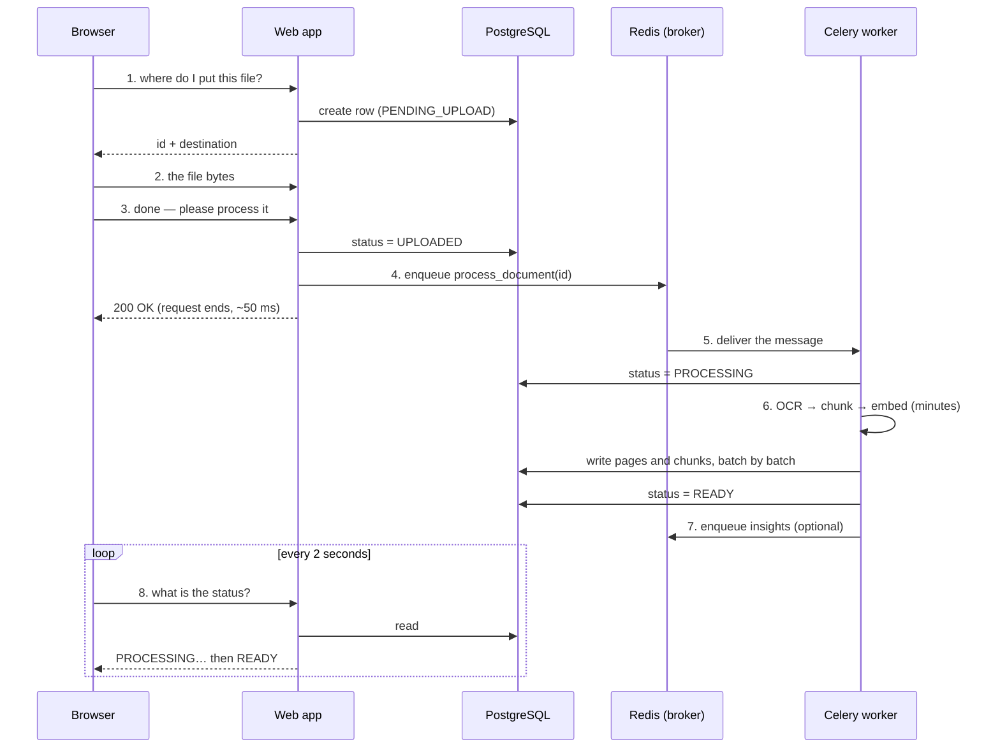

# 12 — Background Jobs: Queues, Workers and Celery

**Prerequisites: none.** Everything this chapter needs is explained here, even
if you have met it before. If a word looks technical, it will be defined in the
sentence where it first appears.

**Estimated study time: 4–5 hours**, including the exercises.

---

# Part A — The Problem

## A.1 A story about a slow request

Let me start with something that actually happens in this project.

A user drags a 200-page scanned contract onto the page and lets go. The file is
40 megabytes — a scan, so every page is a photograph of text rather than text
the computer can read directly.

For that document to become useful, quite a lot has to happen:

1. Read the file.
2. For every page, run **OCR** — *optical character recognition*, which means
   looking at a picture of writing and working out which letters are in it.
3. Cut the resulting text into small overlapping pieces called **chunks**.
4. For every chunk, run a small AI model that turns text into a list of 1024
   numbers representing its meaning.
5. Write all of that into the database.

On a normal machine that takes somewhere between **two and ten minutes**.

Now here is the question this whole chapter answers: **where does that work
happen?**

## A.2 The obvious answer, and why it destroys the system

The obvious answer is "in the request". The browser sends the file, the server
does the work, the server replies "done".

Let me define **request** properly, because everything depends on it. When your
browser needs something from a server it opens a connection, sends a short
message saying what it wants, and waits for a reply. That whole exchange is a
request. A normal one takes a few hundredths of a second.

If we do the document work inside the request, that request now takes four
minutes. **Six separate things break, and each one is worth understanding
because they are the reasons background jobs exist at all.**

**1. Something in the middle hangs up.** Between your browser and the server
there are usually other machines — a load balancer, a proxy, the hosting
platform. Almost all of them have a rule: if a request has produced nothing for
30 or 60 seconds, assume it is broken and close the connection. Your user sees
an error at four minutes even though the work was going fine. Worse, the work
often keeps running with nobody waiting for the result.

**2. A scarce resource is held hostage.** To write to the database, the
application needs a **connection** — an open line to the database program.
Those are limited: this deployment has a budget of about **fifteen in total**
across everything. A four-minute request holds one of those fifteen for four
minutes. Four such uploads and a third of the whole system's database capacity
is asleep.

**3. The user stares at nothing.** No progress, no page, no cancel button. They
will refresh — which starts a *second* four-minute job doing exactly the same
work, making the problem worse in the most natural possible way.

**4. A restart destroys the work with no record.** Deploys happen. Crashes
happen. If the work lives inside a request, and the process stops, the work
disappears. There is no note anywhere saying "this document was half
processed". The document simply sits in the database saying `PROCESSING`
forever.

**5. Everything is coupled to the slowest thing.** OCR needs a lot of memory
and a lot of processor time. The web server needs to be small and fast and to
run several copies. Forcing both into one program means the web server carries
OCR's memory requirements even when nobody is uploading anything.

**6. You cannot scale the parts separately.** If uploads are the bottleneck,
you want more OCR capacity — not more web servers.

## A.3 The idea

**Do not do the work. Write down that the work needs doing, and let a different
program do it.**

That is the entire concept. The rest of the chapter is what "write it down"
means in practice, who picks it up, and everything that can go wrong in
between.

---

# Part B — Synchronous and Asynchronous Work

Two words you will hear constantly. They are simple.

**Synchronous** means *you wait for the answer before doing anything else*. You
telephone someone, they answer, you talk, you hang up. The conversation
happened while you waited.

**Asynchronous** means *you leave a message and carry on*. You send a letter.
You do not stand at the postbox until a reply arrives.

**Almost all web requests should be synchronous.** "Give me my documents" —
wait, receive them, show them. That is right, because the answer is fast and
the user needs it now.

**Anything slow should be asynchronous.** "Process this 200-page scan" — accept
it, promise to do it, tell the user where to check.

**The test for which one you need is not "is it slow?"** It is:

> **Does the user need the result *in this reply*, or only *eventually*?**

If eventually, make it a background job. If they need it now and it is slow,
you have a design problem no queue will fix.

---

# Part C — Queues, From First Principles

## C.1 What a queue is

**A queue is a line of things waiting to be dealt with, in order.**

You already know queues — at a shop, at a bus stop. The properties that matter
in software are the same ones that matter in a shop:

- Things join at one end and leave at the other.
- Whoever is serving takes the next one; they do not choose.
- The line can grow when arrivals outpace service, and shrink when they do not.

That last point is the one people miss, and it is the real reason queues exist
in software.

## C.2 Why a queue is not about speed

Here is a common misunderstanding: *"we added a queue to make it faster."*

**A queue does not make anything faster.** The 200-page document still takes
four minutes. What a queue does is **decouple the rate at which work arrives
from the rate at which it can be done.**

Think about a small restaurant kitchen. Twenty customers order in five minutes.
The kitchen can cook four dishes at a time and each takes ten minutes. Without
order tickets, the waiter has to stand at each table until the food is ready,
and sixteen customers are simply not served at all.

With a spike of tickets on the rail:

- The waiter takes all twenty orders in five minutes and is free again.
- The kitchen works through them steadily.
- Nobody is turned away; they are told "about forty minutes".
- If the rush is bigger than the kitchen, the rail gets longer — which is
  *visible*, and something you can measure and act on.

**That last property is the most valuable one.** A queue converts an invisible
overload into a visible number: *how many tickets are on the rail right now?*
Chapter 17 turns that number into an alarm.

## C.3 Producer and consumer

Two roles, and every queue system in the world uses these names.

**The producer** creates work and puts it on the queue. Here, that is the web
application when someone uploads a document.

**The consumer** takes work off the queue and does it. Here, that is a separate
program we will call the **worker**.

**The crucial property: they do not know each other.** The producer does not
know how many workers exist, whether any are running, or how long the work
takes. The worker does not know which web server produced the job. They agree
only on the queue and the shape of the message.

**Why does that matter so much?** Because it means you can:

- restart the web server without losing jobs,
- restart the worker without breaking the website,
- run five workers on a bigger machine without changing a line of web code,
- and take the worker offline entirely — uploads still succeed, they just wait.

That is called **decoupling**, and it is one of the most valuable properties in
system design.

## C.4 Building a queue by hand, to see what is hard

Suppose you wrote your own. A shared list somewhere both programs can reach:

```
["process document 5a2f", "process document 91cd"]
```

The producer appends. The worker takes from the front. Simple — and here is
what you would discover in the first week:

1. **Two workers take the same job.** Both read the first item at the same
   moment, both process the same document, and now there are two copies of
   everything.
2. **A worker dies mid-job.** It took the job off the list, so nobody else will
   do it, and the worker no longer exists to finish it. The job is gone.
3. **You cannot tell whether the job is waiting, running, or finished.**
4. **A failing job blocks the line**, or vanishes silently, depending on how you
   wrote it.
5. **A job that should run at 8 a.m. tomorrow has nowhere to live.**
6. **The list grows forever** if nobody is consuming.

**Every one of those problems has a standard solution**, and a queue library is
a package of those solutions. Knowing the problems is what lets you use the
library properly — and, more importantly, understand what it is doing when
something goes wrong.

---

# Part D — Brokers, and Redis as One

## D.1 What a broker is

**A broker is the program that holds the queue.** It sits between the producer
and the consumer, accepts messages, keeps them in order, and hands them out.

The producer talks to the broker. The worker talks to the broker. They never
talk to each other.

## D.2 What is actually in a message

This is worth being concrete about, because people imagine something magical.
A queued job is **a small piece of text describing what to do**. Roughly:

```json
{
  "task": "app.workers.tasks.document_tasks.process_document",
  "args": ["0a56958c-7d31-4e2b-9f10-2c88ab441e0e"],
  "id": "f3c1...",
  "retries": 0
}
```

Four things to notice:

- **The task is named by text**, not by a function. The producer does not send
  code; it sends the *name* of something the worker is expected to know.
- **The arguments are simple data** — here, a document's identifier.
- **The document itself is not in the message.** Only its id. The 40-megabyte
  file lives in file storage and the row lives in the database; the message is
  a few hundred bytes saying *which* one.
- **A retry count** travels with it, which Part I uses.

**Why send only the id?** Because a message queue is not a file transfer system.
Small messages are fast, cheap to store, and safe to retry. If you put the file
in the message you would be copying 40 megabytes through a system designed for
kilobytes.

**And this is why the format matters for security.** Chapter 05 showed this
project's setting:

```python
task_serializer="json",
accept_content=["json"],
```

JSON can describe *data*. The alternative format, Python's `pickle`, can
describe *objects, including instructions that run when they are loaded*. A
worker that accepts pickled messages will execute whatever anyone able to write
to the queue tells it to construct. **Restricting to JSON means the worst a
malicious message can be is invalid data.** The format's limitation is the
security control.

## D.3 Redis as the broker

**Redis is a program that stores data in memory** — that is, in the computer's
fast working memory rather than on a disk. Chapter 11 covered it as a cache;
here it does a second job.

Redis has a **list** data type with commands to push onto one end and pop from
the other, and a *blocking* pop that means "wait here until something arrives".
That is a queue.

**Why this project uses Redis rather than a dedicated queue system:** it is
already running for caching, it is fast, and Celery supports it directly. At
this scale a separate broker such as RabbitMQ would be extra machinery for no
gain.

**And the trade you must be able to state out loud**, because interviewers ask
it:

> **Redis keeps everything in memory and is not durable by default.** If the
> Redis process dies with jobs in it, those jobs are gone.

Is that acceptable here? Yes, and for a specific reason: **the database row is
the real record.** A lost job leaves a document sitting at `PROCESSING`, which
is recoverable — someone can requeue it. If these were payment instructions or
outbound emails that must be sent exactly once, it would not be acceptable, and
you would choose a broker that writes to disk before acknowledging.

**Choosing a broker is really choosing what you can afford to lose.**

---

# Part E — Workers, and the Delivery Problem

## E.1 What a worker actually does

A **worker** is just a program running a loop. Written out plainly:

```
forever:
    ask the broker for the next message   (wait if there is none)
    look up the function whose name is in the message
    run it with the arguments from the message
    tell the broker the message is done
```

That is all. No magic. The interesting part is the last line.

## E.2 Acknowledgement, and the two ways to be wrong

**Acknowledging** a message means telling the broker "I have finished with
this; you may forget it."

The order of *doing the work* and *acknowledging* is a genuine design decision,
and there are only two options.

**Option 1 — acknowledge first, then work (at-most-once delivery).**

The broker forgets the message immediately. If the worker crashes halfway
through, nobody will ever do that job. **Work can be lost.**

**Option 2 — work first, then acknowledge (at-least-once delivery).**

If the worker crashes before acknowledging, the broker eventually gives the
message to somebody else. Nothing is lost — but if the crash happened *after*
most of the work, that work happens **twice**.

**There is no third option that avoids both.** In a system where a worker can
die at any instant, you must choose between losing work and repeating work.
"Exactly once" delivery is not something a broker can promise you; it is
something *you* build by making repeats harmless (Part I.3).

**Almost everyone chooses at-least-once**, because losing a user's document is
worse than processing it twice. Celery's default is at-least-once.

## E.3 Prefetch — a small setting with a big effect

A worker usually takes several messages at once rather than one at a time,
because asking the broker has a cost. That number is the **prefetch count**.

- **High prefetch:** fewer trips to the broker, better throughput.
- **Low prefetch:** better fairness. If one worker grabs twenty long jobs, an
  idle worker cannot help — the jobs are already reserved.

**For short jobs, prefetch high. For long jobs, prefetch low**, because with
four-minute tasks a worker holding twenty of them is a queue nobody else can
drain.

---

# Part F — Celery

## F.1 What it is and why it exists

**Celery is a Python library that turns ordinary functions into things you can
put on a queue.**

It exists because every Python team was writing the same broker code — message
formats, retries, scheduling, worker loops — badly and separately. It appeared
around 2009 and became the default in the Python world.

The core promise is this: you write a normal function, mark it, and then you
can either call it directly *or* send it to a worker, and the code that sends
it looks almost the same as the code that calls it.

## F.2 The pieces

Five parts, and it helps to name them before seeing any code:

| Piece | What it is |
|---|---|
| **The app** | one configuration object describing the broker, the queues and the known tasks |
| **A task** | a normal Python function marked so Celery can run it from a message |
| **The broker** | Redis, holding the queues |
| **The worker** | the program running the loop from Part E |
| **Beat** | a small separate program that puts jobs on the queue at scheduled times |

## F.3 The smallest possible complete example

Written from scratch, not from this project — three files, all real and
runnable.

```python
# tasks.py
from celery import Celery

celery_app = Celery("demo", broker="redis://localhost:6379/0")

@celery_app.task
def add(a, b):
    return a + b
```

`@celery_app.task` is a **decorator** — a line beginning with `@` placed above
a function that changes what that function is. Here it registers `add` with
Celery and gives it extra abilities, most importantly `.delay(...)`.

```python
# producer.py
from tasks import add

add(2, 3)          # runs here, immediately, returns 5
add.delay(2, 3)    # sends a message to the queue, returns immediately
```

**Those two lines are the whole idea.** The same function, called two ways.
`.delay()` does not run anything — it writes a message to Redis and returns.

```bash
celery -A tasks worker --loglevel=info
```

That command starts the worker. It imports `tasks`, learns that `add` exists,
connects to Redis, and waits.

**Type all three and watch it work.** Nothing in this chapter is clearer than
seeing the worker's log print a job you sent from another window.

## F.4 Task names — and the trap hiding in them

When you call `.delay()`, Celery sends the task's **name** as text. By default
the name is built from the module path — `tasks.add`.

**The worker can only run a task it knows about.** It learns tasks by importing
the modules that define them. If the worker never imports the module, the name
in the message means nothing to it.

Read that twice, because it is the cause of Part G's incident.

---

# Part G — The Three-Way Rule, and the Incident That Named It

## G.1 The rule

For a background job to actually run, **three separate things must be true**:

1. **Registered** — the worker imports the module that defines the task, so it
   knows the name.
2. **Routed** — the job goes to a named queue (or the default one).
3. **Consumed** — a running worker is actually listening to that queue.

`CLAUDE.md`, the engineering handbook in this repository, states it as an
invariant:

> *"A task must be in `celery_app.include` **and** routed in `task_routes`
> **and** have its queue consumed by a running `-Q`."*

**Miss any one and the job silently never runs.** No error. The producer's
`.delay()` succeeds — it only wrote a message. The message sits in Redis, or
arrives at a worker that does not recognise the name, and the user waits
forever.

## G.2 What actually happened here

Look at the real configuration, in
[`backend/app/workers/celery_app.py`](../backend/app/workers/celery_app.py):

```python
celery_app = Celery(
    "worker",
    broker=settings.CELERY_BROKER_URL,
    backend=settings.CELERY_RESULT_BACKEND,
    include=[
        "app.workers.tasks.document_tasks",
        "app.workers.tasks.export_tasks",
        "app.workers.tasks.audio_tasks",
        "app.workers.tasks.ocr_tasks",
        "app.workers.tasks.hr_tasks",
        # C-2 fix — these modules were routed in task_routes and dispatched by
        # the legal/finance/study/research /process endpoints but never
        # imported by the worker, so their tasks were unregistered and never
        # ran. (email_tasks stays unregistered: email is sent synchronously
        # via email_service; the module is dead code pending its own issue.)
        "app.workers.tasks.legal_tasks",
        "app.workers.tasks.finance_tasks",
        "app.workers.tasks.study_tasks",
        "app.workers.tasks.research_tasks",
        ...
    ]
)
```

Read the comment. **Four whole workspaces — Legal, Finance, Study and
Research — had processing tasks that were routed correctly and dispatched
correctly and were never imported by the worker.**

So: the user clicks "analyse this contract". The endpoint calls `.delay()`. The
message goes to Redis. The worker picks it up, looks for a task by that name,
does not have it, and rejects it. **The endpoint had already returned "success"
to the user**, because writing the message succeeded.

Four features that appeared to work, for anyone testing by clicking the button
and seeing no error.

## G.3 Why it escaped

Three reasons, each generalisable:

1. **The producer's success is not the work's success.** `.delay()` returning
   without error means "the message was written". Nothing more. Beginners read
   it as "the job is done".
2. **The three conditions live in three different places** — a list of imports,
   a routing table, and a command line in a completely different file — with
   nothing checking that they agree.
3. **Testing by using the interface cannot see it.** The button works. The page
   says success. Only checking the *database* for a result, minutes later,
   reveals that nothing happened.

## G.4 The routing table, and a related trap

```python
celery_app.conf.task_routes = {
    "app.workers.tasks.hr_tasks.*": "main-queue",
    "app.workers.tasks.legal_tasks.*": "main-queue",
    ...
    # H-3 fix: these queues MUST be consumed by a running worker (-Q).
    # (Phantom routes for nonexistent embedding_tasks/retrieval_tasks
    # modules were removed — do not re-add a route without a real module.)
    "app.workers.tasks.ocr_tasks.*": "ocr_gpu_queue",
    "app.workers.tasks.export_tasks.*": "export_queue",
}
```

Two separate defects are recorded in that one comment block:

- **`H-3`:** queues were routed to that nothing consumed. A job sent to
  `export_queue` when no worker listens to `export_queue` waits forever, in
  perfect health, invisible.
- **"Phantom routes"** for modules that did not exist. A routing rule for a task
  nobody wrote — harmless, and deeply confusing to the next reader, who assumes
  a feature exists.

And the fix at the command line, in
[`infrastructure/docker-compose.yml`](../infrastructure/docker-compose.yml):

```
command: celery -A app.workers.celery_app worker -Q main-queue,celery,export_queue,ocr_gpu_queue --concurrency=2 --loglevel=info
```

`-Q` lists the queues this worker consumes. **All four routed queues appear in
that list.** That is the third leg of the rule, made true.

## G.5 The lesson

> **Any rule that requires three separate files to agree, with nothing checking
> that they do, will eventually be violated.**

The right long-term answer is not more care. It is a **startup check**: when
the worker boots, assert that every route points at a real imported task and
that every routed queue is in the consumed list. Refuse to start otherwise.

That is perhaps twenty lines, and it converts a silent, months-long failure
into a loud one at boot. It appears in the critique as the first improvement I
would make.

---

# Part H — The Complete Upload Journey

Now we trace a real upload from the click to the finished document, mapping
every step to real code. This is the section to re-read before an interview.

## H.1 Step 1 — The browser asks where to put the file

The browser first asks the server for permission and a destination. The server
creates a database row with status `PENDING_UPLOAD` and returns an identifier.

**Why a separate step?** Because a 40-megabyte file should go straight to file
storage, not through the application. Routing large files through your API
means your API's memory and bandwidth become the limit, and one big upload can
starve every other request.

## H.2 Step 2 — The bytes go to storage

The browser sends the file itself. The server's involvement is minimal.

## H.3 Step 3 — The browser says "done", and the job is created

This is the moment that matters, in
[`backend/app/api/v1/endpoints/documents.py`](../backend/app/api/v1/endpoints/documents.py):

```python
    db.add(new_doc)
    await db.commit()
    await db.refresh(new_doc)

    # Always dispatch the Celery worker. It chunks, embeds, and flips status to READY.
    # The previous "extraction_router skip OCR" optimization marked native PDFs as
    # INDEXING but never enqueued the task — documents stayed in INDEXING forever
    # with no chunks/embeddings, blocking every grounded query.
    try:
        process_document.delay(str(new_doc.id))
        logger.info(
            f"[verify_upload] dispatched process_document for {request.filename} "
            f"(id={new_doc.id}, size={size_bytes} bytes)"
        )
    except Exception as exc:
        # Worker/broker down — surface a real failure instead of leaving the doc
        # stuck in PROCESSING forever.
        logger.error(f"[verify_upload] Could not enqueue process_document: {exc}")
        new_doc.status = DocumentStatus.FAILED
        await db.commit()
        await db.refresh(new_doc)
        raise HTTPException(
            status_code=503,
            detail="Document queue unavailable. Try again in a moment.",
        )

    return new_doc
```

Four things here, and every one is a decision:

**1. The row is saved *before* the job is created.** The database is the record
of truth; the queue is only a request to act. If it were the other way round, a
worker could pick up a job for a document row that does not exist yet.

**2. `.delay(str(new_doc.id))` sends only the id.** As Part D explained.

**3. The comment records a real, painful bug.** An earlier "optimisation"
decided some documents did not need the worker, marked them `INDEXING`, and
never enqueued anything. Those documents stayed in `INDEXING` forever, with no
chunks and no embeddings — so they were *invisible to every question the user
asked*, while the interface showed them sitting in the list. **A performance
optimisation created permanently unusable documents.**

**4. If enqueuing fails, the document is marked `FAILED` and the user gets a
503 error.** This is the loud-failure rule. The alternative — swallow the error
and return success — would leave a document stuck at `PROCESSING` with no
explanation and no job that will ever finish it.

Note what the message says: *"Document queue unavailable. Try again in a
moment."* It tells the user what happened and what to do. That is a small piece
of craft worth copying.

## H.4 Step 4 — The message waits in Redis

Milliseconds, usually. Minutes, if there is a backlog. **The API request has
already finished** — the user has their reply and the connection is closed.

## H.5 Step 5 — A worker picks it up

The worker is a separate process, started by the `worker:` service in the
compose file. It has been sitting in the loop from Part E.

## H.6 Step 6 — The pipeline runs

From [`backend/app/workers/tasks/document_tasks.py`](../backend/app/workers/tasks/document_tasks.py):

```python
@celery_app.task(bind=True, name="app.workers.tasks.document_tasks.process_document")
def process_document(self, document_id: str):
    """
    Executes the OCR pipeline using a synchronous DB session inside the Celery worker.
    """
    logger.info(f"[Tracing] Task started: process_document for {document_id}")

    db = SyncSessionLocal()
    try:
        # 1. Fetch document
        doc = db.query(Document).filter(Document.id == document_id).first()
        if not doc:
            logger.error(f"Document {document_id} not found.")
            return {"status": "error", "detail": "Document not found"}

        # 2. Transition: PROCESSING
        doc.status = DocumentStatus.PROCESSING
        db.commit()
```

Reading the decorator first:

- **`bind=True`** means the function receives `self` — a handle on the running
  task, which is how it can retry itself later (Part I).
- **`name="app.workers.tasks..."`** sets the task's name *explicitly* rather
  than letting Celery build it from the module path. **This matters more than it
  looks:** the name is the contract between producer and worker, and an
  explicit one cannot change because somebody moved a file.

Then the body:

- **`SyncSessionLocal()`** opens a database session using the *synchronous*
  driver. The web application uses an asynchronous one. `CLAUDE.md` states this
  as an invariant — *"Async API / sync workers … Never mix"* — because the
  worker has no event loop and mixing the two produces failures that only
  appear under load.
- **The first thing it does is set `PROCESSING` and commit**, so anyone looking
  at the database can see the work has begun.

The main loop, simplified to its shape:

```python
            for p_data in page_stream:
                total_pages += 1
                page_record = DocumentPage(...)
                db.add(page_record)
                db.flush()   # Need ID for chunk FK

                chunks = ChunkingService.chunk_page_text(...)
                for idx, c in enumerate(chunks):
                    chunk_record = DocumentChunk(...)
                    db.add(chunk_record)
                    current_batch_chunks.append(chunk_record)

                if len(current_batch_chunks) >= batch_size:
                    db.flush()
                    texts_to_embed = [c.text_content for c in current_batch_chunks]
                    vectors = embedding_service.generate_embeddings(texts_to_embed)
                    for chunk_record, vector in zip(current_batch_chunks, vectors):
                        chunk_record.embedding = vector
                    db.commit()   # Commit this batch to avoid ballooning transaction
                    current_batch_chunks = []
```

**Two engineering decisions worth stopping on:**

**Batching, with `batch_size = 50`.** The AI model that turns text into numbers
is much more efficient given fifty pieces at once than fifty times one piece.
This is the standard trade from Chapter 07: batching raises throughput and
raises the latency of any individual item — which is exactly right for
background work, where nobody is waiting on any single chunk.

**Committing per batch, not at the end.** The comment says why: *"avoid
ballooning transaction"*. A **transaction** is a group of database changes that
happen all together or not at all. One giant transaction for a 200-page
document would hold locks for minutes, grow enormous, and lose everything if
the worker died at page 199.

**But notice the honest trade:** committing per batch means a crash halfway
leaves half the chunks saved. The document is neither complete nor clean. Part
I.3 is about surviving that.

Finally:

```python
        doc.status = DocumentStatus.EXTRACTED
        db.flush()
        doc.status = DocumentStatus.READY
        db.commit()
```

`READY` is the status the search path filters on. **Until this line runs, the
document is invisible to every question the user asks** — which is exactly what
made the `INDEXING` bug in H.3 so damaging.

## H.7 Step 7 — A job creates another job

At the end of the task:

```python
            generate_proactive_insights_task.delay(document_id, workspace_type, session_id, owner_id)
        except Exception as insight_exc:
            logger.warning(f"[Tracing] Could not enqueue proactive insights task: {insight_exc}")
```

**Workers can be producers too.** Here the document task queues a second,
optional job that generates suggestions.

Note that failing to enqueue it produces a *warning*, not a failure. That is
correct and deliberate: the document is already `READY` and useful. **A
nice-to-have follow-up must never undo work that succeeded.** Compare with H.3,
where failing to enqueue the *main* job is a hard error — the difference is
whether the primary result depends on it.

## H.8 Step 8 — The browser finds out

Nobody told the browser anything. It asks, repeatedly — every couple of seconds
it requests the document list and looks at the status. That is called
**polling**.

Polling is not elegant, and it is right here: it is simple, it survives a
dropped connection, it needs no extra infrastructure, and a two-second delay in
noticing a four-minute job is irrelevant.

## H.9 The whole journey



---

# Part I — Failure, Retries and Idempotency

Background jobs fail. The network drops, a file is corrupt, an API is rate
limited, the worker runs out of memory. **The interesting engineering is
entirely in what happens next.**

## I.1 Task states

A job moves through named states:

| State | Meaning |
|---|---|
| `PENDING` | not started, or unknown |
| `STARTED` | a worker has picked it up |
| `RETRY` | it failed and will be tried again |
| `SUCCESS` | finished |
| `FAILURE` | finished badly, no more attempts |

**A subtlety that catches everyone:** `PENDING` also means *"I have never heard
of this job"*. Celery cannot distinguish "waiting in the queue" from "this id
does not exist". Ask about a typo of a job id and you will be told `PENDING`,
forever.

**This is a familiar shape by now** — one value meaning two different things.
It is why this project does **not** rely on Celery's states for user-facing
progress, and instead keeps the document's own `status` column in the database.
The database row is unambiguous.

## I.2 Retries with backoff

Here is the real retry logic:

```python
    except Exception as e:
        logger.error(f"[Tracing] Task failed for {document_id} - {str(e)}")
        db.rollback()

        # self.retry(exc=e) defaults to throw=True and re-raises the ORIGINAL
        # exception (not MaxRetriesExceededError) once retries are exhausted.
        # Pre-check so we always flip status to FAILED — otherwise the doc stays
        # in PROCESSING forever and the frontend polls forever.
        if self.request.retries >= 3:
            logger.error(f"[Tracing] Max retries exhausted for {document_id}. Marking FAILED.")
            doc_fail = db.query(Document).filter(Document.id == document_id).first()
            if doc_fail:
                doc_fail.status = DocumentStatus.FAILED
                db.commit()
            return {"status": "error", "detail": "Max retries exceeded", "original_error": str(e)}

        try:
            self.retry(exc=e, countdown=2 ** self.request.retries, max_retries=3)
        except MaxRetriesExceededError:
            ...
    finally:
        db.close()
```

Working through it:

**`db.rollback()` first.** The failed attempt may have written partial data;
rolling back discards uncommitted changes so the retry starts from a clean
state.

**`countdown=2 ** self.request.retries`** — this is **exponential backoff**.
The waits are 1 second, then 2, then 4. Why not retry instantly? Because the
most common reason a job fails is that something else is overloaded or
temporarily down, and hammering it immediately makes recovery harder. **Backoff
gives the world time to fix itself.**

*(A production refinement worth knowing: add a small random amount — "jitter" —
so that a thousand jobs failing together do not all retry at the same instant.)*

**`max_retries=3`.** Retrying forever is a way to burn a worker on a job that
will never succeed. A corrupt file will still be corrupt on attempt nine
hundred.

**And the pre-check is the interesting part.** The comment explains a real trap:
`self.retry()` re-raises the *original* exception when retries run out, not a
special "no retries left" error — so the code below it never runs, and the
document would stay `PROCESSING` forever while the frontend polls forever.

The fix is to check `self.request.retries >= 3` *before* asking for another
retry, and mark the document `FAILED` there.

**The general lesson:** *retry logic must have a defined terminal state.* Every
job must end somewhere a human or a user interface can see — success or failure,
never limbo. A document stuck at `PROCESSING` is the worst outcome of all,
because it is indistinguishable from one that is merely slow.

## I.3 Idempotency — the property that makes retries safe

**Idempotent** means: *doing it twice has the same effect as doing it once.*

Part E.2 established that at-least-once delivery means jobs sometimes run
twice. So safety cannot come from the broker. It has to come from the job.

Examples make it obvious:

- `SET status = 'READY'` — **idempotent.** Run it a hundred times, the status
  is READY.
- `INSERT a chunk row` — **not idempotent.** Run it twice, two chunks.
- `charge the customer £10` — **not idempotent**, and here it matters
  enormously.

**How this project stands.** `process_document` is *partly* idempotent. Setting
statuses is safe. Inserting pages and chunks is not: a task that gets halfway,
dies, and is retried will insert the first half again — leaving duplicate
chunks. Those duplicates would each be retrieved and could each be cited.

Note that the grounding stage does remove duplicates by chunk id at query
time — but these would be genuinely distinct rows with distinct ids, so that
protection does not apply.

**Three standard ways to make a job idempotent**, in increasing strength:

1. **Delete before writing.** Start by removing existing pages and chunks for
   this document, then write fresh. Simple, and safe to repeat.
2. **Use a natural unique key.** A database constraint on
   `(document_id, page_number, chunk_index)` makes a duplicate insert *fail*
   rather than succeed. The database enforces it, so no code path can bypass
   it.
3. **Record what you have done.** Track the last completed page, and resume
   rather than restart.

For this pipeline, option 1 is the right size: a handful of lines, no schema
change, and it makes the whole task safely repeatable.

**This is a real gap and it appears in the critique.**

## I.4 Dead letters

A **dead-letter queue** is where messages go when they have failed too many
times: a separate list nobody processes automatically, kept so a human can look
at them.

**Why not just delete them?** Because a batch of failures usually shares a
cause — a bad deployment, a provider outage, one corrupt file type. Keeping
them lets you diagnose and replay.

This project does not have a true dead-letter queue. It has the *equivalent
state*: the document row is marked `FAILED`, so the failure is recorded
somewhere a human can query, and the log holds the original error. That is
adequate for a system where each job maps to exactly one visible row — and it
would not be adequate for jobs with no such row.

---

# Part J — Scheduled Work

## J.1 The other kind of background job

Some work is not triggered by a user at all. It happens because it is Tuesday.

- Check the health of the system every five minutes.
- Send a daily summary at 02:30.
- Clean up old data every weekend.
- Check whether the AI provider has retired a model, weekly.

**Celery Beat** is a small separate program that does exactly one thing: it
watches the clock and puts jobs on the queue at the right times. **It does no
work itself** — it is a producer, and the ordinary workers do the jobs.

## J.2 The real schedule

```python
celery_app.conf.beat_schedule = {
    'flag-stale-hr-reviews-daily': {
        'task': 'app.workers.tasks.hr_tasks.flag_stale_reviews',
        'schedule': crontab(hour=8, minute=0),
    },
    'auto-health-check': {
        'task': 'app.automation.auto_health_check.run_health_check',
        'schedule': crontab(minute='*/5'),
    },
    'auto-daily-digest': {
        'task': 'app.automation.auto_daily_digest.send_daily_digest',
        'schedule': crontab(hour=2, minute=30),
    },
    'auto-db-cleanup': {
        'task': 'app.automation.auto_db_cleanup.run_db_cleanup',
        'schedule': crontab(hour=20, minute=30, day_of_week=6),
    },
    ...
}
```

`crontab` is a way of writing "when", named after a Unix tool from the 1970s.
`minute='*/5'` means every five minutes; `hour=2, minute=30` means once a day at
02:30; adding `day_of_week=6` narrows it to one day a week.

## J.3 The rule about running exactly one

From the compose file:

> *"Run **EXACTLY ONE** Beat instance — a second one duplicates every scheduled
> task (double emails)."*

**Why?** Because Beat is **stateful** — it holds the schedule and remembers what
it has already fired. Two copies each keep their own memory of that, so both
fire everything. Every user gets two daily digests.

**Compare with the workers**, which are **stateless** — they hold nothing
between jobs — so you may run as many as you like and they cooperate
automatically.

**That distinction is a general one worth carrying:** *stateless components
scale by copying; stateful ones do not.* It is the same property Chapter 02
identified as the prerequisite for horizontal scaling.

And a small operational detail with a reason:

```
--schedule=/tmp/celerybeat-schedule
```

Beat writes a small file recording what it has fired. Putting it in `/tmp`
keeps it out of the shared project folder — otherwise it appears as an untracked
file that people accidentally commit. The project's `.gitignore` lists
`backend/celerybeat-schedule*` for exactly that reason.

---

# Part K — Scaling and the Incidents That Shaped This Configuration

## K.1 The command, decoded

```
celery -A app.workers.celery_app worker -Q main-queue,celery,export_queue,ocr_gpu_queue --concurrency=2 --loglevel=info
```

- `-A app.workers.celery_app` — where the Celery app lives.
- `worker` — run in worker mode (as opposed to `beat`).
- `-Q ...` — the queues to consume. **The third leg of the three-way rule.**
- `--concurrency=2` — how many jobs at once.
- `--loglevel=info` — how much to print.

## K.2 Two ways to grow

**More workers on one machine** (`--concurrency`). Celery's default pool
**forks** — creates copies of the process — so each concurrent job is a
separate process with its own memory. That is what makes the next two incidents
possible.

**More machines**, each running a worker. This is where the decoupling pays: no
web code changes, no coordination. The broker hands each job to whoever asks
next.

## K.3 Why `--concurrency=2` is written explicitly

The compose file explains it at length:

> *"`--concurrency` MUST be explicit. Celery's prefork default is
> `os.cpu_count()` (8 on this host), and each child owns its own SQLAlchemy
> pool — so the worker's share of the database connection budget silently
> changed with whatever machine it ran on."*

Follow that chain, because it is beautiful and horrible:

**A default that depends on how many processor cores the machine happens to
have** → **each forked child opens its own set of database connections** → **the
number of database connections used changes when you move to a different
computer** → **and the database has a hard limit of about fifteen.**

A setting nobody thought of as a database setting was one.

The file even writes the arithmetic out:

```
API    DB_POOL_SIZE 3 + DB_MAX_OVERFLOW 2                      =  5
worker 2 children x (WORKER_DB_POOL_SIZE 1 + OVERFLOW 1)       =  4
beat   1 x (1 + 1)                                             =  2
/health unpooled psycopg2 ping (transient, every 10s)          =  1
                                                                ----
                                                                 12 / 15
```

**Being able to produce a table like that in an interview is worth more than
any amount of vocabulary.**

## K.4 Incident: the flag that crash-looped the worker

Also from the compose file:

> *"do NOT add `--max-tasks-per-child=0` here. Billiard's prefork pool asserts
> `maxtasks is None or (int and > 0)`, so 0 crash-loops the worker (verified:
> AssertionError in `billiard/pool.py:241`, queue backed up to 134 tasks)."*

Somebody set a flag to zero meaning "no limit". The library treats zero as
invalid, and the worker crashed on startup — repeatedly, restarting and
crashing, while **134 jobs accumulated in the queue**.

**Two lessons:**

1. **Zero does not universally mean "unlimited".** Check what a library does
   with edge values rather than assuming a convention.
2. **The symptom was a growing queue, not an error the user could see.** Uploads
   still "succeeded". The failure was entirely on the worker side, and only
   visible to someone looking at queue depth or worker logs. **Which is why
   Part L exists.**

## K.5 Recycling workers, and what it costs

```python
worker_max_tasks_per_child=50,
```

After 50 jobs, a child process is thrown away and a fresh one started.

**Why?** Because long-running processes that repeatedly load large AI models
tend to accumulate memory they never release — a **memory leak**. Eventually
the operating system kills the process. Restarting periodically is blunt and
completely reliable: **you cannot leak memory across a process you no longer
have.**

And the file records the price honestly:

> *"celery_app.conf sets `worker_max_tasks_per_child=50`, which costs a 65.7s
> bge-m3 reload every 50 tasks. That is a real cost, but the recycle also bounds
> memory growth from the ML models."*

**Sixty-five seconds of model loading every fifty jobs.** Writing down the cost
of your own mitigation is a mark of a careful engineer — it means the next
person can re-evaluate the trade with real numbers instead of re-discovering
them.

## K.6 Incident: the forked children that corrupted the database connection

The subtlest one, and it needs one idea first.

**Forking** means creating a new process by copying an existing one. The copy
gets everything the original had — including open network connections.

A network connection is not really copyable. It is one conversation with
another machine. If two processes both believe they own it and both write, their
messages interleave into nonsense.

From [`celery_app.py`](../backend/app/workers/celery_app.py):

```python
@worker_process_init.connect
def _dispose_inherited_db_pool(**_kwargs):
    """
    P0-5: drop the SQLAlchemy pool inherited from the Celery parent.
    ...
    Two processes writing to one socket interleave their traffic and corrupt the
    wire protocol, which surfaces as spurious "server closed the connection
    unexpectedly" / "prepared statement does not exist" errors that look like
    database faults rather than fork faults.
    ...
    close=False is REQUIRED, not an optimisation. The default close=True would
    close the inherited connections — but those file descriptors are shared
    with the parent, so closing them here severs connections the parent still
    believes it owns.
    """
    from app.db.session import sync_engine

    sync_engine.dispose(close=False)
```

**What this does:** `@worker_process_init.connect` registers a function to run
whenever a new child process starts. It throws away the inherited connections
before the child uses them, so the child opens its own.

**Why `close=False` matters:** closing them would break the *parent's*
connections too, because they are the same underlying resources.

**And the diagnostic lesson, which is the reason this is in the chapter:** the
errors looked like database faults. Somebody investigating would go and look at
PostgreSQL, find it perfectly healthy, and be baffled. **The symptom appeared in
a completely different subsystem from the cause** — which is the defining
characteristic of concurrency and process bugs.

---

# Part L — Monitoring and Debugging

## L.1 The three numbers that tell you everything

**1. Queue depth — how many jobs are waiting.**

```bash
docker compose exec redis redis-cli LLEN main-queue
```

- Zero and stable: healthy.
- Growing steadily: arrivals exceed capacity. Add workers, or the work got
  slower.
- Growing while workers are idle: **the three-way rule is broken** — jobs are
  going somewhere nobody consumes.

**2. Are workers alive and connected?**

```bash
docker compose exec worker celery -A app.workers.celery_app inspect ping
```

A reply means the worker is running and can reach the broker. No reply means
one of those two is false, and that distinction is your next question.

**3. What is each worker doing right now?**

```bash
docker compose exec worker celery -A app.workers.celery_app inspect active
```

Shows currently running tasks. A task that has been active for an hour is
stuck.

Two more that are often decisive:

```bash
celery -A app.workers.celery_app inspect registered   # which tasks does this worker know?
celery -A app.workers.celery_app inspect reserved     # what has it taken but not started?
```

**`inspect registered` is the direct test for the C-2 incident.** If the task
name you are dispatching is not in that list, it will never run, no matter how
many messages you send.

## L.2 The procedure for "my document is stuck at PROCESSING"

Ordered, cheapest first. **This is the procedure to reproduce in an interview.**

1. **Read the document row.** What status, and is there a failure reason? If it
   says `FAILED`, the pipeline ran and rejected it — read the reason and stop.
   If `UPLOADED`, no job ever started. If `PROCESSING`, a worker began.
2. **Is the worker process running at all?** `docker compose ps`. The cheapest
   possible check and a very common cause.
3. **Is the queue growing?** `LLEN`. A long queue means the system is working
   but overloaded — capacity, not a bug.
4. **Does the worker know this task?** `inspect registered`. Absent means C-2 —
   registered, routed, consumed: which leg is missing?
5. **Is the routed queue in the `-Q` list?** Compare `task_routes` in
   `celery_app.py` against the `command:` line in the compose file, by eye.
6. **Read the worker log for this document id.** This requires that the id is
   in the log lines — and it is: `[Tracing] Task started: process_document for
   {document_id}`. **That log line exists so that this step is possible.**
7. **Did the worker die mid-task?** Look for restarts. Recycling every 50 tasks
   is normal; an out-of-memory kill on a 200-page scan looks similar and is not.
8. **Only now** consider a bug in the extraction code, and reproduce by running
   the task directly on that file.

**The shape is the lesson: state, then process, then queue, then registration,
then logs, then code.** Never start by reading code.

---

# Part M — Production Mistakes

1. **Believing `.delay()` means the work happened.** It means a message was
   written. Nothing more.
2. **Passing large objects as arguments.** Send an id. The message queue is not
   a file transfer system.
3. **No terminal state.** Every job must end somewhere visible. This project's
   pre-check before retrying exists precisely to guarantee that.
4. **Retrying non-retryable failures.** A corrupt file will still be corrupt on
   attempt four. Distinguish *transient* failures (network, rate limit) from
   *deterministic* ones (bad input), and do not retry the second kind.
5. **Retrying without backoff.** Instant retries hammer whatever is already
   struggling.
6. **Assuming a job runs once.** It can run twice. Design for it.
7. **Two Beat instances.** Everything scheduled happens twice.
8. **No stuck-job detection.** This project has none — a document can sit at
   `PROCESSING` forever and nothing notices. Chapter 02's critique named it, and
   it is still the largest gap in this subsystem.
9. **Long tasks with high prefetch**, so one worker reserves jobs others could
   have done.
10. **No queue-depth monitoring.** The `--max-tasks-per-child=0` incident was
    invisible from the user's side; the only signal was a queue growing to 134.

---

# Part N — How Companies Do This

- **Every non-trivial web system has this**, under different names: Celery in
  Python, Sidekiq in Ruby, BullMQ in Node, Spring Batch in Java, SQS with
  Lambda on AWS.
- **The managed cloud versions** — SQS, Cloud Tasks, Azure Queue Storage —
  remove the operational burden and add cost and vendor coupling. For a small
  team they are often the right call.
- **The concepts transfer completely.** Producer, consumer, broker,
  acknowledgement, at-least-once, idempotency, backoff, dead letters. Learn them
  once.
- **Larger systems separate queues by priority** — a fast queue for small jobs
  so they are not stuck behind four-minute ones. This project has the beginnings
  of that with `ocr_gpu_queue` and `export_queue`, though a single worker
  consumes them all today.
- **In interviews**, the reliable questions are: why use a queue; what happens
  if a worker dies mid-job; what is idempotency and why does it matter; how do
  you retry safely; how would you know the system is falling behind. Part R
  answers all five.

---

# Part O — Exercises

### Level 0 — Understanding

**O1.** In your own words, why can a 200-page document not be processed inside
the web request? Give three separate reasons.

**O2.** Explain producer, consumer and broker using an example that is not
software.

**O3.** What is actually inside a queued message in this project, and why is
the document file not in it?

### Level 1 — Mechanics

**O4.** Explain the difference between `add(2, 3)` and `add.delay(2, 3)`. What
does each return, and when does the work happen?

**O5.** State the three-way rule. For each leg, describe what the user sees when
that leg alone is missing.

**O6.** A worker takes a job, works for two minutes, then the machine loses
power. With at-least-once delivery, what happens to that job? What would happen
under at-most-once?

### Level 2 — Failure

**O7.** Explain exponential backoff and why instant retries are harmful. What
would you add to the formula `countdown=2 ** retries` for a system with
thousands of jobs?

**O8.** Is `process_document` idempotent? Answer for each of its steps
separately, then state the consequence of a retry after a partial run.

**O9.** Write the smallest change that would make `process_document` safely
repeatable, and one alternative that pushes the guarantee into the database.

### Level 3 — Operations

**O10.** A user says their upload has been "Processing" for an hour. Write the
ordered investigation, saying what each step's result would tell you.

**O11.** Queue depth is growing steadily while `inspect active` shows workers
doing nothing. Give the two most likely causes and how to distinguish them.

**O12.** Explain why `--concurrency=2` is written explicitly rather than left to
the default, and reproduce the connection arithmetic.

### Level 4 — Design

**O13.** Design the missing stuck-job detector: what it checks, how often, what
it does when it finds one, and what could make it *cause* harm.

**O14.** A new feature must send a payment receipt email after a successful
charge. Decide synchronous or background; if background, state the delivery
guarantee you need, whether Redis is an acceptable broker, and how you make it
idempotent.

**O15.** Propose the startup self-check that would have prevented the C-2
incident. What exactly does it verify, where does it run, and what does it do
on failure?

---

# Part P — Answer Key

**P1.** Any three of: a proxy or load balancer closes connections that produce
nothing for 30–60 seconds, so the user sees an error even though the work is
fine; the request holds one of about fifteen database connections for minutes;
the user has no progress and will refresh, starting a duplicate job; a deploy or
crash destroys the work with no record, leaving the row at `PROCESSING`
forever; the web server must carry OCR's memory requirements permanently; and
you cannot add processing capacity without adding web capacity.

**P2.** A restaurant. The **waiter** is the producer: takes orders and puts
tickets on the rail. The **rail** is the broker: it holds tickets in order and
does not cook. The **cooks** are consumers: they take the next ticket and make
the dish. The waiter never waits at the kitchen, the cooks never talk to
customers, and either can be replaced without the other noticing.

**P3.** A small JSON message with the task's name, the arguments (here a
document id), a unique job id and a retry count. The file is not in it because a
message broker is designed for kilobyte messages, not 40-megabyte payloads —
copying the file through Redis would be slow, memory-hungry and pointless, since
the file is already in storage and the row is already in the database. The id is
enough for the worker to find both.

**P4.** `add(2, 3)` runs the function immediately in the current process and
returns `5`. `add.delay(2, 3)` writes a message to Redis and returns
immediately with a handle to the job; the work happens later, in a different
process, possibly on a different machine. Crucially, `.delay()` succeeding says
nothing about whether the work will succeed — or even whether any worker
exists.

**P5.** **Registered** (the worker imports the module defining the task),
**routed** (the job is sent to a named queue), **consumed** (a running worker
listens to that queue).

- Missing *registered*: the message arrives at a worker that does not recognise
  the name and is rejected. The user sees success, then nothing ever happens.
- Missing *routed* correctly: the job goes to a queue nobody listens to. Same
  user experience, and the queue grows.
- Missing *consumed*: identical from the user's side; the queue depth is the
  only visible signal.

**In all three cases the endpoint returned success**, which is why the failure
survived so long.

**P6.** Under **at-least-once**, the worker never acknowledged, so the broker
eventually re-delivers the job to another worker and it runs again from the
start — nothing is lost, but the first two minutes of work are repeated (and any
rows written in that time may be duplicated). Under **at-most-once**, the
message was acknowledged before the work, so nobody will ever run it: the
document sits at `PROCESSING` forever with no job in existence.

Losing a user's document is worse than doing it twice, which is why
at-least-once is the standard choice — and why idempotency becomes the job's
responsibility.

**P7.** Exponential backoff waits longer after each failure — 1 second, then 2,
then 4. Instant retries are harmful because the most common cause of failure is
that something else is temporarily overloaded or down, so retrying immediately
adds load to a struggling system exactly when it needs less.

For thousands of jobs, add **jitter** — a small random amount:
`countdown=2 ** retries + random.uniform(0, 1)`. Without it, a thousand jobs
that failed together retry at the same instant, producing a synchronised spike
that can knock over the thing that was recovering.

**P8.** Step by step:

- Fetching the document: idempotent (a read).
- Setting `PROCESSING` / `EXTRACTED` / `READY`: idempotent — the same value
  written twice is the same value.
- Downloading to a temporary file and deleting it: idempotent.
- **Inserting `DocumentPage` and `DocumentChunk` rows: NOT idempotent.** Each
  run inserts new rows with new ids.

**Consequence:** a task that processes 120 of 200 pages, commits several
batches, then dies, will on retry insert those 120 pages and their chunks
again. The document ends with duplicate chunks — each a genuinely distinct row —
so the query-time duplicate suppression by chunk id does not remove them. The
same passage can be retrieved twice and cited twice, and every embedding
computed for a duplicate is wasted money and time.

**P9.** Smallest change — delete before writing, at the start of the task:

```python
db.query(DocumentChunk).filter(DocumentChunk.document_id == doc.id).delete()
db.query(DocumentPage).filter(DocumentPage.document_id == doc.id).delete()
db.commit()
```

Now every run starts from the same state, so running it any number of times
produces one clean set of rows.

Alternative, pushing the guarantee into the database — a unique constraint:

```sql
ALTER TABLE document_chunks
  ADD CONSTRAINT uq_chunk UNIQUE (document_id, page_number, chunk_index);
```

A duplicate insert then *fails* rather than succeeding, so no application path
can create one. Stronger, because it cannot be bypassed by a different code
path — at the cost of a migration and of code that must now handle the conflict.

**P10.** In order:

1. **Read the document row.** `FAILED` with a reason → done, read it.
   `UPLOADED` → no job ever started; suspect enqueueing. `PROCESSING` → a worker
   began.
2. **Is the worker running?** `docker compose ps`. Not running is the most
   common cause and the cheapest to check.
3. **Queue depth.** Growing means overloaded, not broken — a capacity answer.
4. **`inspect registered`.** If `process_document` is absent, the worker cannot
   run it: the C-2 shape.
5. **Compare `task_routes` with the `-Q` list.** A routed queue nobody consumes
   is invisible otherwise.
6. **Search the worker log for the document id**, which appears in
   `[Tracing] Task started: process_document for {id}`. Present means the task
   began; absent means it never arrived.
7. **Check for worker restarts.** Recycling every 50 tasks is expected; an
   out-of-memory kill during a large scan is not.
8. **Only now** suspect the extraction code, and reproduce with that file
   directly.

**P11.** Two likely causes:

- **Nothing is consuming that queue** — jobs are routed somewhere the running
  worker does not listen to. Distinguish by comparing `task_routes` to the `-Q`
  list, and by checking the depth of *each* queue separately rather than one.
- **The worker is crash-looping**, so it is alive long enough to answer `ping`
  but never processes anything. Distinguish by reading the container logs for
  repeated startup messages — the `--max-tasks-per-child=0` incident looked
  exactly like this, with the queue reaching 134.

A third possibility worth eliminating: the tasks are registered but every one is
failing instantly and being retried, which can look like idleness in a snapshot.
The log will show it.

**P12.** Celery's prefork default is `os.cpu_count()`, so the number of child
processes changes with the machine — and **each child opens its own database
connection pool**, so a database setting silently depended on the hardware.
Against a fifteen-connection ceiling that is unsizable at deploy time.

```
API    3 + 2                         =  5
worker 2 children × (1 + 1)          =  4
beat   1 × (1 + 1)                   =  2
health check ping                    =  1
                                       ----
                                        12 / 15
```

**P13.** A scheduled Beat job, every five minutes, that finds documents whose
status is `PROCESSING` and whose `updated_at` is older than a threshold —
generously above the worst realistic processing time, say 30 minutes.

What it does: mark them `FAILED` with a reason such as "processing did not
complete", log at ERROR, and surface them in an admin view. Optionally requeue
once and only once, recording that it did.

**How it could cause harm**, which is the part that makes this a good exercise:

- A threshold set too low kills genuinely slow jobs, and the retry then doubles
  the load — a feedback loop that makes a busy system worse.
- Requeuing automatically without idempotency (P8) creates duplicate chunks
  every time it fires.
- If the detector's own clock or the `updated_at` column is not maintained
  during processing, healthy long jobs look stuck.

So: mark and alert first, requeue only manually until idempotency is fixed.

**P14.** **Background**, definitely — the user must not wait for an email
provider, and a slow provider must never fail a successful payment.

**Delivery guarantee needed: at-least-once**, with idempotency. A missing
receipt is a support ticket; two receipts are confusing but harmless — so err
towards duplicates rather than loss.

**Is Redis an acceptable broker?** Only with care. Redis is not durable by
default, so a crash can lose queued jobs — and here there is no equivalent of
the document row to fall back on, because the receipt has no record of its own.
Two acceptable answers: use a durable broker for this queue, or write a
`receipt_pending` row in the same database transaction as the charge, and have
the job read from that table. **The second is better** — it makes the database
the source of truth again, which is the pattern that already works for
documents.

**Idempotency:** give each receipt a key such as `receipt:{charge_id}` and
record it when sent; the job checks first and exits if it is present. Most email
providers also accept an idempotency key directly.

**P15.** A function that runs at worker startup and asserts three things:

1. **Every pattern in `task_routes` matches at least one registered task.** A
   route to a module that does not exist, or is not imported, is a
   configuration error — this catches the phantom routes.
2. **Every task defined in the imported modules is reachable** — that is, the
   set of registered names is not missing anything the endpoints dispatch. In
   practice this can be a maintained list, or derived by scanning for `.delay(`
   call sites.
3. **Every queue named in `task_routes` appears in the consumed queue list**
   (`-Q`), which the worker knows at startup.

Where it runs: in a Celery startup signal — the same mechanism the pool-dispose
function already uses.

On failure: **refuse to start**, with a message naming the exact route and the
missing leg. That is deliberately harsh, and correct: a worker that starts
successfully and silently ignores four workspaces' jobs is far worse than one
that will not start.

---

# Part Q — Senior Critique

### Strengths

1. **The database row is the source of truth, not the queue.** Every job maps to
   a row whose status is visible, so a lost message is recoverable rather than
   invisible.
2. **Enqueue failure is loud.** If the broker is unreachable, the document is
   marked `FAILED` and the user gets a 503 with a sentence they can act on —
   rather than a document stuck at `PROCESSING` forever.
3. **A defined terminal state.** The pre-check before retrying exists
   specifically so that exhausted retries always flip the document to `FAILED`,
   with the underlying Celery trap documented in a comment.
4. **Exponential backoff with a retry ceiling.**
5. **Batched commits with the reason stated** — avoiding one enormous
   transaction that would hold locks for minutes and lose everything on a crash.
6. **Task names set explicitly**, so moving a file cannot break the contract
   between producer and worker.
7. **The fork/pool problem is handled, with `close=False` and a full
   explanation** of why the obvious default would break the parent.
8. **Configuration costs are written down** — the 65.7-second model reload every
   50 tasks, and the connection-budget arithmetic.

### Weaknesses

1. **No stuck-job detection.** A document can sit at `PROCESSING` forever and
   nothing notices. Beat already runs seven scheduled jobs; an eighth would
   close the worst remaining gap in this subsystem.
2. **`process_document` is not idempotent.** A retry after a partial run
   duplicates pages and chunks, and those duplicates are real rows that
   retrieval will happily return and cite. Delete-before-write is a few lines.
3. **The three-way rule is enforced by discipline, not by the system**, despite
   having already been violated for four workspaces. A startup self-check is
   about twenty lines.
4. **One worker consumes every queue.** `ocr_gpu_queue` and `export_queue` exist
   to separate heavy work, but a single worker consuming all of them means a
   four-minute OCR job still blocks a two-second export.
5. **No per-user fairness.** One user uploading fifty large documents delays
   everyone. A per-user concurrency limit is the standard fix.
6. **No queue-depth monitoring or alerting.** Two of the incidents in this
   chapter were only visible as a growing queue, and nothing watches it.
7. **`email_tasks` is registered nowhere and email is sent synchronously**, in
   the request. Documented as known dead code — but sending email inside a
   request means a slow mail provider slows a user's action.

### The one improvement I would make first

**Make `process_document` idempotent by deleting existing pages and chunks at
the start.** It is about five lines, it makes every retry safe, and until it
exists the retry logic — which is otherwise good — is quietly creating
duplicate evidence that the answering pipeline will treat as real. Second would
be the stuck-job detector; third, the startup self-check.

---

# Part R — Interview Questions With Model Answers

**R1. "Why use a background queue at all?"**

> Because some work is too slow to sit inside a request. In our system a
> 200-page scanned document takes minutes: OCR every page, chunk the text, embed
> every chunk, write it all to the database.
>
> Doing that in the request breaks four things. A proxy closes connections that
> produce nothing for a minute, so the user gets an error even when the work is
> fine. It holds one of about fifteen database connections for the whole time.
> The user has no progress and will refresh, which starts a duplicate job. And a
> deploy destroys the work with no record.
>
> So the request does two cheap things — write a row and put a message on a
> queue — and returns in milliseconds. A separate worker process does the slow
> part. The side benefit is that we can scale processing capacity without adding
> web servers.

**R2. "What happens if a worker dies halfway through a job?"**

> That depends on when it acknowledges the message, and there are only two
> options. If it acknowledges before working, the job is gone and nobody will
> ever do it. If it acknowledges after working — at-least-once, which is
> Celery's default and what we use — the broker re-delivers it and the job runs
> again from the start.
>
> There is no third option that avoids both losing work and repeating it, so
> "exactly once" is not something the broker gives you; it is something you
> build by making the job idempotent.
>
> Ours is only partly there. Setting statuses is safe to repeat, but inserting
> pages and chunks is not — a retry after a partial run duplicates them, and
> those duplicates are real rows that retrieval would return and cite. The fix
> is to delete existing pages and chunks at the start of the task, which is
> about five lines, or a unique constraint on document, page and chunk index so
> the database refuses duplicates outright.

**R3. "Tell me about a background-jobs bug you have seen."**

> Four whole workspaces — Legal, Finance, Study and Research — had processing
> tasks that were routed in the configuration and dispatched by their endpoints,
> and the worker never imported the modules that defined them. So the tasks were
> unregistered: messages arrived with a name the worker did not know and were
> rejected.
>
> The user saw success, because the endpoint's job is only to write the message
> and that succeeded. Nothing happened afterwards, and nothing errored anywhere
> the user or the tests could see.
>
> It taught me the rule we now write down: a task must be registered, routed,
> **and** have its queue consumed by a running worker. Three separate files have
> to agree and nothing checks that they do — so the real fix is a startup check
> that refuses to boot if a route points at a task the worker does not have.

**R4. "How do you retry safely?"**

> With exponential backoff, a ceiling, and a defined terminal state.
>
> Backoff because the usual cause of failure is that something else is
> overloaded, so retrying instantly makes recovery harder — ours waits 1, 2 then
> 4 seconds. At scale I would add jitter so a thousand simultaneous failures do
> not retry in the same instant.
>
> A ceiling because a corrupt file will still be corrupt on attempt nine
> hundred, and I would distinguish transient failures from deterministic ones
> and not retry the second kind at all.
>
> And a terminal state, which is the part people miss. In our code there is an
> explicit check before retrying, because Celery's `retry()` re-raises the
> original exception once retries are exhausted rather than a special error — so
> without that check the code that marks the document `FAILED` never runs and it
> sits at `PROCESSING` forever while the frontend polls forever. Every job has
> to end somewhere a user can see.

**R5. "How would you know the system was falling behind?"**

> Queue depth, primarily — how many messages are waiting. Zero and stable is
> healthy; growing steadily means arrivals exceed capacity; growing while
> workers are idle means the routing is broken rather than the capacity.
>
> Then whether workers are alive and connected, and what they are currently
> doing — a task active for an hour is stuck rather than slow.
>
> We had an incident that was only visible this way: a bad worker flag caused a
> crash loop, so uploads kept "succeeding" while the queue grew to 134 jobs. No
> user-facing error at any point.
>
> Honestly, that is also the biggest gap in our setup — nothing currently
> watches queue depth or flags documents stuck in `PROCESSING`. Beat already
> runs seven scheduled jobs, so an eighth that finds stale documents and marks
> them failed is the cheapest big win available.

---

# Part S — Validation Checklist

- [ ] I can give three reasons why slow work cannot live inside a request.
      *(A.2)*
- [ ] I can explain producer, consumer and broker without using software
      examples. *(C.3, P2)*
- [ ] I can explain why a queue does not make anything faster, and what it
      actually gives you. *(C.2)*
- [ ] I can say what is inside a queued message and why the file is not.
      *(D.2)*
- [ ] I can explain at-least-once versus at-most-once, and why "exactly once"
      is not on offer. *(E.2)*
- [ ] I can state the three-way rule and what the user sees when each leg is
      missing. *(G.1, P5)*
- [ ] I can trace an upload from click to `READY`, naming the file for each
      step. *(H)*
- [ ] I can explain exponential backoff and why a terminal state is required.
      *(I.2)*
- [ ] I can define idempotency and say exactly which parts of
      `process_document` are and are not. *(I.3, P8)*
- [ ] I can explain why exactly one Beat instance may run, and why workers are
      different. *(J.3)*
- [ ] I can explain why `--concurrency=2` is a database setting in disguise,
      and reproduce the arithmetic. *(K.3, P12)*
- [ ] I can explain the fork/connection incident and why `close=False` is
      required. *(K.6)*
- [ ] I can run the investigation for a document stuck at `PROCESSING` from
      memory. *(L.2)*
- [ ] I completed O9, O13, O14 and O15 with written reasoning.
- [ ] **The real test:** open
      [`celery_app.py`](../backend/app/workers/celery_app.py),
      [`document_tasks.py`](../backend/app/workers/tasks/document_tasks.py) and
      the dispatch block in
      [`documents.py`](../backend/app/api/v1/endpoints/documents.py). Explain
      every configuration value, every status transition, the retry block's
      pre-check, and — for each of the three legs of the three-way rule — point
      at the exact line that satisfies it.

If the last box is ticked, you understand the asynchronous half of this system:
the half that does the real work, and the half where failures are quietest.

---

*Next: `13-fastapi.md` — the web framework itself: how a request becomes a
Python function call, how validation and dependencies work, why middleware
order matters, and how a streaming answer is produced.*
