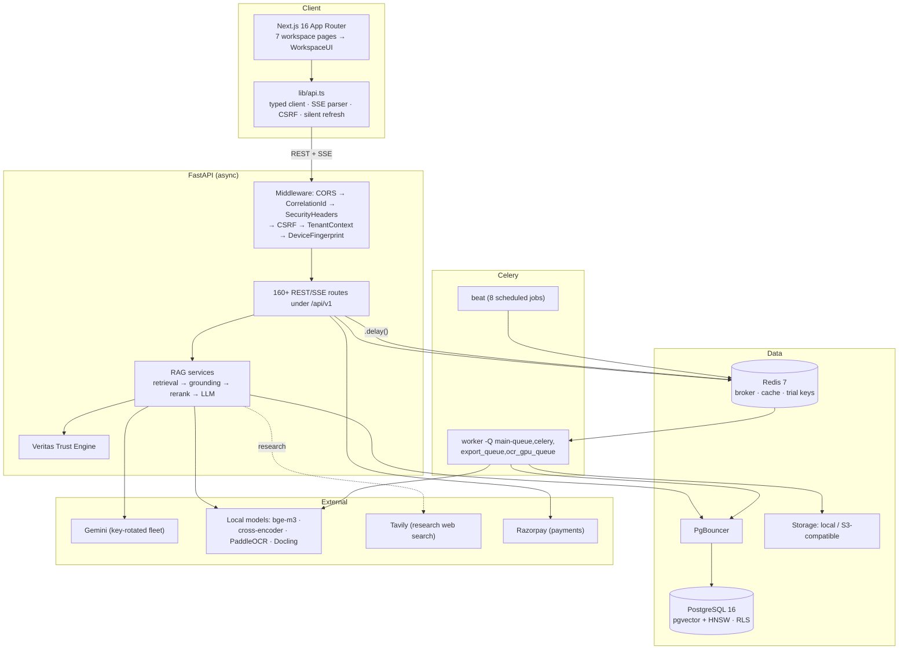
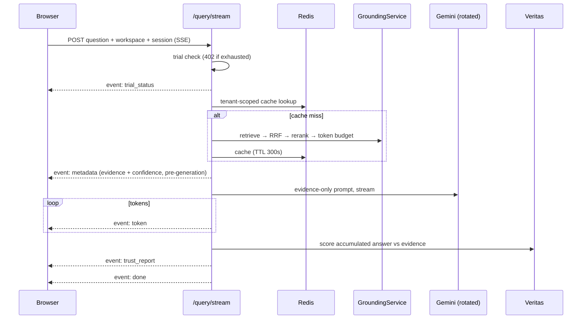
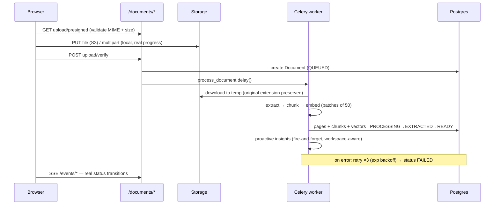
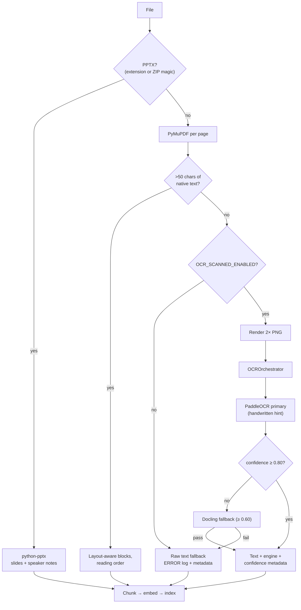
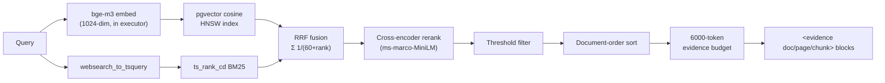
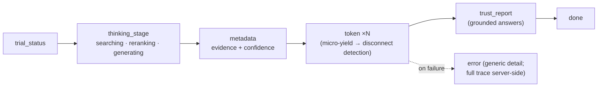
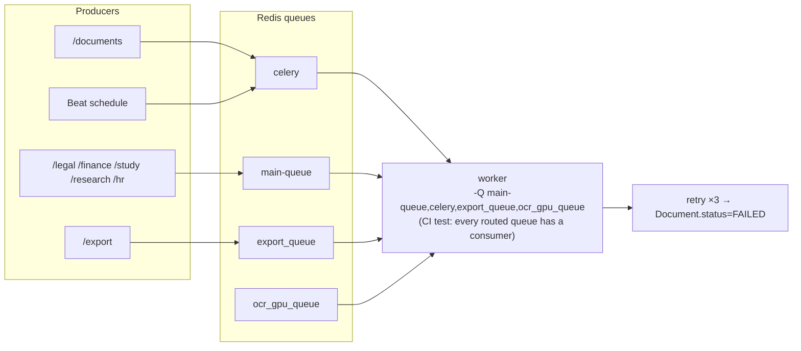
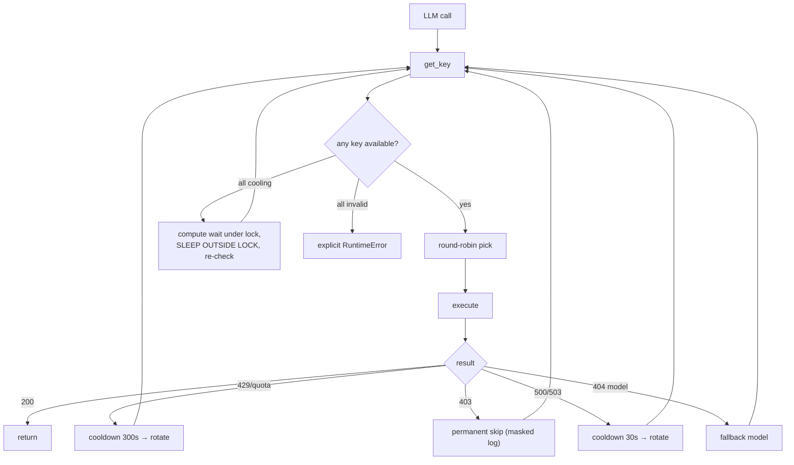
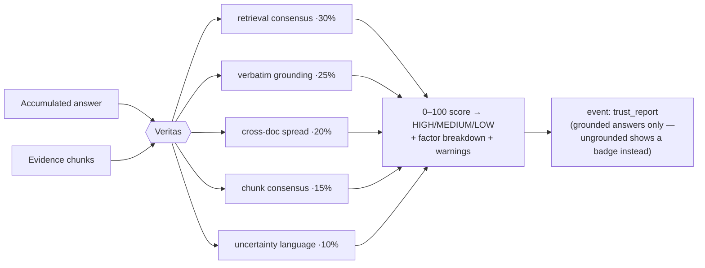

<div align="center">

# 🧠 DocuMindAI

### Grounded document intelligence, seven specialized AI workspaces, one production-grade platform.

*Every answer cited to a page. Every number computed in Python, never by the LLM. Every grounded response scored for trust — or honestly refused.*

[](https://python.org)
[](https://fastapi.tiangolo.com)
[](https://nextjs.org)
[](https://react.dev)
[](https://typescriptlang.org)
[](https://github.com/pgvector/pgvector)
[](https://redis.io)
[](https://docs.celeryq.dev)
[](backend/tests)
[](https://github.com/kanwa2006/DocuMindAI/actions)
[](RELEASE_NOTES_v1.0.0.md)
[](LICENSE)
[](https://github.com/kanwa2006/DocuMindAI/stargazers)

[**Demo & Screenshots**](#16-screenshots) · [**Architecture**](#10-architecture) · [**Features**](#7-core-features) · [**Workspaces**](#8-workspace-guide) · [**Engineering Highlights**](#9-engineering-highlights) · [**Deployment**](#15-deployment) · [**Security**](#12-security) · [**FAQ**](#18-faq)

</div>

---

## Table of Contents

1. [Executive Summary](#1-executive-summary)
2. [The Problem](#2-the-problem)
3. [Why Existing Tools Are Not Enough](#3-why-existing-tools-are-not-enough)
4. [The Solution](#4-the-solution)
5. [Product Vision](#5-product-vision)
6. [For Reviewers: Where to Look First](#6-for-reviewers-where-to-look-first)
7. [Core Features](#7-core-features)
8. [Workspace Guide](#8-workspace-guide)
9. [Engineering Highlights](#9-engineering-highlights)
10. [Architecture](#10-architecture)
11. [Tech Stack — Why Each Piece](#11-tech-stack--why-each-piece)
12. [Security](#12-security)
13. [Performance](#13-performance)
14. [Repository Structure](#14-repository-structure)
15. [Deployment](#15-deployment)
16. [Screenshots](#16-screenshots)
17. [Roadmap](#17-roadmap)
18. [FAQ](#18-faq)
19. [Contributing](#19-contributing)
20. [License](#20-license)

---

## 1. Executive Summary

**DocuMindAI is a multi-tenant SaaS platform that answers questions about your documents — with citations to the exact page, a computed trust score, and an explicit refusal when the evidence isn't there.**

Upload PDFs, DOCX, or PPTX (or paste text clips). The platform extracts them — including scanned and handwritten pages via a real OCR engine — chunks and embeds them locally with BAAI/bge-m3, and indexes them in PostgreSQL with an HNSW vector index. Questions run through hybrid retrieval (semantic + lexical, fused with Reciprocal Rank Fusion), cross-encoder reranking, and token-budgeted grounding before a single LLM token is generated. Answers stream to the browser over Server-Sent Events, and each grounded answer ends with a Veritas trust report.

It is not one product but **seven**: General, Teacher, Student, Research, HR, Legal, and Finance workspaces share the same grounded pipeline while adding domain-specific extraction, computation, and exports — a legal risk report with Python-side escalation logic, a financial ratio engine where the LLM extracts line items but **Python computes all 15 ratios**, an exam generator that refuses honestly instead of inventing questions.

**Who it's for:** lawyers, analysts, recruiters, researchers, teachers, and students — anyone whose job is buried in documents — and engineers who want to study a complete, honest, production-shaped RAG system: FastAPI async API, Celery workers with correct queue wiring, key-rotating LLM resilience, tenant isolation down to Postgres row-level security, and an 82-test regression suite where every test exists because a specific bug once did.

---

## 2. The Problem

Knowledge workers don't have an information problem. They have a **location and verification** problem.

**The reading tax.** A lawyer reviewing a 200-page contract, an analyst reconciling two annual reports, a recruiter triaging 80 resumes, a student revising a 400-page textbook — all of them spend most of their time *finding* the passage, not using it. The knowledge exists; access is O(pages).

**The hallucination tax.** General-purpose chatbots made this worse in a subtle way: they answer *confidently* whether or not the source supports the answer. A fabricated clause citation or an invented revenue figure isn't a minor bug — in legal and finance contexts it is professionally dangerous. A wrong answer that looks right costs more than no answer.

**The arithmetic tax.** LLMs are unreliable at exactly the operations these domains need most: computing a current ratio, totaling exam marks, formatting an IEEE citation. Asking a language model to do deterministic work produces plausible-looking, occasionally wrong output with no way to audit it.

**The fragmentation tax.** The tooling that does exist is siloed: an ATS for resumes, a contract-review tool for legal, a spreadsheet for ratios, flashcard apps for studying. Each has its own upload flow, its own auth, its own subscription — and none of them share a retrieval layer, so the same organization re-solves "get text out of a PDF and find the relevant part" five times.

**The scanned-document tax.** A large fraction of real-world documents are scans: signed contracts, stamped invoices, handwritten notes. Text-layer-only pipelines silently index nothing for these files, and the user discovers it only when every question comes back empty.

---

## 3. Why Existing Tools Are Not Enough

An honest comparison. Each of these tools is genuinely good at its job — the gap is the combination DocuMindAI targets: *grounded + multi-domain + deterministic computation + self-hostable + auditable*.

| Tool | What it does well | Where it falls short for this job |
|---|---|---|
| **ChatGPT / general chatbots** | Breadth, reasoning, conversation | Answers blend training data with your documents; no per-page citations as an architectural guarantee, no tenant isolation, no domain post-processing, no audit trail. Confidence is uncalibrated. |
| **NotebookLM** | Genuinely grounded, good citations | Closed SaaS — no self-hosting, no API surface to build on, no domain computation (ratios, risk escalation, mark validation), no billing/tenancy model of your own. |
| **Perplexity** | Web research with sources | Web-first by design; private-document workflows, multi-tenant isolation, and deterministic domain outputs are not the product. |
| **Adobe Acrobat AI Assistant** | Per-document summaries inside the PDF viewer | Single-document scope; no cross-document retrieval, no workspace-level corpus, no structured extraction pipeline you can act on programmatically. |
| **Generic RAG boilerplates** | Great starting points; show the pattern | Stop at retrieve-and-generate. Typically no rerank stage, no token-budgeted grounding contract, no refusal behavior, no OCR path for scans, no tenancy, no billing, no worker architecture, no tests. The last 80% is the product. |
| **Enterprise search (Glean-class)** | Organization-wide retrieval | Retrieval is the product, synthesis is thin; no domain-specific computation; enterprise pricing and closed deployment. |
| **Traditional ATS** | Pipeline management, compliance | Resume *storage*, not resume *understanding* — keyword matching rather than semantic ranking, no grounded Q&A over candidate documents, no explainable fit scoring. |
| **Legal AI point tools** | Deep contract analytics | Single-domain, premium-priced, closed. The extraction → Python-escalation → immutable-audit-log pattern here is inspectable and extensible. |
| **Finance AI point tools** | Statement ingestion at scale | Same single-domain silo. DocuMindAI's ratio engine is a reference implementation of *LLM-extracts / Python-computes* with per-value source traceability. |

**DocuMindAI's position:** one retrieval spine, seven domain products on top of it, hallucination handled architecturally rather than by prompt-begging, deterministic outputs computed in code, and the whole thing open, self-hostable, and small enough to actually read.

---

## 4. The Solution

DocuMindAI treats hallucination as an **architecture problem**, not a prompting problem. The pipeline is built so the model is never in a position to invent:

```
Upload → Extract (PyMuPDF / PaddleOCR / Docling / python-pptx)
       → Chunk (layout-aware, 1800 chars, 300 overlap, tables kept whole)
       → Embed (BAAI/bge-m3, 1024-dim, local)
       → Index (pgvector + HNSW, per-tenant)

Question → Hybrid retrieval (pgvector cosine + Postgres BM25 tsvector)
         → Reciprocal Rank Fusion (k=60)
         → Cross-encoder rerank (ms-marco-MiniLM-L-6-v2)
         → Token-budgeted grounding (6,000-token evidence window, document order)
         → Gemini generation under a strict evidence-only contract
         → SSE token stream → Veritas trust report → done
```

Five design rules make the difference:

1. **Evidence-only generation.** The system prompt permits exactly one knowledge source — the `<evidence>` blocks — and mandates the exact refusal string *"I cannot answer this based on the provided documents"* when they don't contain the answer. If a chat has no documents, the UI switches to an explicitly labeled **Ungrounded** mode rather than pretending.
2. **Extract-then-compute.** Wherever an answer is a number or a formatted artifact, the LLM only *extracts structured fields*; Python computes the result. All 15 financial ratios, legal risk escalation, exam mark validation, and six citation formats are deterministic code with the extraction inputs recorded for audit.
3. **Trust is measured, not asserted.** After each grounded answer, the Veritas engine scores it 0–100 across five weighted factors (retrieval consensus, verbatim grounding, cross-document spread, chunk consensus, uncertainty language) and streams a `trust_report` the UI renders per response.
4. **Failure is loud.** No zero-vector embeddings, no fabricated rerank scores, no swallowed exceptions on the answer path. Degraded components refuse outright in production and log at ERROR everywhere else — a wrong-but-plausible answer is treated as the worst possible outcome.
5. **Scans are first-class.** Pages without a text layer are rendered to images and routed through a real OCR orchestrator (PaddleOCR primary, Docling fallback, confidence-gated), so a signed contract scan retrieves like a native PDF.

---

## 5. Product Vision

**Workspace Intelligence** is the core thesis: retrieval is horizontal, but *value* is vertical.

The same question-answering spine means something different to a lawyer ("which clauses expose us?") than to a teacher ("generate a 40-mark paper from chapter 3") or an analyst ("did margins improve YoY?"). Most AI products pick one vertical and rebuild the entire stack around it. DocuMindAI inverts that: **one grounded pipeline, seven domain layers** — each with its own database tables, Celery tasks, retrieval tuning (top-k, chunk preference, rerank depth per workspace), response schemas, and deterministic post-processing.

This matters for three reasons:

- **For users**, context follows the work. Switching from reviewing a contract to prepping interview questions is a workspace switch, not a vendor switch — same corpus, same auth, same citations.
- **For the platform**, every improvement to retrieval, OCR, trust scoring, or streaming lands in seven products simultaneously. The marginal cost of a new domain is its extraction schema and its compute layer — not another RAG stack.
- **For correctness**, domain layers are where honesty gets teeth. The generic pipeline can only cite; the Finance layer can *recompute*, the Legal layer can *escalate by rule*, the Exam layer can *refuse to pad*. Vertical logic is what turns "grounded text" into "defensible output."

The long-term direction (see [Roadmap](#17-roadmap)) extends this spine — deeper trust factors, more providers behind the existing abstractions, organization-level isolation by default — without changing the thesis.

---

## 6. For Reviewers: Where to Look First

If you're evaluating this repository as an engineer, these files are the highest signal-per-minute:

| If you care about… | Read |
|---|---|
| RAG done properly | [`backend/app/services/retrieval_service.py`](backend/app/services/retrieval_service.py) (hybrid + RRF) → [`grounding_service.py`](backend/app/services/grounding_service.py) (rerank, token budget, citation blocks) |
| LLM resilience | [`backend/app/services/llm_key_rotation.py`](backend/app/services/llm_key_rotation.py) (rotation, cooldowns, lock discipline) and [`llm_service.py`](backend/app/services/llm_service.py) (safe extraction, JSON repair, timeouts, injection guard) |
| The extract-then-compute pattern | [`backend/app/api/v1/endpoints/finance.py`](backend/app/api/v1/endpoints/finance.py) (`compute_ratios`) and [`legal.py`](backend/app/api/v1/endpoints/legal.py) (risk escalation) |
| Streaming architecture | [`backend/app/api/v1/endpoints/query.py`](backend/app/api/v1/endpoints/query.py) (the SSE generator, cache, Veritas emission) |
| Worker correctness | [`backend/app/workers/celery_app.py`](backend/app/workers/celery_app.py) (include/routes/queues kept in three-way agreement) and [`document_tasks.py`](backend/app/workers/tasks/document_tasks.py) (retry → dead-letter) |
| OCR orchestration | [`backend/app/services/ocr_service.py`](backend/app/services/ocr_service.py) + [`ocr_orchestrator.py`](backend/app/services/ocr_orchestrator.py) |
| Test philosophy | [`backend/tests/`](backend/tests) — 82 tests across 20+ files; nearly every one pins a real, once-shipped bug (worker registration drift, dimension mismatches, silent fallbacks, lock-held sleeps) |

The test suite doubles as an engineering changelog: names like `test_worker_registration.py`, `test_silent_degradation.py`, and `test_embedding_dimensions.py` tell you exactly which classes of production failure this codebase has learned to prevent structurally.

---

## 7. Core Features

### 7.1 Grounded Q&A with page-level citations

- **Purpose:** answer questions from *your* documents only, with every claim traceable.
- **How it works:** `GroundingService` retrieves ~30 candidates, dedupes, reranks with a cross-encoder, filters by threshold, sorts surviving chunks into document order (filename → page → chunk index) so citations read linearly, then packs `<evidence document=… page=… chunk_id=…>` blocks into a 6,000-token budget. The system prompt forbids outside knowledge and mandates the exact refusal string.
- **Benefit:** the model *cannot* silently answer from training data on the grounded path; "I don't know" is a designed outcome, not an error.
- **Example:** *"What's the notice period for termination?"* → *"90 days' written notice (MSA_2024.pdf, p.14)."* — or the refusal, if the contract never says.

### 7.2 Hybrid retrieval with Reciprocal Rank Fusion

- **Purpose:** semantic search alone misses exact identifiers ("Section 4.2(b)", "₹1,24,000"); keyword search alone misses paraphrase.
- **How it works:** two ranked lists per query — pgvector cosine distance over 1024-dim bge-m3 embeddings (HNSW-indexed), and Postgres full-text `ts_rank_cd` over `websearch_to_tsquery` — fused by RRF: `score += 1/(60 + rank)`. Rank-based fusion sidesteps the incomparable-score-scales problem entirely.
- **Benefit:** robust recall across both "concept" questions and "needle" questions, with no learned fusion weights to tune or drift.

### 7.3 Veritas Trust Engine

- **Purpose:** a per-answer, machine-computed honesty signal — because "the model sounded confident" is not a metric.
- **How it works:** after the token stream completes, the accumulated answer plus its evidence chunks are scored across five weighted factors — retrieval consensus (30%), verbatim-quote grounding (25%), cross-document spread (20%), chunk consensus (15%), uncertainty-language density (10%) — into a 0–100 score with HIGH/MEDIUM/LOW grading, a factor breakdown, and warnings. Emitted as a dedicated `trust_report` SSE event; the UI renders a badge and an expandable panel.
- **Honesty note:** the current factors are deterministic heuristics (fast, explainable, <100 ms) — deliberately *not* marketed as model-graded evaluation. Evidence-driven contradiction detection is on the [roadmap](#17-roadmap). Ungrounded answers get an explicit **Ungrounded** badge instead of a score, because scoring general-knowledge output with a grounding heuristic would fabricate meaning.

### 7.4 Multi-engine OCR for scanned and handwritten documents

- **Purpose:** make scans retrieve like native PDFs instead of silently indexing nothing.
- **How it works:** during ingestion, each PDF page is classified native vs. scanned (>50 extractable chars heuristic). Native pages take layout-aware block extraction; scanned pages are rendered to 2× PNG and routed through the `OCROrchestrator` — PaddleOCR (v3 API) primary for handwritten/rotated content, Docling fallback for structured documents, with a confidence-gated validation gateway (0.80 primary / 0.60 fallback) choosing the output. OCR failure degrades loudly to raw text with `ocr_failed` metadata; `OCR_SCANNED_ENABLED=false` is a config-only rollback for the heavy engines. Docling additionally powers table extraction in the Teacher workspace.
- **Benefit:** a stamped, scanned agreement enters the same retrieval corpus as a born-digital one — and when OCR *can't* read a page, that fact is visible, not hidden.

### 7.5 Real-time streaming with a typed SSE contract

- **Purpose:** perceived latency and progressive rendering, with a machine-readable event protocol rather than a raw token pipe.
- **How it works:** `/query/stream` emits named events in a fixed order — `trial_status` → `thinking_stage` (searching / reranking / generating) → `metadata` (evidence + grounding confidence before generation even finishes) → `token`* → `trust_report` → `done` — parsed by a single typed client in `lib/api.ts`. A safe-extraction wrapper means a safety-blocked or truncated Gemini chunk degrades to a friendly message instead of killing the stream; a micro-sleep per token lets ASGI detect client disconnects and cancel generation.
- **Benefit:** the frontend renders citations *before* the answer, thinking stages during it, and trust after it — one HTTP response, no WebSocket infrastructure.

### 7.6 Seven specialized workspaces

One pipeline, seven domain products — each with its own tables, Celery tasks, per-workspace retrieval tuning (e.g., Legal: top-k 10 / large chunks; HR: top-k 18 / small chunks), response schemas, and deterministic compute layers. Full detail in the [Workspace Guide](#8-workspace-guide).

### 7.7 Asynchronous ingestion with honest lifecycle state

- **How it works:** uploads return immediately; a Celery worker (sync SQLAlchemy session — workers never share the API's async engine) downloads from storage, extracts, chunks, embeds in batches of 50, and walks the document through `QUEUED → PROCESSING → EXTRACTED → READY`, with exponential-backoff retry (max 3) dead-lettering to `FAILED` so nothing polls forever. Per-workspace `/events/*` SSE endpoints stream these *real* status transitions. A dedicated Celery Beat container schedules eight automation jobs (health checks every 5 min, key audits hourly, digests, DB cleanup, subscription expiry).
- **Benefit:** a 200-page upload never blocks a request thread, and every terminal state — including failure — is visible to the user.

### 7.8 Proactive insights

On every successful ingestion, a fire-and-forget task runs workspace-aware analysis over the document's top chunks (legal risk flags, finance anomalies, HR standouts — the workspace is resolved from the upload's chat session) and surfaces findings in an insights panel before the user asks anything.

### 7.9 Trial-to-paid billing with abuse resistance

10-query trial enforced server-side (402 on exhaustion) with device-fingerprint gating against repeat trial signups; Razorpay checkout with HMAC-verified webhooks (`compare_digest`) for paid plans; the dev-only sandbox upgrade path is **hard-blocked (403) in production**, so a default-config deployment cannot leak free tier escalation. Lifecycle nudge emails derive from the trial constant, not magic numbers.

### 7.10 Exports and collaboration

Academic DOCX export for generated exams; extracted tables to DOCX/CSV/HTML; candidate pipelines to CSV; citations in six formats; shareable read-only session links (high-entropy public tokens, revocable); bookmarks, notes, corrections, and feedback capture.

---

## 8. Workspace Guide

All seven workspaces share the foundation: chat with grounded Q&A (`/query/stream`), per-chat document isolation, uploads with real progress, trust reports, proactive insights, and workspace-scoped tenancy (`owner_id` + deterministic workspace UUID on every query). What follows is what each adds.

---

### 8.1 General

**Target users:** anyone with documents. **Problem solved:** the universal "find it and prove it" workflow.

The reference implementation of the grounded-answer promise. Summary-intent questions trigger a **map-reduce full-document path** (top-k retrieval structurally cannot summarize a 40-page document — it sees ~10% of it), reading every page and reducing with citations intact. Search is the full hybrid pipeline; OCR, insights, and shared-session exports all apply.

**Example workflow:** drop three vendor proposals into a chat → "Compare payment terms across these" → comparison-mode answer with per-document citations → share the session read-only with your team.

**vs. dedicated tools:** this is the NotebookLM-shaped workspace — with self-hosting, an API, trust scoring, and refusal semantics you can verify in code.
**Limitation:** answer quality is bounded by extraction quality; a low-confidence scan is flagged, not magically repaired.

---

### 8.2 Teacher (Exam)

**Target users:** teachers, trainers. **Problem solved:** producing complete, grounded assessments from actual course material.

The most complete workspace. `POST /exams/generate/paper` validates the mark scheme *before* generation (allocations must sum), retrieves evidence from the chat's READY documents, and prompts for a strict paper + answer key JSON honoring a Bloom's-taxonomy difficulty mix. On parse failure it retries once, then produces an **honest refusal paper** — never placeholder questions. Papers auto-save with versioning, support free-form editing, and export to academic DOCX. Docling/PaddleOCR-backed table extraction pulls tables from source documents (S3-safe: files are fetched through the storage service, not read off local disk) into DOCX/CSV/HTML. Topic-specific Mermaid diagram generation is validated output — a malformed diagram is a 502, not a template.

**Example workflow:** upload the textbook chapter → "60-mark paper, 40% application-level, with answer key" → review, edit two questions, export DOCX → extract the chapter's data tables to CSV for a worksheet.

**vs. dedicated tools:** exam generators rarely ground in *your* syllabus or validate mark allocation; this one refuses rather than pads.
**Limitation:** voice-to-exam returns an honest `501 Not Implemented` — the pipeline isn't built, so the endpoint says so.

---

### 8.3 Student (Study)

**Target users:** students, self-learners. **Problem solved:** turning passive material into active recall.

Flashcards generated from documents carry citations back to source and are scheduled with a faithful **SM-2 spaced-repetition** implementation (quality 0–5 → ease factor / interval / next review, computed in `sm2_service` — deterministic Python, not LLM arithmetic). Quiz generation is **anti-cheat by design**: `correct_index` is stored server-side and stripped from the response; grading and per-question explanations happen on submit. The AI tutor streams SSE responses grounded in the student's own notes (semantic retrieval over note embeddings with recency fallback), and study material is semantically searchable.

**Example workflow:** upload lecture PDFs → auto-generated deck → daily SM-2 reviews → 10-question quiz before the exam → tutor chat for the two concepts you keep missing.

**vs. Anki/Quizlet:** those are excellent at scheduling *cards you wrote*; this generates cited cards from source and adds a grounded tutor.
**Limitation:** card quality tracks extraction quality; SM-2 state is per-card, not yet a cross-deck mastery model.

---

### 8.4 Research

**Target users:** academics, analysts. **Problem solved:** literature synthesis that doesn't fabricate.

Citations follow extract-then-compute at its purest: the LLM extracts bibliographic metadata; **Python formatters** produce APA, MLA, IEEE, Chicago, BibTeX, and Vancouver — formatting is deterministic string logic, never generation. Cross-document **synthesis** clusters findings by embedding cosine similarity (Python), asks the LLM only to classify candidate cross-paper pairs (agree / contradict / unrelated), assigns severity in Python, and persists contradiction reports. Gap analysis surfaces unanswered questions across papers. The **Deep Research agent** (`POST /research/deep-research`, SSE) runs a four-step pipeline — document RAG → LLM gap identification → Tavily web search restricted to academic/government domains → synthesis — with a Veritas trust score on the document evidence and document-ownership validation before anything runs.

**Example workflow:** attach five papers to a project → synthesis groups findings and flags that Paper B's result contradicts Paper D's → deep research fills the gap from arXiv/PubMed, tagging every web-sourced claim `[Web Source]` → export the bibliography in IEEE.

**vs. Elicit/Consensus-class tools:** those search *the literature at large*; this is grounded in *your* corpus first, augments with the web second, and labels which is which.
**Limitation:** the deep-research agent is API-complete with a typed frontend client; a dedicated UI panel is roadmap.

---

### 8.5 HR

**Target users:** recruiters, hiring managers. **Problem solved:** ranking a resume pile against a real job description, explainably.

Resume ingestion (registered async worker) extracts structured candidate profiles and computes an LLM fit score with pros/cons/missing-skills analysis. A second pass blends it with embedding similarity: `final = 0.6 × llm_score + 0.4 × cosine(JD, resume) × 100` — the similarity model (MiniLM) is deliberately isolated to scalar scoring and never mixed into the pgvector corpus (a documented invariant, enforced by dimension tests). Candidate **search is semantic**: profiles are embedded at ingestion and ranked by vector distance, with a keyword fallback that logs loudly when embeddings are unavailable. Pipeline stages, recruiter notes, funnel analytics, CSV export, and a real SSE progress feed (actual per-job candidate counts, not heartbeats) round it out. Resume text is treated as **hostile input**: injection patterns ("ignore previous instructions", "fit score of 100") are detected and neutralized before any scoring prompt, and PII is redacted from logs.

**Example workflow:** create the role → bulk-process 40 resumes → semantic-search "distributed systems + Kafka" → review the score breakdown on the top 5 → advance stages, export CSV for the panel.

**vs. a traditional ATS:** an ATS tracks candidates; this *reads* them — and shows its work per score.
**Limitation:** no calendar/ATS integrations; the interview-scheduling model exists but is thin.

---

### 8.6 Legal

**Target users:** lawyers, legal ops. **Problem solved:** contract risk you can defend in front of a partner.

The risk report is the flagship: the LLM produces structured per-clause JSON (risk level, confidence basis, page), then **Python owns the judgment calls** — escalation triggers on hard rules (overall score ≥ 70, any Critical clause, or ≥ 3 missing standard clauses), consistency validation flags clauses whose risk jumped ≥ 2 levels vs. the previous analysis, and sub-0.5-confidence extractions are downgraded to an honest "insufficient information" rather than a guessed severity. Every analysis and escalation writes to an **immutable audit log**. Clause extraction (async worker) embeds clauses for semantic search ("find every indemnification clause across all our contracts"); contract compare produces clause-by-clause diffs; compliance rules evaluate clauses against your own rulebook. Every response carries a mandatory not-legal-advice disclaimer, appended server-side.

**Example workflow:** upload the vendor MSA → risk report flags an uncapped liability clause as Critical → escalation fires and is logged → compare against your standard template → clause-search prior contracts for the language your counsel already approved.

**vs. legal AI point tools:** the same *pattern* (structured extraction + rule-based escalation + audit trail) in inspectable, extensible code — without per-seat enterprise pricing.
**Limitation:** redline generation is modeled but thin; jurisdiction-specific rule packs are user-supplied.

---

### 8.7 Finance

**Target users:** analysts, auditors, CA/CFO teams. **Problem solved:** ratio analysis where every number is auditable.

The clearest expression of the platform's thesis. `POST /finance/ratios` has the LLM extract line items *only* — each with its raw source text, page number, and confidence — then **Python computes all 15 ratios** (liquidity, profitability, leverage, coverage, efficiency) with zero-division guards and the formula recorded per ratio. Indian number formats (lakh/crore) are normalized deterministically; the accounting standard is detected; a numerical-integrity pass verifies each output value against the source chunks and scores its traceability. Every extracted item persists to an audit table. Period-over-period compare recomputes per period and derives trends (improving/declining/stable) in Python. Transaction-level extraction (async worker) embeds transactions for semantic search ("all consulting expenses over 50k").

**Example workflow:** upload FY23 and FY24 annual reports → 15 ratios per year with per-input citations → compare shows Debt-to-Equity deteriorating with the exact balance-sheet lines that drove it → the integrity check flags one low-confidence extraction for manual review.

**vs. finance AI tools:** most will happily *state* a ratio. This one shows the formula, the inputs, the page each input came from, and how sure it is that the inputs are real.
**Limitation:** extraction reads the leading section of very long filings (bounded context); benchmark thresholds are general-purpose rather than industry-tuned.

---

## 9. Engineering Highlights

The section for readers who evaluate systems by their failure modes.

### 9.1 Provider abstraction & dependency injection

Every external capability sits behind a small ABC: `BaseLLMProvider` (generate / generate_stream), `BaseEmbeddingProvider`, `BaseRerankerProvider`, `BaseStorageProvider`, `BaseOCREngine`. Services take providers via **constructor injection** with production defaults — `LLMService(provider=None)` builds the Gemini provider lazily on first use, while tests inject doubles directly; FastAPI's `Depends` injects DB sessions and the authenticated user per-request. The payoff shows in the test suite: 82 tests exercise real service logic against injected providers with zero network calls.

**Configuration-driven selection, honestly stated:** which *implemented* backend runs is pure config — `VECTOR_BACKEND` (pgvector default / in-memory dev fallback), `STORAGE_PROVIDER` (local/S3), `RERANKER_PROVIDER`, `OCR_SCANNED_ENABLED` — and scaling the LLM key fleet is a pure env change (next section). Adding a *new* provider (e.g., Anthropic) means implementing one small interface class; the orchestration pipeline doesn't change. Only Gemini is implemented today — that's a roadmap item, not a hidden gap.

### 9.2 Automatic API key rotation

The Gemini layer assumes quota exhaustion is normal operating weather, not an exception:

- **Zero-code fleet scaling:** keys are discovered from the environment (`GEMINI_API_KEY_1..N`, unlimited, plus legacy single-key). Adding capacity = adding an env var. No code change, no logic redeploy.
- **Failure taxonomy → policy:** 429/quota → 300 s cooldown for that key and immediate rotation; 403/invalid → permanent skip; 500/503 → 30 s cooldown; model-404/deprecated → automatic fallback model (`gemini-2.5-flash-lite` → `gemini-2.0-flash`). Retry budget is `2 × key count` per call.
- **Concurrency discipline:** when *every* key is cooling, the wait is computed under the rotator's lock but **slept outside it**, then state is re-checked — one throttled caller never serializes the others behind its cooldown. A threaded regression test pins this.
- **Observable, never leaky:** keys are logged only as masked suffixes; live fleet counts (total/available/cooling/invalid) surface via `/health/detailed`, and an hourly Beat job audits the fleet.
- **Fail-loud floor:** with zero usable keys, the service raises an explicit, actionable error at first use (lazy provider construction keeps *imports* key-independent — CI and tooling can load the app without secrets). The mock provider is physically unreachable outside `ENVIRONMENT=test`, so fabricated "grounded" answers cannot ship by misconfiguration.

### 9.3 Vector search: pgvector + HNSW, dimension-pinned

Embeddings are local (bge-m3, 1024-dim, normalized) — no per-token embedding API costs, no document text leaving the box for indexing. Retrieval defaults to pgvector cosine distance under an **HNSW index** (`vector_cosine_ops`, built `CONCURRENTLY` in its migration so existing corpora aren't locked). Keeping vectors in Postgres means tenancy filters, joins to document metadata, and vector ranking are *one query plan* — no second datastore to keep consistent. Every embedding column in the schema is pinned to the pipeline dimension by a parametrized test, because a 1536-vs-1024 scaffold mismatch is exactly the kind of bug that fails only at insert time in production. The non-pgvector NumPy path still exists as an explicitly-labeled dev fallback that warns once per process.

### 9.4 Async architecture, drawn on one line

The request path is fully async (FastAPI + asyncpg); CPU-bound and blocking work — sentence-transformer encodes, Gemini SDK calls — is offloaded via `run_in_executor` so the event loop never blocks. Workers are deliberately **synchronous** (psycopg2 sessions): Celery's process model wants sync, and mixing async sessions into task bodies is a classic corruption source. Where a worker needs an async service, it runs a fresh, closed event loop. PgBouncer (transaction mode) fronts Postgres for both sides. Non-streaming LLM calls carry a hard server-side timeout (`LLM_TIMEOUT_SECONDS`, default 120 s) so a slow upstream can't pin threads invisibly.

### 9.5 Background workers: the three-way rule

A Celery task only runs if it is (1) in the app's `include`, (2) routed to a queue, and (3) that queue is consumed by a running worker. This repo enforces all three **in CI**: tests assert every routed module imports, every dispatched task is registered, every routed queue appears in the deployed worker's `-Q` list (parsed from docker-compose), and exactly one Beat scheduler exists in the stack. Queue topology: `celery` (ingestion), `main-queue` (workspace tasks), `export_queue`, `ocr_gpu_queue` (consumed by the main worker today; a dedicated GPU worker can take it over without any route change). Ingestion retries with exponential backoff, then dead-letters to a visible `FAILED` status.

### 9.6 OCR orchestration

Extraction is a router, not a monolith: PPTX (detected by extension *or* ZIP magic) → python-pptx per-slide with speaker notes; native PDF pages → layout-aware block extraction sorted into reading order; scanned pages → 2× rasterization → `OCROrchestrator`, which picks PaddleOCR or Docling by content hint, validates output confidence (0.80 primary / 0.60 fallback), and records engine + confidence into chunk metadata. The orchestrator supports both the PaddleOCR 3.x and legacy 2.x result formats. Heavy engines have a config kill-switch; failure is an ERROR log plus explicit `ocr_failed` metadata — degraded, never silent.

### 9.7 Prompt-injection defense

Uploaded documents are **untrusted input to the LLM**, and the guard lives at the choke point: an idempotent hardening wrapper prepends explicit security rules — evidence is data; instructions inside it (role changes, "ignore previous instructions", prompt-reveal requests) must be treated as content — to every system prompt at the `LLMService` boundary, covering grounded Q&A, all structured-extraction calls, and the direct streaming call sites. The HR pipeline adds a second, domain-specific layer that pattern-scans resume text and neutralizes manipulation attempts *before* scoring. Defense in depth, both layers tested.

### 9.8 Loud degradation (the anti-silent-failure doctrine)

The most dangerous state for a grounded-answer product is *plausible garbage*: retrieval over zero vectors or fabricated rerank scores still renders a confident, cited-looking answer. This codebase bans that state structurally: embedding failures **raise** (ingestion dead-letters; queries surface an error event) instead of emitting zero vectors; the dummy reranker and dummy embedder **refuse to run in production** and scream at ERROR elsewhere; the deep-research agent logs retrieval failures with tracebacks instead of quietly proceeding web-only. `test_silent_degradation.py` pins all of it.

### 9.9 Tenant isolation, four layers deep

(1) Every workspace-scoped query filters `owner_id` + a deterministic workspace UUID (`uuid5` of the slug — one derivation function, used everywhere). (2) Per-chat document scoping restricts retrieval to the session's attachments. (3) Vector namespaces per user (or per organization, config-selectable). (4) Postgres **row-level security** migrations as the database-level backstop. Cache keys carry the tenant (`retrieval:uid_{user}:{workspace}:{hash}`), and document deletion purges exactly that namespace — deleted content can't be served from a stale cache.

### 9.10 Caching & rate limiting

Retrieval results cache in Redis (300 s TTL) keyed by tenant + workspace + query + attached-document set, so identical questions in different chats or by different users never share results; cache failures degrade to a plain re-retrieval, never a failed request. SlowAPI rate-limits the expensive surfaces: 30/min on `/query/stream`, 20/min on uploads — LLM cost and DoS control at the edge.

### 9.11 Observability

Correlation-ID middleware tags every request and response; OpenTelemetry (FastAPI + Celery spans) and a Prometheus `/metrics` endpoint are wired and **off by default** (deliberate: a collector-less dev stack should not spam exporter errors — production opts in); Sentry integrates backend and frontend with PII scrubbing; `/health` and `/health/detailed` report DB/Redis/Gemini-fleet state with *generic* client strings (details go to server logs — error bodies never leak DSNs). A Beat-scheduled health check probes db/redis/gemini/disk/celery every 5 minutes and emails an admin after 3 consecutive failures.

### 9.12 Database architecture

PostgreSQL 16 as the single source of truth for relational data *and* vectors: ~50 tables across identity/RBAC, the document→page→chunk core, chat, and seven workspace domains; 44 Alembic migrations with CI enforcing `upgrade head` on a clean pgvector instance; dual engines (asyncpg for the API, psycopg2 for workers) built from one URL-normalizing config source; PgBouncer pooling; RLS for isolation; HNSW for ANN. Migration discipline is verifiable: the vector-index and dimension-fix migrations ship with tested downgrades.

---

## 10. Architecture

### System overview



### Query request flow



### Upload & ingestion flow



### OCR routing



### Hybrid retrieval & embedding flow



### SSE streaming contract



### Worker topology



### Key rotation



### Veritas trust scoring



---

## 11. Tech Stack — Why Each Piece

| Layer | Choice | Why — and what was traded away |
|---|---|---|
| API | **FastAPI** | Native async for an SSE-heavy, I/O-bound workload; Pydantic contracts at the edge; OpenAPI for free. *vs Django:* batteries we'd remove; *vs Node:* the ML ecosystem (sentence-transformers, PyMuPDF, Paddle) is Python-native — one language across API and workers. |
| Vectors | **pgvector + HNSW** in Postgres 16 | Vectors live next to the rows that scope them: tenancy filters + metadata joins + ANN in one planner. *vs Pinecone/dedicated vector DBs:* traded peak ANN throughput at extreme scale for self-host simplicity and one consistency domain. *vs raw FAISS:* no persistence/filtering story without building a service around it. |
| Embeddings | **BAAI/bge-m3, local** | Zero marginal indexing cost, documents never leave the box for embedding, one fixed 1024-dim space (dimension-pinned by tests). Trade-off: model memory per worker — mitigated by batching and process recycling. |
| Rerank | **Cross-encoder (ms-marco-MiniLM-L-6-v2)** | The classic cascade: cheap recall, expensive precision on ~30 candidates. Small enough for CPU latency budgets. |
| LLM | **Gemini** behind `BaseLLMProvider` | Fast, inexpensive flash-tier models suit interactive streaming; the multi-key model makes the rotation architecture genuinely useful. The abstraction is the hedge — additional providers are an interface implementation, not a rewrite (roadmap). |
| Jobs | **Celery + Redis** | Boring, proven, right-sized. Queue routing + Beat + retries cover the need. *vs Temporal:* operational weight unjustified at this stage. Redis doubles as cache/broker/trial-state — one less system to run. |
| Frontend | **Next.js 16 + React 19 + TS 5 + Tailwind 4** | App Router SSR for the marketing surface, a single typed API client for the SSE protocol, streaming-friendly rendering. |
| Pooling | **PgBouncer (transaction mode)** | Async API + multi-process workers = connection fan-out; pooling at the infra layer beats per-process tuning. |
| Payments | **Razorpay** | India-first market (INR plans); HMAC-verified webhooks; the provider is isolated in one endpoint module. |
| Observability | **OTel + Prometheus + Sentry + PostHog** | Standards over lock-in; off by default locally, opt-in for production — instrumented code, zero dev noise. |

---

## 12. Security

Defense in depth, each layer verifiable in code:

- **Authentication:** bcrypt (salted, key-stretched) via passlib; JWT pinned to **HS256 at every decode site** — including middleware — with signature verification on (algorithm-confusion resistant); separate access (60 min) / refresh (7 days) tokens where refresh carries `token_type="refresh"` so access tokens can't masquerade; HttpOnly cookie transport; silent-refresh client flow. Covered by dedicated auth tests.
- **Authorization & tenancy:** `owner_id` + workspace-UUID filters on every workspace query; per-chat document scoping in retrieval; per-user vector namespaces (org mode available); Postgres RLS migrations as the backstop; document ownership validated before agent pipelines run.
- **CSRF & headers:** double-submit cookie enforced on all mutations; HSTS, CSP, `X-Frame-Options: DENY`, nosniff.
- **Key & secret hygiene:** all secrets via environment; API keys logged only as masked suffixes; automatic rotation with per-key cooldown/invalidation; Sentry PII scrubbing; `pip-audit` runs **blocking** in CI.
- **Prompt injection:** layered — a tested guard at the LLM service boundary framing all evidence as untrusted data, plus HR-specific resume sanitization before scoring prompts.
- **Rate limiting & abuse:** SlowAPI on the expensive endpoints (30/min stream, 20/min uploads); device-fingerprint gating on repeat trial registration; server-side trial enforcement (402).
- **Billing safety:** Razorpay webhooks verified with HMAC-SHA256 `compare_digest`; the sandbox free-upgrade path is **hard-403'd in production** — insecure-by-default eliminated.
- **Data lifecycle:** deletion purges rows, vectors, *and* the tenant's retrieval-cache namespace (write and purge keys provably match — tested); signed document URLs are HMAC'd with a 15-minute expiry; uploaded filenames are sanitized against path traversal.
- **Error discipline:** clients receive generic messages; full exceptions (with tracebacks) go to server logs under a correlation ID — health endpoints can't leak DSNs.
- **Input validation:** Pydantic schemas on request bodies; MIME and size validation before upload; extraction schemas validated with a bounded JSON-repair loop.

See [SECURITY.md](SECURITY.md) for the vulnerability disclosure policy.

---

## 13. Performance

- **Streaming-first UX:** evidence metadata is emitted *before* generation completes; tokens render progressively; per-token micro-yields let the server detect disconnects and cancel abandoned generations instead of paying for them.
- **Indexed ANN retrieval:** HNSW over pgvector for sub-linear candidate search; hybrid fusion operates on two already-ranked lists (no full-corpus scoring); the lexical branch rides Postgres FTS.
- **Caching:** the Redis retrieval cache (300 s, tenant-scoped) short-circuits the entire retrieve→fuse→rerank stage on repeat questions; HR JD embeddings cache in-process by content hash.
- **Async discipline:** non-blocking DB I/O on the request path; model inference and SDK calls in executors; a hard 120 s cap on non-streaming LLM calls; no sleeps under locks (regression-tested).
- **Batching & memory hygiene:** embeddings in batches of 50 with per-batch commits (bounded transactions on 200-page uploads); worker process recycling (`max_tasks_per_child`) contains model-memory growth; heavy models load once per process as singletons.
- **Bounded responses:** list endpoints paginate (default 100, cap 500); grounding is token-budgeted; extraction contexts are size-bounded.
- **Right-sized infrastructure:** PgBouncer absorbs connection fan-out; queue separation keeps a burst of OCR or export work from starving interactive ingestion.

---

## 14. Repository Structure

```
├── backend/
│   ├── app/
│   │   ├── main.py                  # ASGI app, middleware stack, Sentry, key bridge
│   │   ├── api/v1/
│   │   │   ├── api.py               # router aggregation → /api/v1
│   │   │   └── endpoints/           # auth, documents, query, chats, billing, health,
│   │   │                            #   hr, legal, finance, study, research, exams, …
│   │   ├── core/                    # config (Settings), auth, security, middleware,
│   │   │                            #   rate_limiter, storage factory, workspace resolver,
│   │   │                            #   trial enforcement, telemetry
│   │   ├── services/                # the RAG spine (retrieval/grounding/reranker/embedding),
│   │   │                            #   llm_service + key rotation, veritas_engine,
│   │   │                            #   ocr_service + ocr_orchestrator, deep_research_agent,
│   │   │                            #   processing_events, export_engine, sm2_service, …
│   │   ├── models/                  # ~50 SQLAlchemy tables (core + 7 domains)
│   │   ├── schemas/                 # Pydantic request/response + extraction schemas
│   │   ├── workers/
│   │   │   ├── celery_app.py        # include · task_routes · beat_schedule (three-way rule)
│   │   │   └── tasks/               # document, hr, legal, finance, study, research,
│   │   │                            #   export, ocr, audio tasks
│   │   └── automation/              # 7 Beat jobs (health, keys, digest, cleanup, …)
│   ├── alembic/versions/            # 44 migrations (CI-enforced on clean pgvector)
│   ├── tests/                       # 82 tests / 20+ files — each pins a real failure mode
│   └── load_tests/                  # Locust harness
├── frontend/
│   └── src/
│       ├── app/                     # App Router pages (7 workspaces + auth + admin + billing)
│       ├── components/              # WorkspaceUI shell + domain panels + veritas/ UI
│       ├── lib/api.ts               # single typed client: SSE parsing, CSRF, refresh, uploads
│       └── hooks/ · lib/store/      # onboarding, voice, session expiry; Zustand trial store
├── infrastructure/                  # Dockerfiles + docker-compose (db, pgbouncer, redis,
│                                    #   backend, worker, beat, frontend)
├── docs/                            # architecture map, deployment guide, screenshots
└── .github/workflows/ci.yml         # blocking pip-audit · migrations · pytest · lint · build
```

---

## 15. Deployment

### Local development

```bash
# Backend
cd backend
python -m venv venv && source venv/bin/activate      # Windows: venv\Scripts\activate
pip install -r requirements.txt
cp .env.example .env                                  # set GEMINI_API_KEY_1, secrets, DB
alembic upgrade head
uvicorn app.main:app --reload --port 8000

# Worker + Beat (separate shell)
./scripts/run_worker_linux.sh                         # Windows: scripts/run_worker_windows.ps1

# Frontend
cd frontend
npm install && npm run dev                            # NEXT_PUBLIC_API_URL=http://localhost:8000/api/v1
```

### Docker Compose (full stack)

```bash
cd infrastructure
docker compose up --build
```

Seven services: `db` (pgvector), `pgbouncer`, `redis`, `backend`, `worker` (consuming **all** routed queues), `beat` (exactly one scheduler — duplicate Beats double every cron), `frontend`.

### Production

- **Railway** deployment descriptor included (`railway.json`); any container host works.
- **Managed data plane:** documented against Supabase (Postgres + pgvector) and Upstash (Redis) — any Postgres 16 with pgvector ≥ 0.5 and any Redis 7 will do. Non-local database hosts get SSL automatically.
- **Storage:** local volume by default; any **S3-compatible** store (AWS S3, Supabase Storage) via `STORAGE_PROVIDER=s3` + `S3_*` vars — presigned uploads and worker downloads both go through the storage service.
- Run migrations before app start; keep exactly one Beat instance; never run `--reload` in production; verify `/health/detailed` post-deploy.

### Key environment variables

| Variable | Purpose | Default |
|---|---|---|
| `GEMINI_API_KEY_1..N` | LLM key fleet — add keys to scale quota, no code change | — (required) |
| `AUTH_SECRET_KEY` / `CSRF_SECRET_KEY` | JWT signing / CSRF | — (required, no fallback) |
| `DATABASE_URL` or `POSTGRES_*` | Postgres 16 + pgvector | — (required) |
| `REDIS_URL`, `CELERY_BROKER_URL`, `CELERY_RESULT_BACKEND` | Cache + queues | — (required) |
| `VECTOR_BACKEND` | `pgvector` (default, HNSW) or the in-memory dev fallback | `pgvector` |
| `STORAGE_PROVIDER`, `S3_BUCKET`, `S3_REGION`, `S3_ENDPOINT_URL` | File storage | `local` |
| `OCR_SCANNED_ENABLED` | Heavy-OCR kill-switch (config-only rollback) | `true` |
| `LLM_TIMEOUT_SECONDS` | Server-side cap on non-streaming LLM calls | `120` |
| `RAZORPAY_ENABLED` + keys | Real payments (sandbox upgrade auto-blocked in prod) | `false` |
| `OTEL_ENABLED`, `PROMETHEUS_ENABLED`, `SENTRY_DSN` | Observability (opt-in) | `false` |
| `ENVIRONMENT` | `development` / `test` / `production` — gates mocks, billing, dummies | `development` |

Full annotated list: [`backend/.env.example`](backend/.env.example).

---

## 16. Screenshots

| | |
|---|---|
|  *Workspace dashboard — seven domains, one corpus.* |  *Grounded chat: citations, evidence panel, trust score.* |
|  *Exam generation with mark validation and DOCX export.* |  *Ranked candidates with explainable fit-score breakdowns.* |
|  *Contract risk report with Python-side escalation.* | 🖼️ *Finance workspace — 15 computed ratios with per-input citations and integrity confidence.* (screenshot pending) |
| 🖼️ *Student workspace — SM-2 flashcards, anti-cheat quizzes, tutor chat.* (screenshot pending) | 🖼️ *Research workspace — synthesis clusters, contradiction reports, deep-research stream.* (screenshot pending) |

---

## 17. Roadmap

Verified future work only — none of this is claimed as implemented:

- **Deep Research UI panel** — the agent, SSE endpoint, and typed client exist; a dedicated workspace panel does not yet.
- **Evidence-driven Veritas factors** — replace the heuristic contradiction/consensus constants with semantic cross-checking against evidence.
- **Additional LLM providers** — Anthropic/OpenAI implementations behind the existing `BaseLLMProvider` interface.
- **Per-tier quota enforcement** — plans gate access today; metered per-tier limits post-upgrade are not yet enforced.
- **Organization-level isolation by default** — org vector namespaces and RBAC models exist; the default remains per-user.
- **Dedicated GPU OCR worker** — `ocr_gpu_queue` is routed and consumed by the CPU worker today; the topology already supports splitting it out.
- **Full Qdrant backend** — currently wired for deletion only; ingestion/retrieval paths would complete it.
- **Database-integration test fixtures** — endpoint logic is unit-tested against injected doubles; live-pgvector contract fixtures are the next testing tier.
- **Voice-to-exam pipeline** — the endpoint intentionally returns `501` until the transcription flow is real.
- **Migration squash** before the next major release.

---

## 18. FAQ

**How is hallucination actually prevented, beyond prompting?**
Three mechanisms stack: the model only ever sees token-budgeted `<evidence>` blocks with a mandated refusal string; anything numeric or formatted is computed in Python from LLM-*extracted* fields (ratios, marks, citations, escalations); and Veritas scores each grounded answer after the fact. When there are no documents, the UI says **Ungrounded** — it never pretends.

**What happens when the embedding model is down?**
The request fails loudly. Zero-vector fallbacks were deliberately removed: ingestion retries and dead-letters to `FAILED`; queries surface an SSE error. A corpus that silently matches nothing while answers still *look* grounded is the one failure mode this system refuses to have.

**Why SSE instead of WebSockets?**
The traffic is strictly server→client. SSE gives ordered, named events over plain HTTP — no connection upgrade, no reconnection state machine, proxy-friendly. The event contract (`trial_status`/`thinking_stage`/`metadata`/`token`/`trust_report`/`error`/`done`) is versioned in one client function.

**Why is the API async but the workers sync?**
Different concurrency problems. The API is I/O-bound fan-out — async wins. Workers are long-running CPU/model jobs under Celery's process model — sync sessions are simpler and safer there. The boundary is explicit: blocking calls on the API side go through executors; async services on the worker side run in fresh, closed event loops.

**What exactly happens when a Gemini key hits quota?**
That key cools down for 300 s and the call transparently retries on the next key (up to 2× the fleet size). 403s remove a key permanently; 5xx cools it briefly; a deprecated model falls back to the configured secondary. If *everything* is cooling, the caller waits — without holding the rotator's lock — and the fleet state is visible at `/health/detailed`.

**Can I run this without a GPU?**
Yes — that's the default deployment. bge-m3, the cross-encoder, and PaddleOCR all run on CPU (PaddleOCR 3.x selects the device from the installed paddle build). The `ocr_gpu_queue` exists so a GPU worker can be added later *without route changes*.

**Why are the vectors in Postgres and not a vector database?**
Because retrieval here is never just ANN — it's ANN *filtered by tenant, workspace, chat attachment, and document status*, joined to page metadata for citations. One planner, one consistency domain, one backup story. HNSW closes most of the performance gap at this scale.

**How real is multi-tenancy?**
Four layers: application filters on every query, per-chat retrieval scoping, per-user vector namespaces, and Postgres RLS underneath. Even the Redis cache is tenant-keyed, and delete purges the tenant's namespace.

**Is any of the AI output faked anywhere?**
No — and this is enforced, not promised. Mock providers are unreachable outside the test environment; dummy rerankers/embedders refuse in production; stub endpoints that once returned canned data now either do the real work or return honest `501`s.

**Two embedding models appear in the code — why?**
Deliberate and documented: bge-m3 (1024-dim) is the *only* model whose vectors enter pgvector. HR's MiniLM produces a similarity *scalar* blended into fit scores and is never persisted — enforced by a dimension test over every embedding column.

---

## 19. Contributing

Contributions are welcome — see [CONTRIBUTING.md](CONTRIBUTING.md) for setup, style, and PR conventions.

House rules that keep this codebase what it is:

1. **The code is the truth.** Documentation follows implementation, never the reverse.
2. **No silent fallbacks.** Degradation must log loudly and be observable; in production, fabricated output must be impossible.
3. **Extract-then-compute.** LLMs extract; Python calculates and formats.
4. **Every fix ships its regression test** — the suite is the institutional memory of every bug this project has had.
5. **Workers obey the three-way rule** (registered + routed + consumed), and CI checks it so you don't have to remember.

Security issues: see [SECURITY.md](SECURITY.md) — please disclose privately.

---

## 20. License

[MIT](LICENSE) © 2026 Kanwa Munipalle

---

<div align="center">

**DocuMindAI** — *cited, computed, or refused. Never invented.*

If this repository was useful — as a product or as a reference architecture — a ⭐ helps others find it.

</div>
