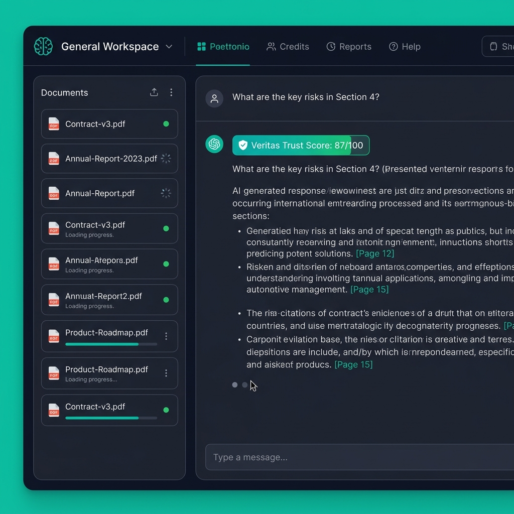
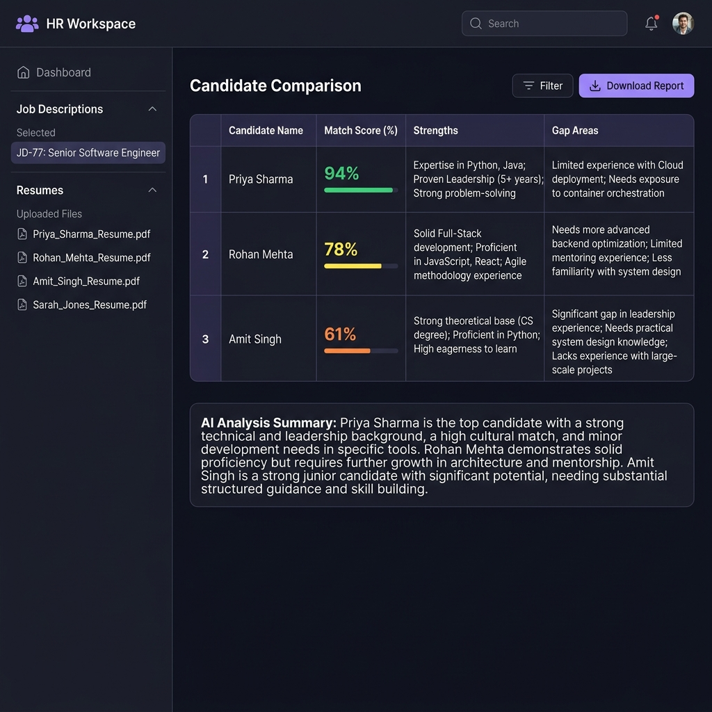
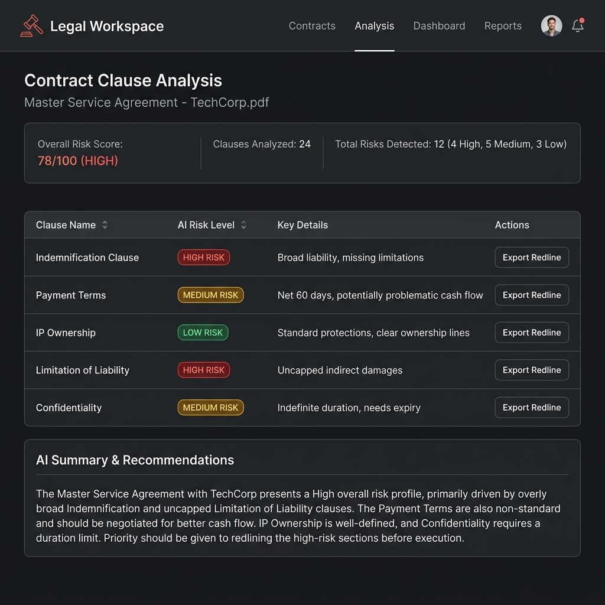
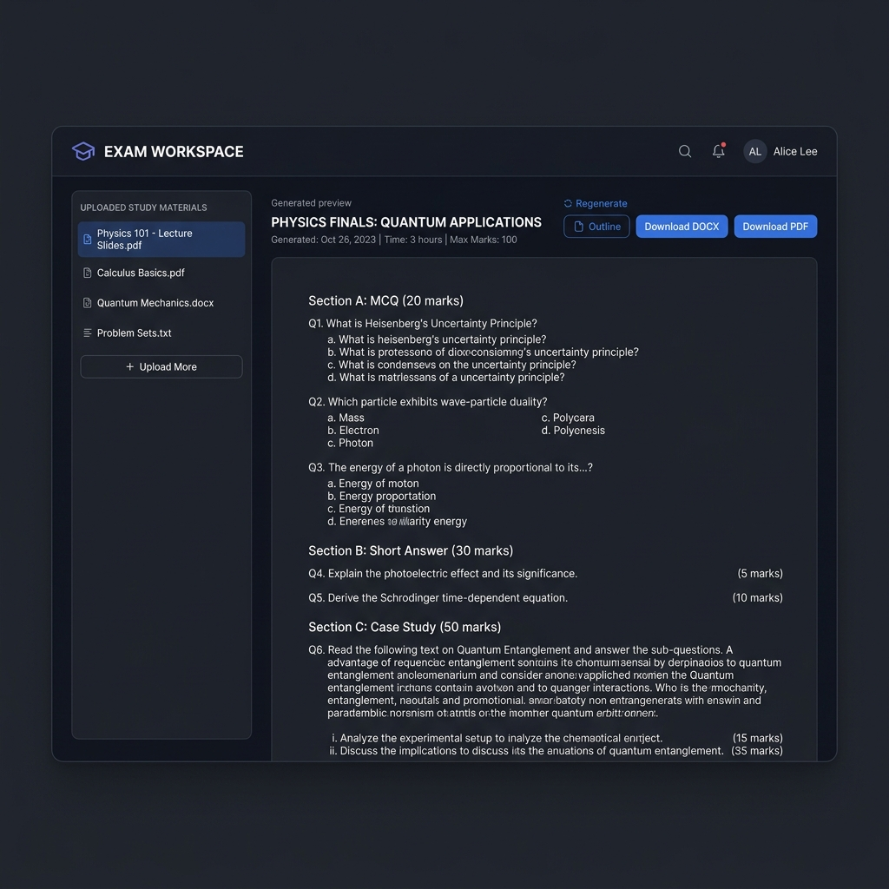

<div align="center">

# 🧠 DocuMindAI

**AI-powered document intelligence platform — grounded, cited, and trusted.**

[](LICENSE)
[](https://www.python.org/)
[](https://nextjs.org/)
[](https://fastapi.tiangolo.com/)

</div>

---

## Problem

Professionals who work with large document sets — contracts, financial reports, research papers, resumes — waste hours manually searching for answers that already exist in their files. Generic AI chatbots make the problem worse: they hallucinate confidently and cannot cite their sources.

---

## Solution

DocuMindAI is a **full-stack AI document intelligence platform** built around a strict **zero-hallucination policy**. Upload your documents and get AI-powered answers that are grounded in your content, cited to the source page, and scored for trustworthiness before they reach you.

> *"I cannot answer this based on the provided documents."* — what DocuMindAI says instead of guessing.

---

## Key Features

- **Hybrid Retrieval** — Semantic (pgvector cosine) + Lexical (BM25 tsvector) search fused via Reciprocal Rank Fusion (RRF) for best-of-both-worlds accuracy
- **Veritas Trust Engine** — Every response is scored 0–100 across five weighted factors before it reaches the user
- **7 Specialized Workspaces** — HR, Legal, Finance, Study, Research, Exam, and General — each with domain-tuned retrieval and AI pipelines
- **Multi-engine OCR** — PaddleOCR (handwritten/rotated) + Docling (structured/tabular) with automatic routing
- **Proactive Insights** — AI surfaces critical findings from a document automatically on upload, before any query
- **Real-time Streaming** — Server-Sent Events (SSE) for live answer delivery
- **Export Engine** — Generate formatted DOCX reports: legal redlines, exam papers, literature reviews
- **Enterprise Security** — JWT + CSRF + rate limiting + device fingerprinting
- **India-first Billing** — Razorpay-ready Go / Plus / Pro tiers (₹799 / ₹999 / ₹2,999)

---

## Screenshots

<table>
  <tr>
    <td align="center" width="50%">
      
      <br/><em>Grounded Q&amp;A · inline page citations · Veritas Trust Score</em>
    </td>
    <td align="center" width="50%">
      
      <br/><em>Auto-ranked candidates · job-description match scores</em>
    </td>
  </tr>
  <tr>
    <td align="center" width="50%">
      
      <br/><em>Clause-by-clause risk levels · redline export</em>
    </td>
    <td align="center" width="50%">
      
      <br/><em>AI-generated exam paper · MCQ · short &amp; long answer · case study</em>
    </td>
  </tr>
</table>

---

## Tech Stack

| Layer | Technologies |
|---|---|
| **Frontend** | Next.js 16 (App Router), React 19, TypeScript, Tailwind CSS 4 |
| **Backend** | FastAPI, Pydantic v2, SQLAlchemy 2.0, Alembic, Celery 5 |
| **Database** | PostgreSQL 16 + pgvector, PgBouncer, Redis 7 |
| **AI Stack** | Google Gemini (multi-key rotation), BAAI/bge-m3 embeddings, PaddleOCR, Docling |
| **Infrastructure** | Docker Compose, GitHub Actions CI/CD, Railway (production) |
| **Observability** | OpenTelemetry, Prometheus, Sentry, PostHog |

---

## Architecture Overview

```
┌─────────────────────────────────────┐
│         Next.js 16 Frontend         │
│  7 Workspaces · Streaming UI · SSE  │
└──────────────────┬──────────────────┘
                   │ REST + SSE
┌──────────────────▼──────────────────┐
│         FastAPI Backend             │
│  Auth · Documents · Query · Export  │
│  CORS · CSRF · Rate Limit · OTel    │
└──────┬──────────────────┬───────────┘
       │                  │
┌──────▼──────┐   ┌───────▼────────────┐
│  RAG Pipeline│   │   Celery Workers   │
│             │   │  Per-workspace task │
│ 1. OCR      │   │  queues + Beat      │
│ 2. Embed    │   │  automation jobs    │
│ 3. Retrieve │   └────────────────────┘
│ 4. Rerank   │
│ 5. Ground   │   ┌────────────────────┐
│ 6. Gemini   │   │    Data Layer      │
│ 7. Veritas  │   │  PostgreSQL 16 +   │
└─────────────┘   │  pgvector · Redis  │
                  └────────────────────┘
```

---

## Challenges Solved

**Zero-Hallucination Pipeline** — The entire stack, from retrieval to grounding to the system prompt, is designed to prevent fabricated responses. The Veritas Engine quantifies trust on every answer.

**Hybrid Retrieval with RRF** — Combining vector similarity (semantic) and full-text BM25 (keyword) search, then fusing via Reciprocal Rank Fusion, consistently outperforms either method alone.

**Production-Grade LLM Key Rotation** — A `GeminiKeyRotator` manages multiple Gemini API keys with per-key cooldowns, automatic failover, and permanent invalidation — surviving quota limits without downtime.

**Domain-Specific Tuning at Scale** — Each of the 7 workspaces has independently tuned retrieval parameters (top-k, rerank-n, chunk sizes) reflecting the nature of its documents (e.g., large chunks for Legal to preserve clause context; small chunks for Finance to isolate precise figures).

---

## Local Setup

**Prerequisites:** Python 3.11+, Node.js 18+, Docker + Docker Compose, a [Gemini API key](https://aistudio.google.com/)

```bash
# 1. Clone and configure
git clone https://github.com/kanwa2006/DocuMindAI.git
cd DocuMindAI
cp .env.example .env
# Fill in GEMINI_API_KEY_1, AUTH_SECRET_KEY, CSRF_SECRET_KEY

# 2. Start infrastructure (Postgres + pgvector, PgBouncer, Redis)
cd infrastructure && docker-compose up -d db pgbouncer redis

# 3. Backend
cd ../backend
python -m venv venv && venv\Scripts\activate
pip install -r requirements.txt
alembic upgrade head
uvicorn app.main:app --host 0.0.0.0 --port 8000 --reload

# 4. Celery worker (new terminal)
celery -A app.workers.celery_app worker -Q main-queue,celery --loglevel=info

# 5. Frontend
cd ../frontend && npm install && npm run dev
```

App at `http://localhost:3000` · API docs at `http://localhost:8000/api/v1/openapi.json`

> **Full Docker Compose** — `cd infrastructure && docker-compose up --build` starts all 6 services.

---

## Roadmap

- [ ] Razorpay/Stripe payment webhook integration and quota enforcement
- [ ] Migrate to `google-genai` SDK (next-gen Gemini integration)
- [ ] OTLP exporter for production tracing (Jaeger / Tempo / Datadog)
- [ ] Mobile PWA improvements (offline support, push notifications)
- [ ] Multi-language support (Hindi, Tamil, regional Indian languages)
- [ ] Organization-level multi-user collaboration
- [ ] Exam workspace Phase 2: teacher image upload + AI-generated diagram insertion

---

## Author

**Kanwa Munipalli**

---

<div align="center">

*Built with care for professionals who work with documents every day.*

</div>
