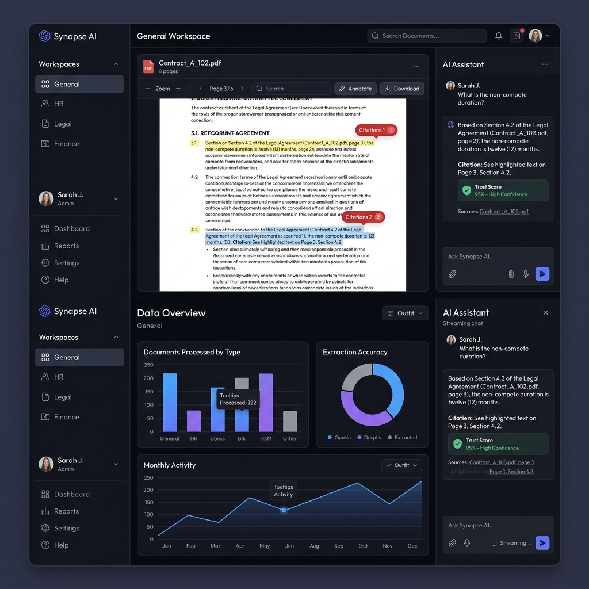

<div align="center">

<br/>

# 🧠 DocuMindAI

### Enterprise AI Document Intelligence — Grounded. Cited. Trusted.

<br/>

*Every answer traces back to a page. Every claim carries a citation. Every response is scored for trust.*

<br/>

[](LICENSE)
[](https://python.org)
[](https://fastapi.tiangolo.com)
[](https://nextjs.org)
[](https://react.dev)
[](https://typescriptlang.org)
[](https://postgresql.org)
[](https://redis.io)
[](https://docker.com)
[](https://docs.celeryq.dev)
[](https://github.com/kanwa2006/DocuMindAI/actions)
[](https://github.com/kanwa2006/DocuMindAI/releases)

<br/>

**DocuMindAI** is a full-stack AI document intelligence platform that enforces a strict zero-hallucination policy. It retrieves evidence from your documents, grounds every answer in source text, cites the exact page, and scores each response for trustworthiness before it reaches you — across seven purpose-built professional workspaces.

<br/>

[**Quick Start**](#-quick-start) · [**Live Demo**](#-demo) · [**Workspaces**](#️-seven-workspaces) · [**Architecture**](#️-architecture) · [**Why DocuMindAI**](#-why-documindai)

<br/>

</div>

---

## 📋 Table of Contents

- [Why DocuMindAI](#-why-documindai)
- [Key Highlights](#-key-highlights)
- [How It Compares](#-how-it-compares)
- [Screenshots](#-screenshots)
- [Demo](#-demo)
- [Seven Workspaces](#️-seven-workspaces)
- [What Makes It Different](#-what-makes-it-different)
- [Features](#-features)
- [Architecture](#️-architecture)
- [Tech Stack](#️-tech-stack)
- [Quick Start](#-quick-start)
- [Environment Reference](#️-environment-reference)
- [Project Structure](#-project-structure)
- [Performance & Engineering](#-performance--engineering)
- [Security](#-security)
- [Roadmap](#️-roadmap)
- [Documentation](#-documentation)
- [Contributing](#-contributing)
- [License](#-license)
- [Acknowledgements](#-acknowledgements)

---

## 🎯 Why DocuMindAI

### The Problem

Knowledge workers — lawyers, analysts, researchers, HR professionals — spend enormous time searching through documents for answers they need *right now*. Generic AI chatbots are fast, but they hallucinate. They blend your document content with their training data and produce confident-sounding answers that are factually wrong.

### The Limitation of Existing Tools

| Tool | What it gets wrong |
|------|-------------------|
| **ChatGPT / Claude** | Cannot ground answers in your private documents; known to hallucinate |
| **NotebookLM** | Single-domain; no workspace specialization; no trust scoring |
| **Generic RAG systems** | Retrieve chunks but don't enforce grounding; no citation audit trail |
| **Enterprise search** | Keyword-based; no semantic understanding; no AI-generated synthesis |

### The DocuMindAI Approach

DocuMindAI is built from the ground up to **never guess**. The pipeline:

1. **Retrieves** the most relevant evidence using hybrid semantic + keyword search
2. **Grounds** the LLM strictly within that evidence — no knowledge beyond your documents
3. **Cites** the exact document, page, and passage in every answer
4. **Refuses** to answer when evidence is absent — explicitly, not silently
5. **Scores** every response with the Veritas Trust Engine (0–100) before delivery

> *"I cannot answer this based on the provided documents."*
> — what DocuMindAI says instead of making something up.

---

## ✨ Key Highlights

<table>
<tr>
<td width="33%">

### 🛡️ Zero Hallucination
Every answer is strictly grounded in retrieved document evidence. The LLM cannot draw on training data beyond your documents. If evidence is missing, the system refuses to answer.

</td>
<td width="33%">

### 🔍 Hybrid Retrieval
Semantic search (pgvector cosine similarity) is combined with lexical search (PostgreSQL BM25 tsvector) and fused using **Reciprocal Rank Fusion** — capturing both conceptual and keyword matches.

</td>
<td width="33%">

### 🏅 Veritas Trust Engine
A post-generation scoring layer (0–100) evaluates citation density, structural alignment, hedging language, and source coherence before the answer reaches the user.

</td>
</tr>
<tr>
<td width="33%">

### 🗂️ 7 Specialized Workspaces
General · HR · Legal · Finance · Study · Research · Exam — each with independent database models, API routes, Celery workers, and domain-tuned retrieval configs.

</td>
<td width="33%">

### 📄 Multi-Engine OCR
PaddleOCR handles handwritten and rotated scans. Docling handles structured and tabular documents. A validation gateway selects the best output automatically.

</td>
<td width="33%">

### ⚡ Real-Time Streaming
Answers stream token-by-token to the browser via Server-Sent Events. Users see partial responses immediately rather than waiting for full completion.

</td>
</tr>
<tr>
<td width="33%">

### 📤 Export Engine
Generate formatted DOCX reports: legal redline documents, graded exam papers with answer keys, literature review reports, and HR candidate summaries.

</td>
<td width="33%">

### 💡 Proactive Insights
On document upload, the AI pipeline automatically surfaces critical findings — risks, key clauses, anomalies — without the user needing to ask a single question.

</td>
<td width="33%">

### 🔄 Gemini Key Rotation
Distributes requests across multiple Gemini API keys with per-key rate-limit state tracking and exponential-backoff cooldown — continuous availability without manual key management.

</td>
</tr>
</table>

---

## 📊 How It Compares

The table below reflects the intended design of each system based on publicly available information. It is not a benchmark.

| Capability | ChatGPT | NotebookLM | Generic RAG | **DocuMindAI** |
|-----------|:-------:|:----------:|:-----------:|:--------------:|
| Answers grounded in your documents | ⚠️ Partial | ✅ | ✅ | ✅ |
| Refuses to answer without evidence | ❌ | ⚠️ | ❌ | ✅ |
| Page-level citations on every answer | ❌ | ⚠️ | ❌ | ✅ |
| Trust score per response | ❌ | ❌ | ❌ | ✅ |
| Hybrid semantic + keyword retrieval | ❌ | ❌ | ⚠️ Varies | ✅ |
| Multi-engine OCR (handwritten + structured) | ❌ | ❌ | ❌ | ✅ |
| Specialized workspaces per domain | ❌ | ❌ | ❌ | ✅ 7 workspaces |
| Proactive insights on upload | ❌ | ❌ | ❌ | ✅ |
| DOCX / report export | ❌ | ❌ | ❌ | ✅ |
| Self-hosted / on-premises | ❌ | ❌ | ✅ | ✅ |
| Open source | ❌ | ❌ | ✅ Varies | ✅ MIT |

> ⚠️ = partial or limited implementation · ❌ = not supported · ✅ = supported

---

## 📸 Screenshots

> **Note:** The image below is an interface design mockup. A screenshot of the live application will replace it once a public deployment is available.

### Document Q&A — Grounded Answer with Trust Score



*The main workspace interface: document list, grounded AI chat with source citations, and Veritas trust score on each response.*

---

**Additional workspace screenshots** will be added here once a hosted demo is deployed:

| Workspace | Status |
|-----------|--------|
| General — Document Q&A | `TODO: screenshot` |
| HR — Candidate Ranking Panel | `TODO: screenshot` |
| Legal — Contract Risk Flagging | `TODO: screenshot` |
| Research — Literature Synthesis | `TODO: screenshot` |
| Exam — Paper Generation | `TODO: screenshot` |

---

## 🚀 Demo

| Resource | Status |
|----------|--------|
| 🌐 **Live Demo** | Coming soon — run locally with Docker Compose in the meantime |
| 🎬 **Demo Video** | `TODO: Walkthrough video link` |
| 📖 **API Docs (Swagger)** | Available locally at `http://localhost:8000/docs` after startup |

---

## 🗂️ Seven Workspaces

Each workspace is a **fully independent environment** with its own:
- Database models and migration history
- API route namespace (`/api/v1/hr/`, `/api/v1/legal/`, etc.)
- Celery task queue with domain-specific worker logic
- Per-workspace retrieval parameters (chunk size, top-k, RRF weights)
- Proactive insight prompts tuned to the domain

<br/>

| Workspace | Who It's For | Core Capabilities |
|-----------|-------------|-------------------|
| 💬 **General** | Anyone working with documents | Universal Q&A — upload any file, ask any question, get grounded answers |
| 👥 **HR** | Recruiters, HR managers | Resume parsing, candidate auto-ranking, job-match scoring, interview pipeline tracking |
| ⚖️ **Legal** | Lawyers, legal ops teams | Contract clause extraction, compliance risk flagging, redline DOCX export |
| 📈 **Finance** | Analysts, auditors, CFO offices | Financial ratio extraction, anomaly detection, audit finding identification |
| 📚 **Study** | Students, educators | SM-2 spaced-repetition flashcard generation, Pomodoro timer, adaptive quizzes |
| 🔬 **Research** | Academics, scientists | Literature synthesis, contradiction detection, Deep Research Agent (RAG + Tavily web search) |
| 🎓 **Exam / Teacher** | Teachers, trainers | Grounded MCQ/Short/Long/Case Study paper generation with answer keys and DOCX export |

---

## 💡 What Makes It Different

### 1. Zero-Hallucination by Architecture

DocuMindAI doesn't try to reduce hallucinations at the prompt level. It eliminates the opportunity for them at the architecture level.

The Grounding Service injects only retrieved document chunks into the LLM context within a strict token budget. The LLM has no access to external knowledge for the answer. If the retrieved evidence doesn't support the query, the system returns an explicit refusal — not a hedged fabrication.

### 2. Veritas Trust Engine

A second AI evaluation layer runs *after* generation. It scores the answer on five weighted factors:

- **Citation density** — how many claims reference a specific document passage
- **Structural alignment** — whether the answer structure matches the question type
- **Hedging detection** — penalizes excessive uncertainty language that signals hallucination risk
- **Source coherence** — whether cited passages actually support the claims made
- **Retrieval quality** — confidence of the underlying retrieval step

The 0–100 trust score is returned to the user alongside every grounded answer (ungrounded general-knowledge replies show an explicit "Ungrounded" badge instead).

### 3. Hybrid Retrieval with Per-Workspace Tuning

Most RAG systems use semantic search only. DocuMindAI fuses:
- **pgvector** (semantic cosine similarity via BAAI/bge-m3 embeddings)
- **PostgreSQL tsvector** (BM25 lexical keyword matching)

These two ranked lists are fused via **Reciprocal Rank Fusion (RRF)**, which outperforms either method alone without requiring score normalization. Each of the 7 workspaces has independently configured retrieval parameters optimized for its domain's document types and query patterns.

### 4. Enterprise-Grade Design

This is not a proof-of-concept. DocuMindAI is designed to production-grade standards:
- Async throughout: FastAPI + asyncpg + async SQLAlchemy — zero blocking I/O on the API server
- PgBouncer connection pooling for database scalability
- Celery distributed task queue with Beat scheduler for background automation
- OpenTelemetry distributed tracing, Prometheus metrics, Sentry error tracking
- Multi-key Gemini rotation with per-key cooldown and failover
- JWT + CSRF + SlowAPI rate limiting + HSTS + device fingerprinting

---

## ⚙️ Features

### 🔍 Hybrid RAG Retrieval
Fuses pgvector semantic search (BAAI/bge-m3 embeddings, 1024-dim) with PostgreSQL BM25 full-text search via Reciprocal Rank Fusion. A cross-encoder reranking pass follows. Each workspace has independently tuned top-k, chunk size, and RRF weight parameters. This means a Legal workspace querying a 200-page contract receives fundamentally different retrieval behavior than a Study workspace processing a textbook — by design.

### 📄 Multi-Engine OCR Pipeline
PaddleOCR handles handwritten notes, rotated pages, and low-quality scans. Docling handles structured documents with tables, headers, and multi-column layouts. A validation gateway compares both outputs and selects the best result automatically. All OCR runs asynchronously in Celery workers — the API never blocks waiting for document processing.

### 🛡️ Veritas Trust Engine
Post-generation trust scoring on a 0–100 scale. The score is computed from five weighted factors: citation density, structural alignment, hedging detection, source coherence, and retrieval confidence. A score below a configurable threshold triggers a warning indicator on the frontend. Users always know how much to trust an answer before acting on it.

### 💡 Proactive Insights
Every document upload triggers an async AI analysis that surfaces domain-specific findings without user prompting. In the Legal workspace, this flags high-risk contract clauses. In Finance, it highlights anomalous transactions. In HR, it surfaces standout candidates. Users see these insights appear in the ProactiveInsightsPanel automatically after upload.

### 🔄 Gemini Multi-Key Rotation
The `llm_key_rotation` service maintains a pool of Gemini API keys, tracks per-key rate-limit state, and applies exponential-backoff cooldowns on exhausted keys. Requests are distributed across healthy keys in round-robin order. This provides continuous availability under load without manual key management.

### ⚡ Real-Time SSE Streaming
Answers stream token-by-token from the LLM to the browser via Server-Sent Events. The pipeline uses async generators through every layer — from the Gemini API call through the grounding service to the FastAPI response — maintaining true streaming without buffering. Users see partial answers immediately.

### 📤 Export Engine
Generates formatted DOCX files via `python-docx`. Legal workspace exports produce redline-style contract annotation documents. Exam workspace exports produce formatted examination papers with question numbering, section headers, and separate answer key pages. All exports run in Celery `export_tasks` to keep the API responsive.

### 🔐 Enterprise Security
JWT access + refresh tokens (7-day expiry), CSRF double-submit cookie pattern, SlowAPI rate limiting on upload and query endpoints, HSTS headers, device fingerprinting for session integrity, email OTP verification for new registrations.

### 📊 Full Observability
OpenTelemetry distributed tracing across all FastAPI routes and Celery workers. Prometheus metrics at `/metrics`. Sentry error tracking on both backend and Next.js frontend. PostHog product analytics. All configurable via environment variables — no code changes required to enable or disable.

---

## 🏗️ Architecture

```
┌──────────────────────────────────────────────────────────────────────┐
│                     Next.js 16  (App Router)                         │
│                                                                      │
│   /general  /hr  /legal  /finance  /study  /research  /exam  ...    │
│   WorkspaceUI · Sidebar · CommandPalette · ProactiveInsightsPanel    │
│   EnterpriseDocumentViewer · SSE Stream Consumer                     │
└────────────────────────────┬─────────────────────────────────────────┘
                             │  REST + Server-Sent Events (SSE)
┌────────────────────────────▼─────────────────────────────────────────┐
│                  FastAPI   /api/v1/                                   │
│                                                                      │
│   auth · documents · query · hr · legal · finance · study           │
│   research · exams · export · billing · bookmarks · insights · admin │
│                                                                      │
│   Middleware stack:  CORS → CSRF → RateLimit → TenantContext → OTel  │
└──────────┬──────────────────────────────┬────────────────────────────┘
           │                              │
┌──────────▼─────────────┐   ┌────────────▼──────────────────────────┐
│    AI / RAG Pipeline    │   │          Celery Workers               │
│                         │   │                                       │
│  ① OCR Orchestrator     │   │  document_tasks   hr_tasks            │
│    ├── Docling          │   │  legal_tasks      finance_tasks       │
│    └── PaddleOCR        │   │  study_tasks      research_tasks      │
│                         │   │  export_tasks     eval_tasks          │
│  ② Embedding            │   │                                       │
│    └── BAAI/bge-m3      │   │  Celery Beat (scheduled):             │
│        (1024-dim)       │   │  auto_health_check                    │
│                         │   │  auto_daily_digest                    │
│  ③ Hybrid Retrieval      │   │  auto_db_cleanup                     │
│    ├── pgvector          │   │  auto_key_rotation                    │
│    ├── tsvector BM25     │   └───────────────────────────────────────┘
│    └── RRF Fusion        │
│                         │   ┌───────────────────────────────────────┐
│  ④ Reranker              │   │           Data Layer                  │
│    └── Cross-encoder     │   │                                       │
│                         │   │  PostgreSQL 16 + pgvector extension   │
│  ⑤ Grounding Service     │   │  PgBouncer  (connection pooling)      │
│    └── Token Budget      │   │  Redis 7    (broker · cache · sessions│
│                         │   │  Storage    (local · S3 · Supabase)   │
│  ⑥ Gemini LLM            │   └───────────────────────────────────────┘
│    └── Key Rotation      │
│                         │   ┌───────────────────────────────────────┐
│  ⑦ Veritas Engine        │   │         Observability                 │
│    └── Trust Score 0-100 │   │                                       │
│                         │   │  OpenTelemetry distributed tracing    │
└─────────────────────────┘   │  Prometheus metrics  /metrics         │
                              │  Sentry  (errors)                     │
                              │  PostHog (analytics)                  │
                              └───────────────────────────────────────┘
```

### Query Pipeline

```
User submits query
        │
        ▼
 Hybrid Retrieval ────────────── pgvector cosine + tsvector BM25
        │                             fused via RRF
        ▼
   Cross-Encoder Reranker ─────── re-scores top-k candidates
        │
        ▼
  Grounding Service ─────────────  token budget · citation format
        │                               · document-order sort
        ▼
  Gemini LLM ──────────────────── multi-key rotation · safe streaming
        │                               · JSON repair loop
        ▼
  Veritas Trust Engine ────────── 0-100 score · 5 weighted factors
        │
        ▼
  SSE Stream ──────────────────── token-by-token to browser
```

---

## 🛠️ Tech Stack

### Frontend

| Technology | Version | Purpose |
|------------|---------|---------|
| **Next.js** | 16.2.6 | App Router, SSR, file-based routing |
| **React** | 19.2.4 | Component model and rendering |
| **TypeScript** | 5.x | Static type safety |
| **Tailwind CSS** | 4.x | Utility-first styling |
| **react-pdf** | 10.4.1 | In-browser PDF rendering |
| **recharts** | 2.15.4 | Interactive analytics and charts |

### Backend

| Technology | Version | Purpose |
|------------|---------|---------|
| **FastAPI** | ≥0.109 | Async REST API and SSE server |
| **SQLAlchemy** | ≥2.0 | Async ORM with `asyncpg` driver |
| **Alembic** | ≥1.13 | Database schema migration management |
| **Celery** | ≥5.3.6 | Distributed async task execution |
| **PaddleOCR** | latest | OCR for handwritten / rotated documents |
| **Docling** | latest | Structured document layout parsing |
| **sentence-transformers** | latest | BAAI/bge-m3 embedding model (1024-dim) |
| **google-generativeai** | latest | Gemini LLM API client |
| **SlowAPI** | latest | Rate limiting middleware |

### Database & Storage

| Technology | Purpose |
|------------|---------|
| **PostgreSQL 16** | Primary relational database |
| **pgvector** | Vector similarity search extension |
| **PgBouncer** | Connection pooling (transaction mode) |
| **Redis 7** | Celery message broker, result backend, session cache |
| **Local / S3 / Supabase** | Document file storage (configurable) |

### Observability

| Technology | Purpose |
|------------|---------|
| **OpenTelemetry** | Distributed tracing across all services |
| **Prometheus** | Metrics collection at `/metrics` |
| **Sentry** | Error tracking (backend + frontend) |
| **PostHog** | Product analytics and user events |

### Deployment

| Technology | Purpose |
|------------|---------|
| **Docker Compose** | Local multi-service orchestration (6 containers) |
| **Railway** | Cloud deployment via `railway.json` |
| **GitHub Actions** | CI/CD: dep audit · migrations · tests · lint · build |

---

## 🚀 Quick Start

> Requires: **Docker Desktop**, **Git**, and a **Google Gemini API key** ([get one free](https://aistudio.google.com/))

```bash
# 1. Clone
git clone https://github.com/kanwa2006/DocuMindAI.git
cd DocuMindAI

# 2. Configure environment
cp .env.example .env
# Open .env and set GEMINI_API_KEY_1 and your security secrets

# 3. Launch
cd infrastructure
docker-compose up --build
```

| Service | URL |
|---------|-----|
| **Frontend** | http://localhost:3000 |
| **Backend API** | http://localhost:8000 |
| **Swagger / OpenAPI** | http://localhost:8000/docs |

Docker Compose starts 6 containers: PostgreSQL + pgvector, PgBouncer, Redis, FastAPI backend, Celery worker, and Next.js frontend.

For manual (non-Docker) setup, see the **[Installation & Deployment Guide →](docs/deployment/installation.md)**

---

## ⚙️ Environment Reference

| Variable | Required | Description |
|----------|----------|-------------|
| `GEMINI_API_KEY_1` | ✅ | Primary Gemini API key — add `_2`, `_3`, ... for rotation |
| `AUTH_SECRET_KEY` | ✅ | 64-character JWT signing secret |
| `CSRF_SECRET_KEY` | ✅ | CSRF token signing secret |
| `POSTGRES_SERVER` | ✅ | Database host (`localhost` for local Docker) |
| `REDIS_URL` | ✅ | Redis URL (`redis://localhost:6380/0` for local Docker) |
| `STORAGE_PATH` | ⚡ | Local document storage directory (default: `./uploads`) |
| `SENTRY_DSN` | Optional | Sentry error tracking DSN |

Full configuration reference: [`.env.example`](.env.example)

---

## 📁 Project Structure

```
DocuMindAI/
│
├── backend/                    # FastAPI application
│   ├── app/
│   │   ├── api/v1/endpoints/   # Route handlers (auth, documents, query, hr, legal, ...)
│   │   ├── core/               # Auth, config, security, storage
│   │   ├── models/             # SQLAlchemy ORM models
│   │   ├── schemas/            # Pydantic request / response schemas
│   │   ├── services/           # Business logic: RAG, OCR, grounding, Veritas, export
│   │   ├── workers/tasks/      # Celery tasks per workspace
│   │   └── automation/         # Celery Beat scheduled tasks
│   ├── alembic/                # Database migrations
│   ├── tests/                  # API contract & regression tests
│   └── requirements.txt
│
├── frontend/                   # Next.js 16 application
│   ├── src/app/                # App Router pages (one per workspace)
│   ├── src/components/         # Shared UI components
│   ├── src/hooks/              # Custom React hooks
│   └── src/lib/                # API client, Zustand stores, analytics
│
├── docs/
│   ├── architecture/           # System architecture & API mapping
│   ├── deployment/             # Installation & deployment guides
│   └── screenshots/            # Application screenshots
│
├── infrastructure/             # Docker Compose configs
├── .github/workflows/          # GitHub Actions CI
├── .env.example                # Environment template
├── CONTRIBUTING.md
├── SECURITY.md
├── LICENSE
└── RELEASE_NOTES_v1.0.0.md
```

---

## ⚡ Performance & Engineering

DocuMindAI is engineered for responsiveness at every layer:

| Layer | Design Decision |
|-------|----------------|
| **API Server** | FastAPI with `asyncpg` and async SQLAlchemy — zero blocking I/O on the API process |
| **Database** | PgBouncer in transaction mode handles connection bursts; pgvector index accelerates similarity search |
| **Task Queue** | Celery distributes CPU-heavy work (OCR, embedding, export) to worker processes, keeping the API latency low |
| **Caching** | Redis caches session state, Celery results, and frequently accessed data |
| **Streaming** | True async generator pipeline from Gemini response → grounding → SSE — no buffering at any stage |
| **Automation** | Celery Beat runs background maintenance (health checks, DB cleanup, key rotation) without impacting request handling |
| **Scalability** | Worker count is independently scalable from API server count — OCR-heavy workloads scale workers, not API replicas |

---

## 🔐 Security

| Control | Implementation |
|---------|---------------|
| **Authentication** | JWT access tokens + refresh tokens (7-day rotation) |
| **CSRF Protection** | Double-submit cookie pattern on all mutating endpoints |
| **Rate Limiting** | SlowAPI limits on `/documents/upload` and `/query/stream` |
| **HSTS** | HTTP Strict Transport Security headers enforced |
| **Device Fingerprinting** | Session binding to device characteristics |
| **Email Verification** | OTP-based email confirmation for new accounts |
| **Secret Management** | All credentials via environment variables — nothing hardcoded |
| **Dependency Auditing** | `pip-audit` runs on every CI push to `main` |

To report a vulnerability privately, see [SECURITY.md](SECURITY.md).

---

## 🗺️ Roadmap

### ✅ Shipped in v1.0.0

- [x] 7 specialized workspaces (General, HR, Legal, Finance, Study, Research, Exam)
- [x] Hybrid retrieval — pgvector + BM25 + Reciprocal Rank Fusion
- [x] Veritas Trust Engine — 0–100 post-generation trust scoring
- [x] Multi-engine OCR — PaddleOCR + Docling with validation gateway
- [x] Proactive insights — automatic findings on document upload
- [x] Real-time SSE streaming
- [x] DOCX export engine (legal, exam, HR reports)
- [x] Gemini multi-key rotation with per-key cooldown
- [x] OpenTelemetry + Prometheus + Sentry + PostHog observability
- [x] GitHub Actions CI (dep audit, migrations, API tests, lint, build)
- [x] Docker Compose + Railway deployment

### 🔄 In Progress

- [ ] Quota enforcement gating by pricing tier (Go / Plus / Pro)
- [ ] Normalized frontend API prefix conventions

### 📋 Planned

- [ ] Hosted public demo deployment
- [ ] Migration to `google-genai` SDK (next-gen Gemini client)
- [ ] Workspace identity unification (`workspace_id` type normalization)
- [ ] Mobile PWA improvements and offline document caching
- [ ] Multi-language support for regional Indian languages
- [ ] Code coverage reporting in CI

---

## 📚 Documentation

| Document | Description |
|----------|-------------|
| [Installation Guide](docs/deployment/installation.md) | Step-by-step Docker and manual setup |
| [Architecture & API Map](docs/architecture/project-map.md) | Complete page → API → service → model → worker mapping |
| [Contributing Guide](CONTRIBUTING.md) | Branch naming, commit conventions, PR process, code style |
| [Security Policy](SECURITY.md) | Vulnerability reporting, response SLA, security scope |
| [Release Notes v1.0.0](RELEASE_NOTES_v1.0.0.md) | Full changelog, known limitations, migration notes |
| [License](LICENSE) | MIT License |

---

## 🤝 Contributing

Contributions are welcome! DocuMindAI follows [Conventional Commits](https://www.conventionalcommits.org/) and a branch-per-feature workflow.

```bash
# Branch naming
feat/your-feature-name
fix/short-description
docs/what-you-changed
```

Before opening a pull request:
- All backend tests must pass: `pytest tests/ -v`
- Frontend lint must show 0 errors: `npm run lint`
- Next.js production build must succeed: `npm run build`

See [CONTRIBUTING.md](CONTRIBUTING.md) for the full guide including PR template and code style.

---

## 🔒 Security

Please **do not** open public GitHub issues for security vulnerabilities.

Report privately: **security@documindai.com** · Response within 48 hours · See [SECURITY.md](SECURITY.md)

---

## 📄 License

Distributed under the **MIT License**. See [LICENSE](LICENSE) for details.

---

## 🙏 Acknowledgements

DocuMindAI is built on top of exceptional open-source projects:

| Project | Role |
|---------|------|
| [Google Gemini](https://deepmind.google/technologies/gemini/) | LLM backbone for grounded answer generation |
| [BAAI/bge-m3](https://huggingface.co/BAAI/bge-m3) | Multilingual sentence embeddings (1024-dim) |
| [pgvector](https://github.com/pgvector/pgvector) | Vector similarity search for PostgreSQL |
| [PaddleOCR](https://github.com/PaddlePaddle/PaddleOCR) | OCR for handwritten and rotated documents |
| [Docling](https://github.com/DS4SD/docling) | Structured document layout parsing |
| [Tavily](https://tavily.com/) | Web search API for the Deep Research Agent |
| [FastAPI](https://fastapi.tiangolo.com/) | High-performance async Python API framework |
| [Next.js](https://nextjs.org/) | React framework powering the workspace frontend |
| [Celery](https://docs.celeryq.dev/) | Distributed task queue for async document processing |

---

<div align="center">

**Built with care for professionals who work with documents every day.**

*Kanwa Munipalle · MIT License · [v1.0.0](https://github.com/kanwa2006/DocuMindAI/releases/tag/v1.0.0)*

<br/>

[⬆ Back to top](#-documindai)

</div>
